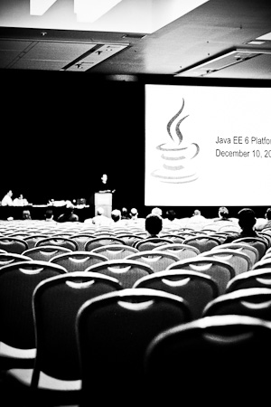

And it is rapidly approaching. 106,560 minutes or 1776 hours or rounded 10 weeks until the industry meets again in San Francisco! If you were waiting for the <a href="https://oracleus.wingateweb.com/scheduler/eventcatalog/eventCatalogJavaOne.do?Src=7308729&amp;Act=36&amp;pcode=WWMK11042185MPP016" target="_blank">content catalog</a>, it is finally there, too. With over 400 Sessions in 8 tracks this will be a huge event. As you know, I was helping to shape the Java EE Web Profile and Platfrom Technologies - Track. It has 71 sessions, 3 panels, 3 hands-on-labs and 38 Birds-of-a-Feather sessions and here are my personal highlights:
 
 <b>Conference Sessions</b>
 

 

 This years topics clearly are Java EE 6 and 7. Beside introducing the new specification with it's latest developments you can get involved with all the latest Java EE 6 best practices from the most well know experts. Let's start with the new products to look at:
 
 <i>Application servers</i>
 
 Beside the fact, that the industry still lags some Java EE 6 support with the commercial vendors, some OSS alternatives have grown up. Most notably the latest AS7 by JBoss and the Apache TomEE Web Profile container. 
 
 - David Blevins from the Apache Software Foundation introduces you to Apache TomEE Java EE 6 Web Profile (<i>23680</i>)
 
 - Andrew Rubinger from the JBoss by Red Hat, get's you started with Death of the Slow: JBoss AS7 (<i>25288</i>).
 
 <i>Java EE 7</i>
 
 There is plenty of room for the upcoming Java EE specification this year. Beside the minor updates to existing specifications we also have some new stuff in stock for you. 
 
 - Manik Surtani, Red Hat Inc. A Tale About Caching (JSR 107) and Data Grids (JSR 347) in Enterprise Java (<i>23382</i>)
 
 - Danny Coward, Oracle Concurrent Java EE Programming (<i>25085</i>)
 
 - Marina Vatkina, Oracle Enterprise JavaBeans Technology 3.2 (23180)
 
 - Peter Muir, Red Hat, Inc. Introducing Contexts and Dependency Injection 1.1 (<i>22480</i>)
 
 - Marek Potociar and Santiago Pericas-Geertsen both Oracle give you all the latest features of JAX-RS 2.0: What's in JSR 339? (<i>22800</i>)
 
 - Linda DeMichiel, Oracle updates you on Java Persistence API 2.1: What's New and What's Coming (<i>24981</i>)
 
 - Ron Monzillo, Oracle The Java Identity API (25171)
 
 - Cameron Purdy, Oracle and Greg Luck, Terracotta The New JSR 107 Caching Standard (<i>24223</i>)
 
 <i>GlassFish</i>
 
 Being the reference implementation for Java EE it's not a big surprise to see some more details about GlassFish. It's not half as much as I would have liked to see but that's probably ok for the majority :)
 
 - Ludovic Champenois, Oracle gives you the latest insights for the GlassFish REST Administration Back End: An Insider Look at a Real REST Application (<i>25008</i>)
 
 - Sanjeeb Sahoo and Jagadish Ramu both Sun, an Oracle Company introduce you to Handling Service Orchestration in the Cloud for GlassFish (<i>25360</i>)
 
 - Masoud Kalali, Informatics Matters takes care about Secure Java EE Applications on GlassFish 3.2 (<i>26420</i>)
 
 <i>Arquillian</i>
 
 I'm proud to see Dan and Aslak presenting on their baby. Arquillian is behind this one and you should reserve the date!
 
 Dan Allen and Aslak Knutsen both Red Hat Real Java Enterprise Testing (<i>23813</i>)
 
 If you have some input for both, you can also reserve the time for the corresponding BoF (Arquillian: The Extendable Enterprise Test Platform, <i>24121</i>)
 
 <b>BoF sessions</b>
 

 

 Some proposals didn't make it as a conference session (for many reasons, I can tell you :)). But that's not sad because we still have the BoFs for a more open discussion. And there are quite a lot this year. Here is a very short list of my favs: 
 
 
 Beginning with the GlassFish Community Event (<i>23426</i>), which is hosted by Anil Gaur and Alexis Moussine-Pouckine (both Oracle of course). You should (!) sign up in advance for this one <a href="http://www.facebook.com/event.php?eid=151433824934940" target="_blank">via facebook</a> (more details on <a href="http://blogs.oracle.com/arungupta/entry/glassfish_community_event_and_party1" target="_blank">aruns blog</a>.)
 
 
 Jevgeni Kabanov from ZeroTurnaround ius willing to discuss the results of their <a href="" target="_blank">recent survey</a> about How Do You Update Your Java EE App in Production? (<i>19240</i>)
 
 
 And you need to see Lincoln Baxter III (Red Hat) talking about <a href="" target="_blank">PrettyFaces </a>Beautiful Java EE: URL Rewriting for the Next-Generation Web User (<i>24507</i>)
 
 
 And we also have some chance for the community to give their valuable input for the next Java EE specification. Don't let this chance pass: 
 
 
 Edward Burns spec lead JSF from Oracle is willing to discuss the JSF Status and receive some community Input (<i>25147</i>)
 
 
 Peter Muir and Manik Surtani, both Red Hat Inc. talk with you about Making Java EE Cloud-Friendly: JSR 347, Data Grids for the Java Platform (<i>23380</i>)
 
 
 Marina Vatkina from Oracle and the EJB 3.2 EG are willing to answer questions around EJB 3.2 (<i>23166</i>)
 
 
 Linda DeMichiel from Oracle is ready to receive feedback about Java Persistence API 2.1 (<i>24923</i>)
 
 
 And there also is a chance to give feedback to Nigel Deakin (Oracle), Reza Rahman (Caucho Technology) and Clebert Suconic (Red Hat) about JSR 343: What's Coming in Java Message Service 2.0 (<i>24580</i>)
 
 <b>Hands-On Labs</b>
 

 

 Only three this year. I mean: this is only for the Java EE part. So don't be afraid. There is a lot of stuff to discover. JavaOne has 13 hands-on-labs overall. If you are beginning with Java EE, you should attend the following two. Sign up early, as there is not infinite space available in the rooms:
 
 
 Alexis Moussine-Pouckine from Oracle gives you a kick start with Beginning Java EE 6 (<i>23421</i>). A two hour introductory session about everything you need to know to get started. 
 
 
 The second by Byron Nevins and Arun Gupta, both Oracle introduce you to Develop, Deploy, and Monitor a Java EE 6 Application with Clustered GlassFish 3.1 (<i>19120</i>)
 
 <b>Registration is open</b>
 
 If you like, what you have seen: <a href="http://www.oracle.com/javaone/register/packages/index.html" target="_blank">Register today!</a> Until July 29, 2011 you get the Early Bird which saves you $400.
 
 <b>Make plans!</b>
 
 If you are going to make your travel arrangements don't forget to read <a href="http://blog.eisele.net/2010/07/links-and-tips-for-openworld-javaone.html">my post about further links and tips</a> from last year. And remember to take care about the <a href="http://blog.eisele.net/2011/07/10-ways-to-make-best-out-of-conference.html">10 Ways to make the Best out of a Conference</a>.