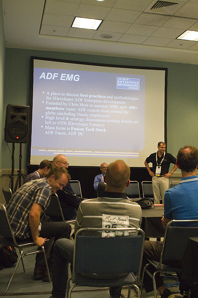
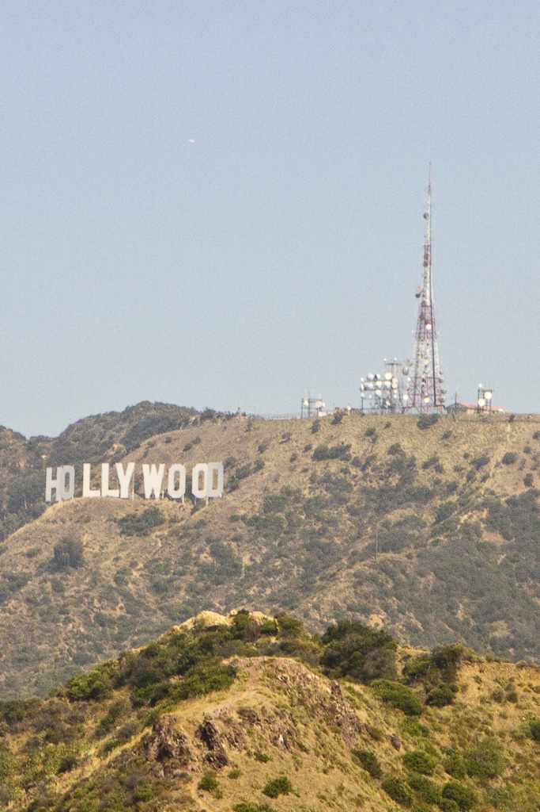
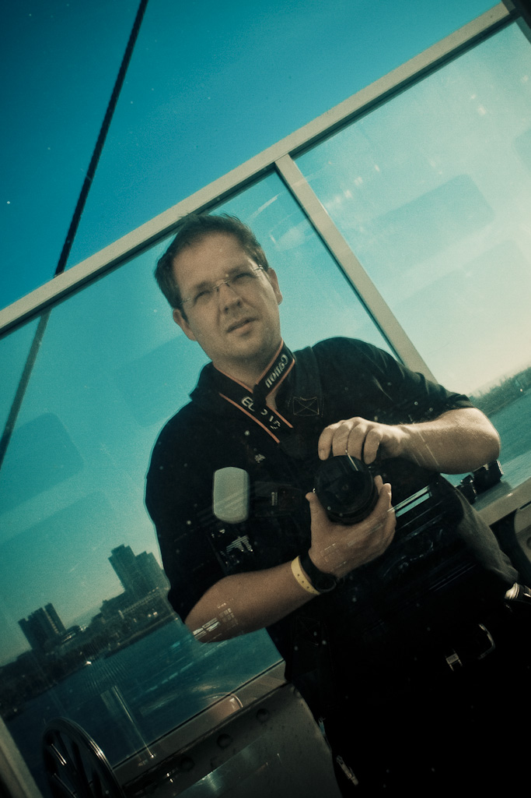
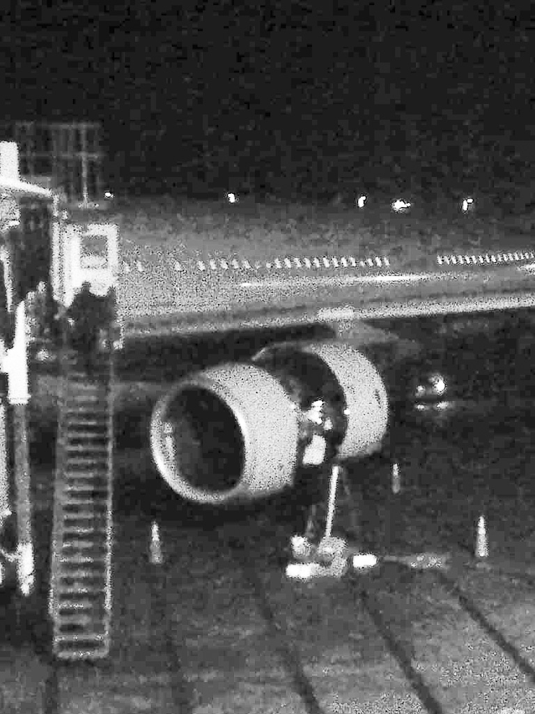
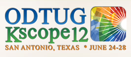

I made it back to Germany. After the outbound flight took about 12,5 hours the inbound one was shorter with 11,5 h. Both not very comfortable time frames to be on a plane in general. But this is the price to pay if you are attending conferences on the west cost. But let's catch up with the conference days 4 to 6. Be warned, it's a lengthy post :)
 
 <b>Day 4 - sessions and friends</b>
 

 

Tuesday was about to start early for me. Still a bit jet-lagged it was a pleasure to fetch my first Starbucks coffee directly in the hotel. Conference mornings began with a <a href="http://en.wikipedia.org/wiki/Qigong">Qigong</a> practice at 7. Followed by a nice breakfast. Sessions started 8:30 am and were interrupted by smaller pauses and the <a href="http://www.kscope11.com/events/lunch-and-learn">Lunch and Learn</a> panels between 12:15 and 1:45. Those panels were lead by the attending Oracle ACE Directors and ACEs. I attended the Fusion Middleware panel, moderated by Oracle's Duncan Mills. Guido Schmutz (Trivadis), Sten Vesterli (scott/tiger), Ronald van Luttikhuizen (Vennster) and Chris Muir (Sage computing) talked about their experiences within the latest projects and answered some questions from the attendees. Back with sessions 8 to 10 the conference day ended around 5:30 pm. Basically it was nice to see the many attendees walking around from session to session and talk a lot to each other. As always socializing was a big part and I guess the schedule made this really easy. The track, that interested me mostly was FMW. It always happened in the same three rooms (203 A,B,C). Beside the other fellow ACEs also Oracle contributed some very good sessions which basically aimed at the beginners level. Generally speaking I believe, the content leads for FMW did a great job assembling this first real FMW track. It has much improved over the ones happening last year. More on this later in the wrap up section.
 
 Day 4 ended with a great ACE Dinner. This little tradition is something I really love to see Oracle catching on up over and over again. It was a casual appreciation dinner for all Oracle ACE &amp; ACE Directors participating in ODTUG Kscope11. We went to <a href="" target="_blank">Gladstones</a> and had a great evening catching up with the OTN Team (Thanks to Justin, Vikki and Lillian for all your awesome support!) and fellow ACEs from around the world. It always feels a little weird seeing those familiar faces once or twice a year. You normally know very little from each other and so there is a lot to catch up with. 
 
 <b>Day 5 - sightseeing and a boat</b>
 

 

Wednesday started all over again as every conference day. Waking up too early around 5, first coffee around 6 and Qigong session before breakfast in the lunch area. Again this Qigong thing? Yes. I mean, not for me ;) I loved catching the early morning air and looking at the up to 20 people attending the exercise. I preferred drinking my coffee. The silence was needed right before the conference day which again started at 8:30 am with the first sessions and last until 5:15 pm. To be honest, this was my day off. I've never been to LA before and I knew there would be tons of stuff to visit and picture so I was looking for a chance to do this very compressed and without spending too much time on non conference things. The concierge recommended <a href="" target="_blank">Sunseeker Tours</a> and their one day Hollywood and LA tour. Asking around, if anybody want's to join UK'OUG Chairman <a href="" target="_blank">Debra</a> and <a href="" target="_blank">Stanley</a> joined for the complete day. Which was a pleasure for me having them with me! We were picked up from the hotel by a small Mercedes-Benz bus and started the guided tour of Hollywood, Los Angeles and the Beaches at exactly 8:30. This was a packed day which contained Grauman's Chinese Theater, Hollywood Walk of Fame, Sunset Strip, Rodeo Drive, The Hollywood Sign, Kodak Theater, The Hollywood Roosevelt, Santa Monica Pier, Venice Beach, Hollywood Boulevard, some Star Homes, Ports of LA/Long Beach and Harbor Bridges. You can get some impressions from my flickr photoset about <a href="" target="_blank">Long Beach, LA and Hollywood</a>. The sad part was, that we were on the bus quite a lot. Except the too few stops we have seen a lot but in drive-by mode only. We made it back just in time for the evening appreciation event which was held on the <a href="" target="_blank">Queen Mary</a>. 
 

 

The majestic Queen Marry offers the chance to step back in time aboard one of the most famous ocean liners in history. Going back to the days where steamships were the quickest and most elegant way to travel, it was the first choice for the elite of high society.&nbsp;In 1939, at the start of World War II, the Queen Mary was drafted into service and outfitted as a troopship. Deemed the Grey Ghost due to her new camouflaged grey exterior, she joined the Allied Forces and played a crucial role in their success. When the war ended, she was restored to her former glory and continued passenger service until 1966, when Cunard announced the Queen Mary for sale and Long Beach became her new home.&nbsp;Just like the passengers of years ago, Kscopers were treated to several activities on board, such as:&nbsp;Listening to cool jazz in one of the elegant dining rooms; Singing in the dueling piano bar; Checking out the ship on a historical tour led by one of the ship’s docents; Playing cards in the poker room; Dancing under the stars; Eating and drinking food. An awesome live band was playing, too and thanks to the generous host ODTUG we were given VIP wrist bands to enter some well protected places to catch up with drinks and find places to talk. As you might have expected, I was running around with my 7D a lot and took some pictures. You'll find them in the already mentioned <a href="" target="_blank">flickr.com/myfear photosets</a>. The evening lasts until 10:00 pm. A too early ending for a great evening which could have last hours longer.
 
 <b>Day 6 - 9 to 9</b>
 

 

The short day. Beginning with the usual coffee, Qigong, coffee, breakfast the last three FMW sessions all happened in one room. This was the day I was traveling back to Germany. Unfortunately in the late evening around 9 pm. so I had to spend the whole day with all my things packed up somewhere, because we had to leave the rooms at noon, and the last sessions ended 12:45 this was going to be a boring and useless day. Highlight of the day was the "Thursday Thunder" event in which some ACEs tried to build a complete SOA app from scratch in less than an hour. This was impressive and a great inspiration for some content, the German ACED are now trying to build up for our own conferences in Germany. With a little help of Debra I was able to get to the airport earlier than planned and spend some hours with Torsten until his flight to FRA left. But the big nerve-wracking part was only about to begin. If you look at the picture to the right, you can see, what happened to the plane right after it came in from MUC. The engine had to be opened and some technicians were checking it. After three hours of waiting it finally was clear, that will still will make it today. The needed parts have been brought to the plane and after some additional testing we finally left LAX around midnight heading to MUC. Unlike the outbound flight, I was back in economy this time. Not too sad generally, but as I said, west cost flights really last longer than they should. Without any further problems I reached MUC and went home by 9 pm.
 
 <b>Exhibition Hall</b>
 
 This is an essential part of any conference I attended in the past. Same should be true to KScope. I don't know why the exhibition hall hours were some kind of restrictive. Only lasting some hours during the day. This was quite confusing, at last to me. Every time I felt the need of walking around there and catching up with the offers, it was closed. Ok. It might be, that the conference is too small in general to open it up all day long, but I guess this part could be improved if the break snacks and coffee (yes, there was to less coffee on site!) simply move to the exhibition hall and only there. This could lead some more people there and make it more attractive in general. I bet, if some of the exhibitors would have decided to provide coffee at their booths, they would have been overwhelmed by the response ;)
 
 <b>Session Voting</b>
 

 

This year was the first year ODTUG decided to move forward in terms of voting. A mobile iPhone/IPod app which also runs on iPads was at your hand to assist you with your schedule.&nbsp;Beside the apple products, you also could use a <a href="" target="_blank">web based version</a> for your android and blackberry phones. And it was great! I really liked it. You always had your schedule right at hand and it also was your entry point for the session voting. Which was not too great in general. It simply wasn't working stable enough. I've seen a lot of problems around with it. Sometimes it refused the voting someone gave, sometimes it simply was not up and running. And the web based interface has some security issues which I don't like. The fact that it was based on ASP.NET was something I really did not get. I would have expected it to be some fancy Oracle/Java stuff behind it. Or even APEX with some mobile add-ons. Anyway, this is the right direction for a conference and the app looked far more useful to me than anything I have seen for Oracle's conferences so far. I hope, there will be a more improved and tested version for next years KScope.
 
 <b>FMW Content</b>
 
 KScope calls itself the place to bring together the best Oracle minds in the industry. This historically covers DB and BI/EPM mostly. Beginning with last year, Fusion Middleware (FMW) starts gaining more attention. And this years track was put together by a great team of ACED around Chris. With all the support of Oracle and OTN the <a href="http://www.kscope11.com/fusion" target="_blank">FMW content</a> was presented by a great team of speakers from Oracle, ACE and ACE Directors and the industry. With 50 ACE and ACED speaking at KScope I would guess, it's the next best place to be looking for FMW know how right after Oracle Open World and Develop. But it seems as if this in't widely known. So, it seems to me, that there is still a lot of work to do to make all the FMW interested people know about the great KScope FMW content tracks and to draw more attendees with FMW focus to the conference. I am really looking forward to next years <a href="" target="_blank">http://www.kscope12.com/</a> in San Antoino, Texas from June 24-28. Thanks ODTUG for keeping up the great work and delivering a conference I am really proud being a part of! See you at KScope 12, hopefully! <a href="http://www.kscope12.com/content" target="_blank">Content submission</a> is already open!
 
 

 

