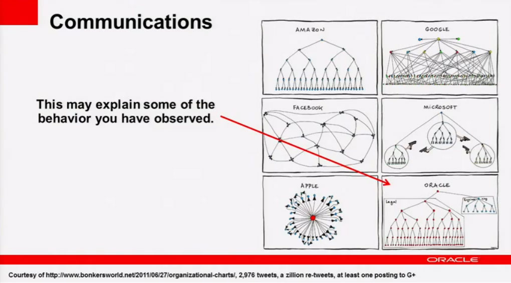
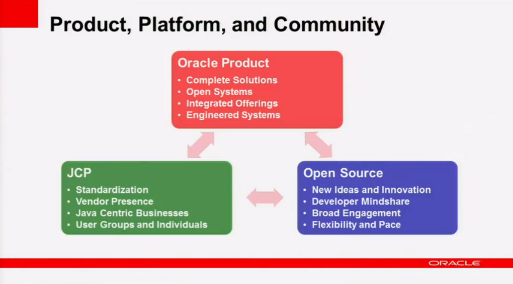
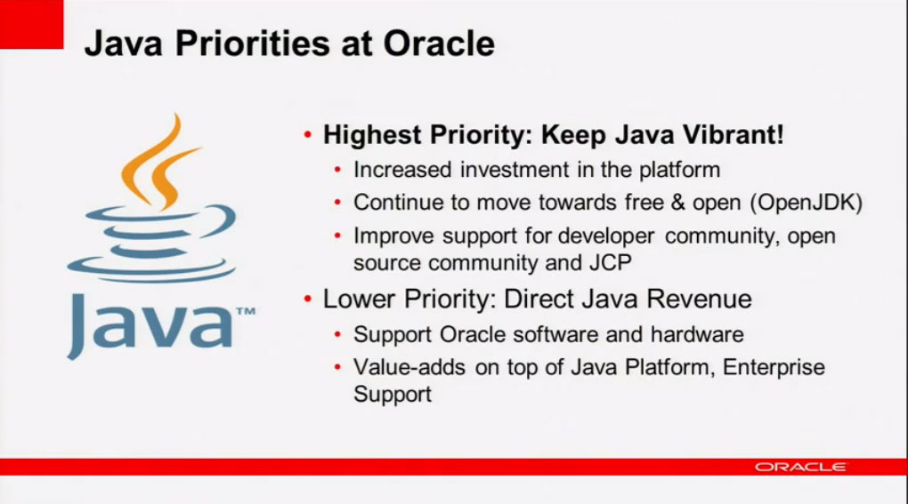

<a href="http://www.oscon.com/oscon2011" target="_blank">OSCON 2011</a> is going on at the moment. One of the conferences I would have loved to visit. This did not work out this year, but today I stumbled upon a video of Steven G. Harris Java Keynote there. The title is a theme we had back in the <a href="http://blog.eisele.net/2009/10/oracle-updates-sun-merger-faq.html">days of the beginning merger</a>. Everybody thought about Oracle and the way they handle or let's say make money of open source. Back than it was:
 <quote>
 "We are also strong believers in open source and actively participate in numerous communities supporting open source development." (
 <a href="http://blog.eisele.net/2009/10/mike-lehmann-on-weblogic-jee6-and-open.html">M.Lehmann</a>)
  
</quote> Read: We are here, but we don't want to say, that we basically don't have a business model with open source. We are simply using it as part of our products. I believe Oracle was afraid of telling the truth. Even if the truth isn't too bad at all. In direct comparison to former Sun Microsystems, Oracle is and always has been focused on customer solutions and products. They never had the goal to "sell open source" (<a href="http://news.cnet.com/8301-13505_3-9757417-16.html" target="_blank">J.Schwartz</a>) as part of their business model. And that clearly is the reason for Oracle being successful. And Sun not. 
 
 With this keynote, Steven touched the most interesting parts about interaction and integration of the OSS community into Oracle's organisation and strategy. And to me, this was the most open, honest and complete presentation I have seen on that topic from an Oracle VP.
 
 <b>What drives Open Source at Oracle</b>
 
 The most exciting part of the presentation was the part about Open Source decisions made at Oracle. Steven explained, that they are driven by Oracle's Lines of Business. 
 
 

 

 And this is relevant to the behavior we observe looking in. At Oracle LoB make decisions around these open source projects. Those are Oracle decisions executing within that overall complete, integrated kind of strategy. In contrast to Sun, they are not driven by a larger scale open source strategy. So the separate LoB don't talk too much to each other if they are thinking about doing new features.
 
 <b>Communication</b>
 
 Steven also picked up a cartoon floating around the internet since a few weeks. And wow. I was surprised about his interpretation and openness in general.
 
 

 

 According to him, communication at Oracle has&nbsp;traditionally&nbsp;been very structured.
 <quote>
 "We&nbsp;definitely&nbsp;have some challenges in learning how to communicate and work with the open source community." (Steven G. Harris)
</quote>
 
 But he told us, that the organization shown in the cartoon is not like Oracle :) And he promised that the communication with the community IS getting better! And it will continue to get better with the input they get back from the community.
 <quote>
  
</quote>
 <quote>
 "Our goal is, that our Open Source developers should behave like Open Source developers. They should communicate with the community, transparently, openly and so on." (Steven G.Harris)
</quote>
 
 <quote>
 "We’re not where we should be, but it has gotten better and it will get better. ” (Steven G.Harris)
  
</quote>
 
 <b>Oracle's Products and the OSS Community</b>
 
 He also gave a very high level introduction about how the Java community relates to the overall product strategy.
 
 Given the following slide it's obvious, that Java is important to Oracle's products.&nbsp;The OSS community is incredibly important to Java at all.
 
 

 

 For that strategy to succeed; Java has to succeed.&nbsp;Oracle prioritize&nbsp;these areas because it helps to grow their business.
 
 But let me make a break here. This is the slide, I am least happy with. There is one point that should be changed in my personal&nbsp;opinion. This little red arrow down from Oracle to the JCP scares me. If this is meant to be the arrow for "being the steward and running the JCP": I am fine. If this means: "We are driving specifications to fit our needs."; We need to talk. As a major user of the Java ecosystem Oracle has any right to contribute to specifications and standards. But there is still the little yellow warning light blinking if I see potential Oracle solutions within the industry standard. So, I would prefer some truly independent architecture board to guard the specs.
 
 <b>Java Priorities at Oracle</b>
 
 "We are a profit-making entity. [...] We do not apologize for this at all [...] but this isn't our highest priority [...] relative to Java." (Steven G. Harris)
 
 

 

 <b>The complete Keynote</b>
 
 The JavaSource blog also has a <a href="http://blogs.oracle.com/java/entry/open_source_java_and_oracle1" target="_blank">very short cover of this keynote</a>.
 
 Find the complete keynote on Youtube. The pictures of slides are taken from this video and are probably (C) by Oracle.
 <iframe allowfullscreen frameborder="0" height="311" src="http://www.youtube.com/embed/CDlsJF52iKY" width="495"></iframe>