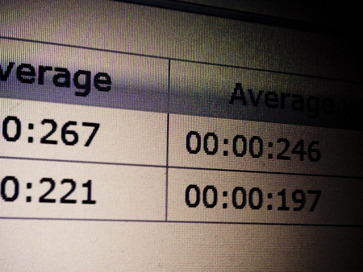

We all do software development for a living. And we most often hit the day where we have our latest project up and running and the first customers using it. Not a big surprise, that something goes wrong. Has never been tested or is slow in general. The best prevention for this is to design some kind of monitoring into your application. 
 

 

 And it's not meant as a simple infrastructure monitoring but as a basic part of your development. Why? Because most of the time you will find users complaining about function x or y is slow. You will never be able to answer to this complaint without knowing about the real duration in your code. This is the right stuff to implement as a cross cutting concern. So the right place to put all this would be an interceptor. This longer article is walking you through the basic ideas and concepts. You can have a look at the complete sources by downloading them (see below). Let's go.
 
 <b>Basic Idea</b>
 
 Beside the performance information you most often also need some kind of general production logging. So we are in need of some special @Logged and @Timed annotations which should handle this for us. Further on, we are not simply going to monitor any single method but only the ones we need. The output should go to a database because we do not have access to our logfiles for different reasons. Applied to a local bean this should look like this:
 <code> 
  package net.eisele.service; 
  ... 
  @Stateless 
  @LocalBean <b> @Logged</b> 
  public class BusinessBean \{ 
  ... <b> @Timed(Task.SOME_FANCY_METHOD)</b> 
  public String businessMethodTakingTime() \{ 
  ...\} 
  .. 
  \} </code>
 
 We need a couple of statistic information. The report should look similar to this one. Containing the total invocation count, the average execution time in min:sec:milisec, peak times, the average without peak, last execution time and a accumulated total execution time.
 
 

 

 <b>The Datamodel and Access to it.</b>
 
 Let's start with your favorite IDE and add a Java EE 6 Web Project. That should be sufficient.&nbsp;Let's add a base package (e.g. net.eisele.statistics) to your source packages and create a&nbsp;TaskStatistic entity in a sub package called "store". Now add all the attributes defined in the table (compare screenshot). And add an empty public constructor and a constructor with&nbsp;String description, String hostname, long timeMillis attributes. It should also have a nice little NameQuery which should bring up all Tasks by description (which is in fact the PK here)
 <code> 
  @NamedQuery(name = "TaskStatistic.BY_DESCRIPTION", query = "select t from TaskStatistic t where t.description = :description") </code>
 
 If you IDE did not ask you weather it should create a persistence.xml for you. Do it yourself.&nbsp;Transaction-type needs to be set to"JTA". It should reference a&nbsp;jta-data-source (e.g.&nbsp;jdbc/statistics) which should exist with your application server of choice, too. As a supporting actor we need the Task enum. It contains all the needed keys (Description) for the methods you are going to monitor. This is also a good place to put the hostname resolution:
 <code> 
  public enum Task \{  
  SOME_FANCY_METHOD("some fancy method"); 
  ... 
  try \{ 
  hostname = java.net.InetAddress.getLocalHost().getHostName(); 
  \} catch (UnknownHostException e) \{ 
  hostname = "N/A"; 
  \} </code>
 
 Now we reuse the simple <a href="http://kenai.com/projects/javaee-patterns/sources/hg/content/DAOPattern/src/java/com/abien/patterns/business/crud/CrudService.java?rev=249" target="_blank">CrudService </a>from Adam Biens Java EE 5 pattern. And also put it into the store package. Another small addition here: I created a little utility class assisting me with the timing stuff. A StopWatch cat start, stop, reset and get the elapsed time. 
 
 <b>Sending Monitoring Events</b>
 
 I would love to have some kind of events being fired and processed by a separate handler for every call we should log. Let's start by implementing the MonitorEvent with it's payload (a Task and the elapsedTime). Now we need a MonitorMessenger which can start a Task and send the event in it's finished method. To do this, it needs to have the MonitorEvent injected.
 <code> 
  @Named 
  @Stateless 
  public class MonitorMessenger \{  
  @Inject 
  Event<monitorevent>
  events;
   
   ...
   
   
   public void finish() \{
   
   events.fire(new MonitorEvent(task, watch.getElapsedTimeMilli()));
   
   \}
   
   \}
   
 </monitorevent></code>
 
 If the sender is in place you need to take care for the receiver. Implement a simple MonitorService which gets the @Observes MonitorEvent method. It should be @Asynchronous to be a little more responsive if the Database experiences any delays.
 <code> 
  @Stateless 
  @TransactionAttribute(TransactionAttributeType.REQUIRES_NEW) 
  public class MonitorService \{ 
  ... 
  @Asynchronous 
  public void listenToMonitorEvent(@Observes MonitorEvent monitorEvent) \{ 
  ... 
  \} </code>
 
 All left to do now is to add the logic for persisting the collected statistics. Inject the @EJB CrudService and check if there is an existing entry for the PK with your DB. If not, create a new TaskStatistic entity and do an update on it. But what about all the "average" stuff we have in the table? That's easy. Add a little update(long time) method to your TaskStatistic and let it do the job before updating.
 <code> 
  public void update(long time) \{ 
  lastTimeMillis = time; 
  synchronized (this) \{ 
  totalTimeMillis += time; 
  averageTimeMillis = totalTimeMillis / ++count; 
  if (peakTimeMillis &lt; time) \{ peakTimeMillis = time; peakDate = System.currentTimeMillis(); \} if (minTimeMillis &gt; time) \{ 
  minTimeMillis = time; 
  \} 
  if (count &gt;= 2) \{ 
  averageTimeWithoutPeak = (totalTimeMillis - peakTimeMillis) / (count - 1); 
  \} 
  \} 
  \} </code>
 
 <b>The Interceptors</b>
 
 The only thing left to do now is to implement the custom interceptors. A lot has been written about interceptors and CDI. If you start using it, you will get into trouble. A couple of things are still very bumpy and you need to make your way through. Ok.We'll try. Add an empty beans.xml to your WEB-INF folder. Add three interfaces to a subpackage called interceptors. We need: The Logged annotation:
 <code> 
  @InterceptorBinding 
  @Target(\{TYPE\}) 
  @Retention(RetentionPolicy.RUNTIME) 
  public @interface Logged \{ 
  \} </code>
 
 the Timed annotation:
 <code> 
  @Retention(RUNTIME) 
  @Target(\{METHOD\}) 
  public @interface Timed \{ 
  Task value(); 
  \} </code>
 
 Only thing missing is the glue in between. The
 <code> 
  @Logged 
  @Interceptor 
  public class LogInterceptor \{ 
  @EJB 
  MonitorMessenger messenger; 
  ... 
  \} </code>
 
 Within it's 
 <code> 
  @AroundInvoke 
  public Object intercept(InvocationContext invocation) throws Exception \{ 
  ...\} </code>
 
 method you get a hand on the Task and you can start the timer with the help of the messenger.start(task). If everything is done, simply call messenger.finish().
 
 Perfect. That's it. Now you can start collecting your runtime stats. There is some more stuff to do: Put your TaskStatistic.ALL results to the frontend and display a nice table. Primefaces is useful here. You could also think about doing some charts ... There is always room for improvement!
 
 Find those stuff in the NetBeans project attached. Hope, that was helpful. Let me know what you think! 
 
 <b>The sources</b>
 <a href="http://www.eisele.net/jar/statistics.zip">Download the complete NetBeans project</a> if you like. Don't forget to add a local Glassfish 3.x server as a Service and change your Database settings with the glassfish-resources.xml file!
 
 