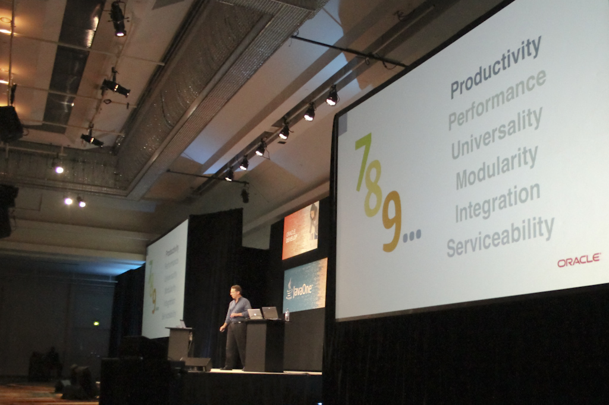

A short information for my German readers. A new article series of mine started at heise developer channel. This is all about Java 7 and it's new features. Some might think, this is a good&nbsp;timing&nbsp;:) it is :)
 
 Read through it: It's free and available online <a href="http://heise.de/-1274360" target="_blank">http://heise.de/-1274360</a>
 
 btw: I even did the picture myself at last years JavaOne! :) I'm proud!
 
 

 

