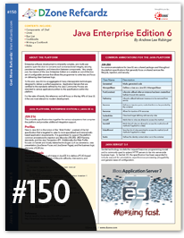

Not everywhere is summer slump. The JBoss guys are hard at work (as always) and Andrew Lee Rubinder (<a href="" target="_blank">@ALRubinger</a>) published a new Java EE 6 DZone Refcard today. It's your quick and handy guide which provides a short intro about the Platform, Common Annotations For Java, Java Servelet 3.0, JavaServer Faces 2.0 and Enterprise JavaBeans 3. 

 

 You can get your copy <a href="http://refcardz.dzone.com/refcardz/java-enterprise-edition-6-most">directly from DZone</a>. It's free to view online and you can download your personal PDF (2,51 MB) free of charge, if you have a DZone account. 
 
 <a href="" target="_blank">DZone Refcards</a> are free Cheat Sheets for Developers which save you time and guarantees that you stay well-informed. They are written by bestselling authors and leading experts and provide reliable information on major developer topics.Filled with useful tips and source code examples the downloadable PDFs look great on-screen or printed from your printer. 
 
 
 Andrew Lee Rubinger is an Open Source Software Engineer and Author. Most of you will know him for his book <a href="http://oreilly.com/catalog/9780596158033" target="_blank">“Enterprise JavaBeans 3.1"</a> from O’Reilly Media. But he is also a Member of the JBoss Application Server development team and technical lead of the ShrinkWrap project.