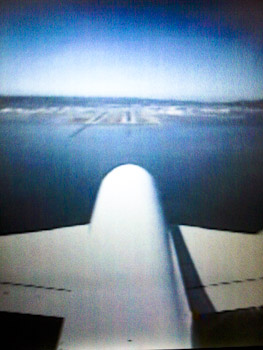

As every year in September it finally is time for a series of blog posts about the happenings in San Francisco. September is the Oracle month. Beside the big Oracle Open World we also have the little sister Oracle Develop and finally the no 1 Java happening JavaOne going on in California. Three reasons to pack your stuff and visit the states. 
 
 <b>A380 - Lufthansa's big bird</b>
 

 

 And that is what I am doing these days. First highlight of my trip was the <a href="">A380</a>. Lufthansa's newest family member with roughly 510 tons start weight and 80m wingspread and 835qm wing surface took me from FRA directly to SFO. As you can see on the right, they have some nice external cameras to capture the surroundings. That's a good reason to introduce this years <a href="">flickr photoset</a> which is going to be filled during the next few days.
 
 <b>ACED Briefing</b>
 
 You may ask, why am I here already? Good question. The conferences start on Sunday with a lot of User Group stuff. But as usual we have a two day pre conference briefing at the Oracle HQ to get the latest news and some confidential additional information beforehand. Exciting as every year we are joined by some big names! Thomas Kurian, Executive Vice President, Product Development will give the opening address, Ted Farrell, Chief Architect and Sr. Vice President will talk about Oracle Development Tools, Mark Townsend himself, Vice President Database Product Management is going to provide the latest in Database updates. My highlights will be WebLogic/GlassFish/EE 7 update by Mike Lehmann, Sr. Director of Product Management and Wim Coekaerts, Sr. Vice President, Linux and Virtualization. Further on some ACED will also present about what they are doing and I am really looking forward to some open and informative discussions. As you might guess, these two days are packed with information and stressful. And the worst part: Some of the stuff we will here is presented under NDA (at least until Monday), so I probably have to delay some information a bit.
 
 <b>Thank you OTN!</b>
 
 What seems to be normal and usual: It is not. The OTN Team is doing a great effort to put those two briefing days together to get their ACED exclusively updated. This is something we all do appreciate and a big "Thank you!" goes out to Justin, Vikki and Lillian and another one to the "big names" on our agenda. Without their ongoing support for the ACE Program and the complete, open and integrated discussions they support every single ACED a lot! &nbsp;I am looking forward to some great days in SFO and I am excited to meet soooo many people in person I used to catch up online only! The&nbsp;upcoming&nbsp;week will rock!