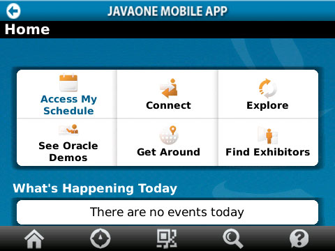
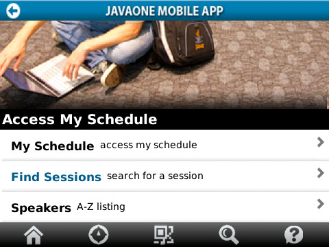
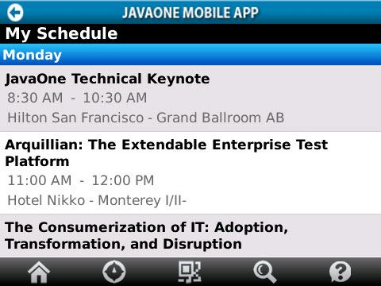
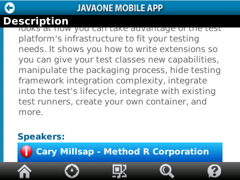
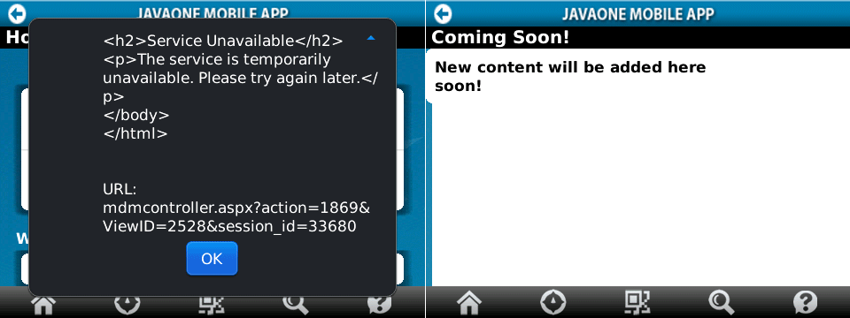

JavaOne is coming closer day by day. Another proof of that is, that the official Mobile App for JavaOne was launched yesterday. Great news! Let's rock&amp;roll. It's available from <a href="http://hosting.pyxismobile.com/javaone/deploy/JavaOne2011.aspx" target="_blank">pyxismobile.com</a>. You can download a <a href="http://appworld.blackberry.com/webstore/content/54225?lang=en">BlackBerry version</a> (&gt;=OS 5.0), an <a href="https://market.android.com/details?id=com.pyxismobile.JavaOne.ui.activity&amp;feature=search_result">Android version</a> (&gt;= OS 2.0.1) or even an <a href="http://itunes.apple.com/us/app/javaone-2011/id455404947?ls=1&amp;mt=8">iPhone, iPod version</a> (&gt;= iOS 4.0). 
 

 

 You can access Schedule Builder, exhibitor listings, daily updates, Oracle demos, bus routes. Here are the first impressions installing and using it. It looks quite&nbsp;consistent&nbsp;running on different devices. Installing on both iOS and BlackBerry is smoothly and you can download the version from the known app stores. What is true for the iOS version is, that there is no dedicated iPad version. You have to use the small keyboard and can't take advantage from your big touch screen. Overall feeling is, that it works quite smoothly (at least on the tested OS).
 
 <b>iPad</b>
 
 As you are used to, you can install the app via iTunes. It's free and you simply install the 7.6 MB application. What's weird is, that the application is authored and provided by&nbsp;Pyxis Mobile. So, if you search for Oracle you are probably working into the wrong direction.
 
 <b>BlackBerry</b>
 
 The BlackBerry version on my 9700 was installed quickly and loads in quite some seconds. It has a file size of 1.3 MB. It looks nearly the same like the iOS version. 
 <b> </b>
 <b>Home Screen</b>
 

 

 The home screen is well-arranged and the most important part, the schedule, is the prominent application. From a usability point of view I don't like the light blue "active" color. I believe this works as long as you are in a dark office, but you will not know what you are selecting if you are standing in the&nbsp;California sun&nbsp;right in front of any of the conference hotels.
 
 <b>Submenu</b>
 

 

 Every section has something like a submenu. Those submenus are a bit more&nbsp;navigable. Beside the too big headline picture, you have a scroll listing of all available functions. Again the&nbsp;highlighting with light blue doesn't work for me. &nbsp;If you scroll down to the very bottom the bottom&nbsp;menu&nbsp;expands a bit and you get a description for every icon located there. They basically guide you to every top level menu point.
 
 <b>Session Listing</b>
 

 

 The schedule screen is clear and the&nbsp;highlighting&nbsp;here works very good. You can scroll down. Initially this contains all general sessions and keynotes. If you add something to or change your personal schedule (see <a href="https://oracleus.wingateweb.com/scheduler/login.jsp">online schedule builder</a>) you can&nbsp;directly access your changed session listing by simply re-opening the "My Schedule" dialog. This works without problems in the recent version.
 
 <b>Session Details</b>
 

 

 If you look at the session details you get a brief description of the content and see the location. The version I downloaded yesterday does mix up some things with the speaker listing. For now it seems as if the complete speaker list is shown below every single session. The fact that you can&nbsp;highlight&nbsp;the speakers let's you think, that you could select a single one and get more information. That's wrong. You can (as of today) simply scroll down. No further information is given.
 <b> 
 Errors and improvements&nbsp;</b>
 
 As usual with 1.0 releases you have some blank lines and errors around. The basic maps integration isn't there now. some other stuff also is not available at the moment and it seems as if we will get some more updates in the future. What I do like is the fact, that we have some very wordy error messages. I honestly hope this error didn't came from a too high server load.
 
 
 

 

 
 My experiences with the session search are very diverse. Sometimes the results differ from the&nbsp;web based&nbsp;schedule builder and session finder within the apps. Last night the iOS app didn't present a single result. Today the BlackBerry is faster and better than the web based schedule builder. Even searches within days seem to provide differently ordered lists. That looks like an area to improve on.
 
 <b>Better than last year</b>
 
 What I really like is that Oracle did take care and published the apps before the actual conferences are happening. Generally the apps seems to be a bit more mature. Maybe this basically because of the fact that they hired a company which is using the pyxis platform which seems to <a href="">provide a complete framework</a>.
 
 <b>Missed&nbsp;Opportunities</b>
 
 A couple of things are missing. Here is a brief list of things I would like to see within the apps:
 
 <i>0) Gather User Feedback&nbsp;</i>
 
 I don't know why. Most of the mobile business do this day by day. They integrate any kind of feedback functionality into their applications. Why the hell, don't you do this? If you are rolling out in an "agile" manner (a.k.a letting users test the application) you should be open to feedback. Provide at last an email address people can contact. Or integrate a feedback form which pushes into a bug tracker.
 
 <i>1) Speaker information (Name, Bio, Twitter)</i>
 
 What I need is more information about the speakers. Beside the fact that they have a name you should try to get as much information from them as possible. Homepage, Twitter handle, blog, whatever is out there and known. I want to have this at hand, too.
 
 <i>2) Social Media Integration for sessions</i>
 
 The year before last year we had a cool feature. You could twitter about every session with a unique hashtag. There are official twitter apps on every targeted device. Why don't we have a twitter integration for it? Accessing the session information and live twittering about the session from the same app. Awesome! That's what I want to have. And I also want to see the hastag pre-filtered content stream of the ongoing session within the app!
 
 
 3) Find your way to your session
 
 Guys ... I'm one of the lucky attendees knowing where to go. I've been there. Done that. But what about first timer? You know where they should go according to their schedule. Guide them there.
 
 <i>4) Detailed information integration</i>
 
 There is more to tell about the sessions than simply the location, the speaker listing and a brief description, right? What about supporting papers? Presentation download? Link to the online schedule builder? I want all that! Period.
 
 <i>5) Location awareness</i>
 
 I want to&nbsp;check-in&nbsp;at sessions. With foursquare. Or at last with facebook. Don't those guys provide APIs to use? If I have a session in my schedule: please give me the option to link my fsq and fcb profiles to simply check-in where I am! All my friends are using one of those services and if you let me check-in with them, I am not only happy but I also know where all the other cool kids are!
 
 Another great time-saver would be to have floor plans of all the big hotels around.
 
 <i>6) Calendar integration</i>
 
 Why don't you integration with the native calendars? It would be a breeze putting today's schedule in my calendar. And doing this you could also add some hints how long it would take to move from one session to the other. Running over from Moscone to Nikko isn't done in seconds (except you are running @arungupta :-D).