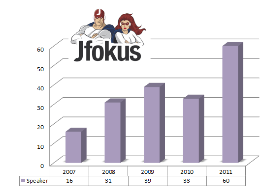

It's been some time since I published a post in my data analysis series. Following <a href="http://blog.eisele.net/2011/06/w-jax-some-data-analysis-about-speakers.html">WJAX </a>and <a href="http://blog.eisele.net/2011/06/devoxx-some-more-data-analysis-about.html">Devoxx </a>it's finally time to look at Jfokus. As usual, this was compiled from the sources available (compare links at the end of the post). &nbsp;The <a href="http://www.jfokus.se/jfokus/proposals.jsp?lang=en" target="_blank">CfP for Jfokus 2012</a> is open until October 1st. 
 
 <b>General Information</b>
 

 

<a href="http://www.jfokus.se/jfokus/?lang=en" target="_blank">Jfokus</a> is the largest annual conference for software developers held in Stockholm, Sweden. The focus is system development with Java and surrounding techniques like Scala, Groovy and other dynamic languages. Jfokus also covers Android, HTML5, Cloud and agile methodologies. Attendees travel to Jfokus from most countries in Europe and a few from the rest of the world. During three days in mid February, you will have an great opportunity to keep yourself updated with the latest development through numerous interesting sessions. Jfokus is the best way for you to get the latest trends and buzz from people who live and breathe technology.
 
 <b>Speaker Distribution</b>
 
 Let's start with a look at the general distribution of the speakers over the years: 
 
 Compared to Devoxx and WJAX this is probably the smallest conference in terms of attending speakers. Even in the nearer past they still don't reach the maximum of the other two. 
 
<table align="center" cellpadding="0" cellspacing="0" class="tr-caption-container" style="margin-left: auto; margin-right: auto; text-align: center;">
 <tbody>
  <tr>
   <td style="text-align: center;"></td>
  </tr>
  <tr>
   <td class="tr-caption" style="text-align: center;">The plain numbers per year</td>
  </tr>
 </tbody>
</table>
 <b>Top 10 - always on</b>
 
 The most interesting part in this analysis are the top 10 speakers. As you might remember, this was the true reason to start looking at the speakers of different conferences. I don't want to see the same people speaking over and over again. So let's look at how Jfokus handles this:
 
 To be honest, there is not a single speaker who has attended all five Jfokus from the past. A single 4-timer is Erik Hellman (SonyEricsson). He has attended every Jfokus as a speaker except the 2010 one. Next to this you only find the ones attending three different Jfokus conferences:
 
 
 Dan Bergh Johnsson
 
 Henrik Kniberg
 
 Jonas Bonér
 
 Kirk Pepperdine
 
 Martin Gunnarsson
 
 Pär Sikö
 
 Patrik Fredriksson
 
 Thorbiörn Fritzon
 
 <b>One or two-Timer</b>
 
 What is true for the top speaker is also true for the general distribution of the speakers. Compared with both <a href="http://blog.eisele.net/2011/06/devoxx-some-more-data-analysis-about.html">Devoxx </a>(19%) and <a href="http://blog.eisele.net/2011/06/w-jax-some-data-analysis-about-speakers.html">WJAX </a>(25%) there is an awesome small amount of returning speakers at 7%. If you are looking for fresh faces you probably have found the conference to attend.
 
<table align="center" cellpadding="0" cellspacing="0" class="tr-caption-container" style="margin-left: auto; margin-right: auto; text-align: center;">
 <tbody>
  <tr>
   <td style="text-align: center;"></td>
  </tr>
  <tr>
   <td class="tr-caption" style="text-align: center;">Complete speaker distribution 2007-2011</td>
  </tr>
 </tbody>
</table> And this seems not to be an accident. Compared with a very stable high rate of returning speakers at other conferences I looked at, you can follow this pattern nearly since the beginning: 
 
<table align="center" cellpadding="0" cellspacing="0" class="tr-caption-container" style="margin-left: auto; margin-right: auto; text-align: center;">
 <tbody>
  <tr>
   <td style="text-align: center;"></td>
  </tr>
  <tr>
   <td class="tr-caption" style="text-align: center;">Breakdown by years</td>
  </tr>
 </tbody>
</table>
 <b>Conclusion</b>
 
 This seems to be a fresh conference. Very few returning speaker and always new topics to listen too. This isn't obvious from the plain numbers of course. You could also argue, it must be a bad conference for speakers. But looking at the speaker names attending year after year it's quite obvious that this is not true. Some of them clearly wouldn't attend a small and badly organized conference. So this is anything but an accident. Let's speculate, that this is&nbsp;volitional and there to embrace change and new topics. A very brave decision.
 
 <b>Links</b>
 <a href="http://www.jfokus.se/jfokus07/speakers.html" target="_blank">Jfokus Speaker Listing 07</a>
 <a href="http://www.jfokus.se/jfokus08/speakers.html" target="_blank">Jfokus Speaker Listing 08</a>
 <a href="http://www.jfokus.se/jfokus09/speakers.html" target="_blank">Jfokus Speaker Listing 09</a>
 <a href="http://www.jfokus.se/jfokus10/speakers.html" target="_blank">Jfokus Speaker Listing 10</a>
 <a href="http://www.jfokus.se/jfokus11/speakers.html#page=page-1" target="_blank">Jfokus Speaker Listing 11</a>
 
 Thanks to <a href="" target="_blank">@matkar</a> for providing some additional information and logos!