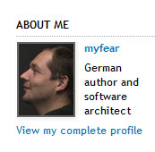
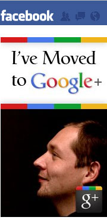
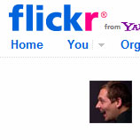
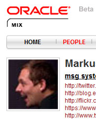

WARNING: This is a personal post about nothing real Java related. If you don't like it, I apologize and I promise that this is not going to happen more frequent than it already did over the past few years. All others are welcome to read about me, myself and myfear. My personal brand.
 
 <b>Why have you written this post?</b>
 
 Time is moving very fast these days. Many things happen and make me think. Different reasons for that. Children growing up quicker every day. Too less time with family in general. You name it. If you are in this special kind of mood, you start thinking about stuff you do each day. This happened to me a few days ago. A new article/interview about my latest project was published and I was happy to be among the first ones to get the printed issue. It is a single page with a huge headline and an image: Showing my silhouette. You should also know it. There is hardly any other picture of me around than that.
 
 Why the hell I am spreading the same picture over and over into the world. That was the question, which made me start this post. Here are my thoughts and answers.
 
 
<table cellpadding="0" cellspacing="0" class="tr-caption-container" style="float: right; margin-left: 1em; text-align: right;">
 <tbody>
  <tr>
   <td style="text-align: center;"></td>
  </tr>
  <tr>
   <td class="tr-caption" style="text-align: center;">(Source: MeSsaGe, internal msg newspaper)</td>
  </tr>
 </tbody>
</table><b>Which story do faces tell you?</b>
 
 Have you ever realized which impact looking at pictures of (happy) faces has on your feelings or emotions? What about adverts? Which ones do you like most? If you think about it and even try to remember how advertising was back in the days, you see, that it was all about being "on-message" and getting talking points right. This has changed heavily. Primarily because of the latest brain science breakthroughs which confirmed what you might feel, too.&nbsp;People are primarily emotional decision-makers. If you look at the publications about&nbsp;21st-century advertising (e.g. About Face: The Secrets of Emotionally Effective Advertising, <a href="http://www.amazon.com/About-Face-Emotionally-Effective-Advertising/dp/0749457570">Amazon</a>) you find some simple rules to follow:
 
 If you are going to sell something, you should:
 
 - Keep it simple
 
 - Make it relevant
 
 - Be memorable
 
 - Focus on faces
 
 - Always sell hope
 
 - Don’t lead with price
 
 &nbsp;(Source: Dan Hill, Ph.D. <a href="http://www.amazon.com/About-Face-Emotionally-Effective-Advertising/dp/0749457570">About Face: The Secrets of Emotionally Effective Advertising</a>) 
 
 <b>But, stop: Are you selling yourself?</b>
 
 No. Not really. True. I'm employed and this is not going to change shortly, hopefully. But what I am doing is, that I am trying to be "the one", consistent and helpful person. Not only in real life but also with my online identity. You might call this&nbsp;<a href="http://en.wikipedia.org/wiki/Personal_branding">personal branding</a> if you like. But for me this is not about branding like a product or even selling but about trying to transport as much of what I am trying to be in real live through the very restricted possibilities of online channels. So, even if some of my personal contacts do find this very boring you will find the same Markus in all channels I am contributing to. The same topics. And only slightly modified versions of the same picture.
 
 <b>Myfear&nbsp;</b>
 
 Some people don't stop asking me about "myfear". Well. That could be a longer story. I'll try to make it short. It all started with my first internet baby steps. That was the time back, when all we had was IRC and email and <a href="http://en.wikipedia.org/wiki/Netscape">Netscape</a> Navigator &lt;=3. And I was young and looking for topics to address. The idea was (surprise) to make money out of it. Sooner or later. And so I was looking for topics and names. All others were taken. Myfear was left. That was the first kind of "logo" done by the wonderful creative <a href="" target="_blank">Friedhelm Fischer</a> (who was the owner of <a href="" target="_blank">fischer-cgd.de</a> back in these days):
 
 

 

 
 As you already know. There isn't something like a brand "myfear". All that is left from the former dreams and ideas is my nickname.
 
 <quote>
 <b> “We cannot change our past. We can not change the fact that people act in a certain way. We can not change the inevitable. The only thing we can do is play on the one string we have, and that is our attitude.”</b>
  
 <i>Charles R. Swindoll (American Writer and Clergyman, b.1934)</i>
  
</quote>
 
 <b>Google, Facebook, Twitter and the others</b>
 
 And for your reference here are my different online versions of the&nbsp;silhouette you know:
 
        