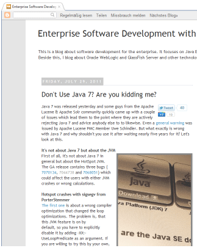

What a month for Java 7. Articles about the new features all over and just at the <a href="http://blogs.oracle.com/javase/entry/java_7_has_released">release day</a>, <a href="http://www.gossamer-threads.com/lists/lucene/java-user/131387" target="_blank">Apache issued a warning</a>, not to use Java. That's a big meal for the press and German based S&amp;S Media caught up on that quickly (<a href="http://jaxenter.com/java-7-causes-headaches-for-lucene-and-solr-users-37195.html" target="_blank">Java 7 Causes Headaches for Lucene and Solr Users</a>). 
 

 

 And even my <a href="http://blog.eisele.net/2011/07/dont-use-java-7-are-you-kidding-me.html">2c</a> have been <a href="http://it-republik.de/jaxenter/artikel/JDK7-Bugs-im-Fokus-Ich-gehe-davon-aus-dass-aktuell-nicht-viele-Anwender-betroffen-sein-werden-3982.html" target="_blank">published (German)</a>. Nearly one month after the initial report, everything is back to normal. Mostly because of the fact, that the mentioned bugs ( <a href="http://bugs.sun.com/bugdatabase/view_bug.do?bug_id=7070134" target="_blank">7070134</a>, <a href="http://bugs.sun.com/bugdatabase/view_bug.do?bug_id=7044738" target="_blank">7044738 </a>and <a href="http://bugs.sun.com/bugdatabase/view_bug.do?bug_id=7068051" target="_blank">7068051</a>) are fixed with the latest jdk7u2-b04 (<a href="http://download.java.net/jdk7u2/changes/jdk7u2-b04.html" target="_blank">Changes</a>, <a href="http://jdk7.java.net/archive/7u2-b04.html" target="_blank">Download</a>). And further on, there is another build b05 available since 31-Aug-2011 (<a href="http://download.java.net/jdk7u2/changes/jdk7u2-b05.html" target="_blank">Changes</a>, <a href="http://jdk7.java.net/archive/7u2-b05.html" target="_blank">Download</a>). 
 
 <b>Thoughts</b>
 
 A lot has been talked about weather it was appropriate. The process. The communication. Letting an "old" build become GA. You probably followed the buzz around it and I am not going to repeat it here. I strongly believe, that everybody involved did make some mistakes. The bugs should probably have been caught by a testcase (which obviously wasn't the case). The Apache community should probably have acted different with communication. Oracle should have done this differently, too. But, at the end of the day the results speak for themselves. The bugs are fixed. If you look at the table below you can see when this actually was the case. And the bleeding-edge Apache Lucene/Solr users are save again. And last but not least, we have the <a href="" target="_blank">JDK 7 Updates Project</a> where everybody "stubborn enough to dig into it can make a fix" on either JDK7 or JDK8. (For further details compare <a href="http://robilad.livejournal.com/87097.html" target="_blank">dalibor topics post</a> on that). The only thing I am missing after all those exciting days is the revocation of the general warning. Hey, <a href="http://twitter.com/thetaph1" target="_blank">Uwe</a>: That should be your part, right? Missed that? Or was it intentionally? ;) 
 
 <b>What can you do to prevent future bugs?</b>
 
 Test. Test. Test. As with any software or product. And let Oracle know about "bugs that bug you". Help testing early access builds, follow the JDK7 project and report issues you find to the bug tracker. <b>Use Java 7 to make it better! I am not kidding!</b>
 
 <b>The changesets and bugs in detail</b>
 
<table border="1">
 <tbody>
  <tr>
   <td>Date</td>
   <td>Changeset</td>
   <td>Bug</td>
   <td>Desc</td>
  </tr>
  <tr>
   <td>Tue Jul 26 19:35:23 2011</td>
   <td width="10%"><a href="http://hg.openjdk.java.net/jdk7u/jdk7u/hotspot/rev/4e761e7e6e12" target="_blank">4e761e7e6e12</a></td>
   <td width="7%"><a href="http://bugs.sun.com/bugdatabase/view_bug.do?bug_id=7070134" target="_blank">7070134</a></td>
   <td>Hotspot crashes with sigsegv from PorterStemmer</td>
  </tr>
  <tr>
   <td>Tue Jun 28 15:24:29 2011</td>
   <td width="10%"><a href="http://hg.openjdk.java.net/jdk7u/jdk7u/hotspot/rev/e3cbc9ddd434" target="_blank">e3cbc9ddd434</a></td>
   <td width="7%"><a href="http://bugs.sun.com/bugdatabase/view_bug.do?bug_id=7044738" target="_blank">7044738</a></td>
   <td>Loop unroll optimization causes incorrect result</td>
  </tr>
  <tr>
   <td>Fri Jul 29 09:16:29 2011</td>
   <td width="10%"><a href="http://hg.openjdk.java.net/jdk7u/jdk7u/hotspot/rev/c96c3eb1efae" target="_blank">c96c3eb1efae</a></td>
   <td width="7%"><a href="http://bugs.sun.com/bugdatabase/view_bug.do?bug_id=7068051" target="_blank">7068051</a></td>
   <td>SIGSEGV in PhaseIdealLoop::build_loop_late_post</td>
  </tr>
 </tbody>
</table>