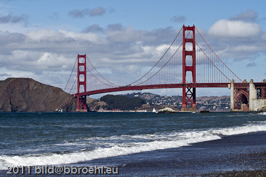

After a couple of days packed with information today was my day off. Together with Björn, we took a car and did some sightseeing and errands. The best part is, that you get to see a lot of stuff, if you have somebody at your site with enough SF&nbsp;experiences. Even if I am an alumni and have seen a lot in the past few years, Björn is an awesome guide. And he is brave enough to drive a rental car through this insanity called traffic.
 
 
 A must see spot is the Golden Gate. You have seen a lot of pictures of here before and if you are standing right on or next to it, you are thinking about how those guys took those awesome pictures. I can tell you: There is a lot to do to find out. There are nice beaches and hills around and you have to drive around a bit to find the right angle for your picture.
 
 

 

 
 If that is done, you can spend hours watching the clouds change their face and direction, looking at the different lightning options and further and further. To make it short: It was a wonderful day.
 
 

 

 
 With a lot of pictures taken. I am going to upload this stuff tomorrow to my <a href="">flickr account</a> and you can judge for yourself.
 
 
 Having brought back the car, it finally was time to register for JavaOne and OpenWorld. As usual I have the pleasure to have a Blogger Pass. This basically brings you in to any separate location and you have some other really small stuff at hand to guide a professional writer through this hugh event. All this was crowned by a nice dinner with the German DOAG Team at the <a href="http://www.lamarcebicheria.com/web/intro.php">La Mar</a> restaurant. Now it's time to face tomorrow. A lot of stuff up-coming: Java Community Leaders brunch, GlassFish community Event, ACE Dinner and GlassFish Party. So. I will be busy tomorrow and hope to meet a lot of people I only know via twitter. Safe travels to all of you still incoming to SFO!