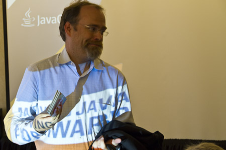
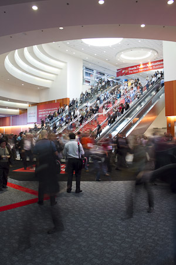

The jetlag left me alone since yesterday. Thanks guy. I hate you and I am really happy to be able to sleep again. The fourth day was all about community. It started with the&nbsp;annual&nbsp;DOAG breakfast at the Marriott. It's always fun to meet the board members which make it to OOW and talk about all the stuff going on. Thanks Fried and Dietmar for the kind invitation!
 
 <b>Java Community Leaders Brunch</b>
 
 Afterwards I headed directly to the Java Community Leaders Brunch. Even if I am not a JUG Leader or Java Champion I am one of the few ACE Directors which have a very close relation to Java and it's community. I'm saying, that I am not only into Oracle's products but also try to do my best to help with Java community building. It was an honor to be there. It was an awesome lineup of people. to name but a few:
 

 

 - Adam Messinger
 
 - Cameron Purdy
 
 - Henrik Stahl
 
 - Nandini Ramani
 
 - Mike Lehmann
 
 - Mark Reinhold
 
 - Donald Smith
 
 - Roger Brinkley
 
 We have been given the latest information about Java SE, ME, EE, Embedded and JavaFX. Waiting for the big news? I have to dissapoint you. Everything was, again, given under NDA and you therefore have to wait a few more days until the general technical sessions have been held and the keynotes are over. You will hear nothing world changing (except one thing probably) and you will be pleased with what you see and hear mostly. The best part for me was to meet so many people I only know from twitter or Email. Martijn Verburg, the names from above, Stephen Chin, Bruno Souza, Fabiane Nardon, Cay Hostmann, Stephan Janssen and soo many more. Thanks for having me there! The best part was my little chat with Mark Reinhold. He is on my list for the Heroes of Java series. He got the questions already and I know that it was not possible for him to answer them before J1. But now at least he knows about me and the background about the series and I am looking forward to his answers. Wanna know how he is? He's a normal and sympathetic guy. It's fun to chat with him. And believe me: we did not talk about Java :)
 
 <b>GlassFish Community Event</b>
 

 

 Done with that, I joined Alexis and Adam Leftik to run over to Moscone. That's where the GlassFish Community Event was waiting in room 2020. A big room as I can tell you. And the community stuff continued. I've finally met Laird Nelson and Johan Vos. Alexis, Arun and Anil were giving a short overview about GlassFish and it's future. Followed by some customer case studies and a great community building event, where they build the GF Logo from Lego. Awesome. A big thank you to OTN again for supporting the team with a new version of the GlassFis t-shirts! Running in the cloud is printed on them and this is also the topic for Java EE 7. As usual there is no NDA stuff in here. GlassFish is free and open and you know where to follow the latest developments. The slides and some pictures will be posted to the aquarium and I keep you updated with the latest information.
 
 <b>Sunday opening Keynote</b>
 

 

 A nice tradition is to attend Larry's first welcome keynote on Sunday. I like to see the people floating in. They are talking about 45.000 attendees and only a fraction of it makes it to the keynote room. But even that is impressing. Having a press pass, I was able to do some pictures. Find them on <a href="http://flickr.com/myfear">flickr.com/myfear</a>. There weren't any surprises here. Most of the stuff he was talking about was&nbsp;unveiled&nbsp;a few hours earlier. They now have a SPARC Supercluster and the new ExaLytics. Impressive numbers in terms of performance and hardware. Especially the ExaLogis is still something I would like to get my hands on. Anyway: Like it or not, we are going to see more of those ExaEverything&nbsp;machines&nbsp;in the future. Not a word about Java this year. Ok. Thanks for now. I left early. Security started pushing me around a bit. Seems as if I was trying to get too close with my camera.
 
 
 <b>ACE Dinner</b>
 
 Another tradition I really appreciate: The annual ACE Dinner. Happening at Sens this year again. It's wonderful to catch up with all the ACEs and ACE Directors. After having seen most of the ACED since Wednesday we reached the point where technology and Oracle were behind on topics to talk about and we get a chance to talk a bit more about families, children and the year in general. To me it always feels like a&nbsp;Christmas&nbsp;evening. catching up with the family. Today is going to be packed with meetings and the Java One Keynote. Seems as if I need to get ready for this now.