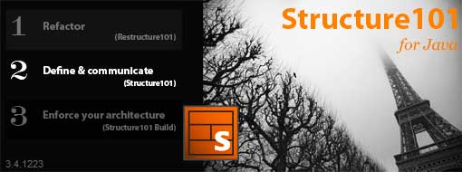

According to <a href="http://www.java.net/community/java-user-groups/news-item/headway-software-supports-your-local-jug" target="_blank">a post</a> by Michael Huettermann <a href="" target="_blank">Headway</a> the company building (and selling) Structure101 is giving away a fully functional perpetual license of <a href="http://www.headwaysoftware.com/products/?code=Structure101" target="_blank">Structure101</a> to one attendee, and one <a href="http://www.headwaysoftware.com/products/?code=Restructure101" target="_blank">Restructure101</a> to another attendee ...... at each JUG meeting! This is all organized by your local JUG leader (refer to more details about this in Michael's post).
 
 

 

 &nbsp; <b> 
 What is that structure101 stuff all about?</b>
 
 &nbsp;Structure101 is a tool to help define and communicate your architecture and layering rules to the whole team. The rich, intuitive architecture diagrams express containment, visibility and layering. Map blocks in diagrams to physical code with patterns that are used by structure101 to discover and display violations. I personally have used it with a couple of projects in the past and it's fast, reliable and unique with it's features. If you need a more detailed example: Here is a screenshot of a analysis I did with an older Primefaces milestone-build. 
 
 

 

 <b> 
 And restructure101?</b>
 
 Restructure101 let you do simulated sandbox refactorings of your architecture while you detangle your codebase without risk, removing unnecessary complexity and dependencies. The sandbox uses Unique Levelized Structure Maps (LSMs) that let you see exactly the details you need in the context of the whole code-base. Manipulate the LSMs interactively with drag-and-drop simplicity to simulate structural changes. I haven't had the pleasure to&nbsp;test drive&nbsp;this one but it also sounds promissing.
 
 

 <iframe allowfullscreen frameborder="0" height="225" src="http://player.vimeo.com/video/24112576?title=0&amp;byline=0&amp;portrait=0" webkitallowfullscreen="" width="400"></iframe>
  <a href="http://vimeo.com/24112576">Brief Introduction to Structure101 &amp; Restructure101</a> from <a href="http://vimeo.com/structure101">Structure101</a> on <a href="">Vimeo</a>.

 
 
 Now: Go ahead! Visit your local JUG and make sure to spread the news to your JUG leaders! And don't forget to say: Thank you Headway!