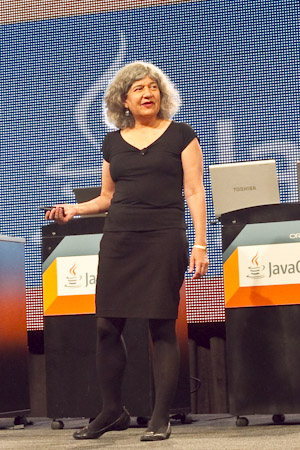

One prominent topic of the recent JavaOne 2011 was the next major Java EE 7 release. As stated in the keynotes, the work on it is well underway. It will contain the 28 specifications we already know from the forerunner plus a number of new specs. Nobody can tell you about the exact number at them moment because EE 7 will only accept the new specifications if they finish "in time". Which means, the planned release date for EE 7 (Q3 2012 Final Release) is a superior goal which sets scope and pace. Candidates for inclusion include Jcache 1.0 (JSR 107), Concurrency Utilities 1.0 (JSR-236), State Management 1.0, Batch Processing 1.0 and JSON 1.0. This ambitious goal is only one thing that makes me wonder. But let's start at the beginning. 
 
 

 

 New Java EE 7 spec lead Linda DeMichiel (picture to the right) detailed the general approach in their keynote part. The big focus with Java EE 7 is getting Java apps into the cloud. With the steps taken from J2EE to Java EE the general service approach was integrated into the platform. Meaning, that developers are able to use services and have a declarative way of consuming them. Beginning with Java EE 7 the platform itself should become a service. In the meaning of providing sufficient ways of enabling PaaS (Platform as a Service) with Java EE application servers. Basically to enable customers and users of EE to leverage the complete range of clouds (public, private and hybrid).&nbsp;This should be reached by adding new platform roles, metadata and APIs which support the needed requirements like multi-tenancy, elasticity and scalability. Beside the new kids-on-the-block, also the proven specs need a bunch of updates to support these requirements.
 
 Looking at the bullet-point topics that are already there for the 9 "work-in-progress" specifications should bring a bit more light into how to achieve the "cloud goal". 
 
 <b>JPA 2.1 (<a href="http://jcp.org/en/jsr/summary?id=338" target="_blank">JSR 338</a>) </b>
 
 The first spec to include new features is the JPA 2.1. The new features can be described with the following short list:
 
 - Multi-Tenancy (Table discriminator)
 
 - Stored Procedures 
 
 - Custom types and transformation methods - Query by Example 
 
 - Dynamic PU Definition 
 
 - Schema Generation (Additional mapping metadata to provide better standardization)
 
 <b>JMS 2.0 (<a !="" href="http://jcp.org/en/jsr/detail?id=343" target="_blank">JSR 343</a>)</b>
 
 This could be considered as the most mature spec in general. It had a long 9 years to go since it's last maintenance release (April 2002). 
 
 - Modest scope 
 
 - Ease of development 
 
 - Pluggable JMS provider 
 
 - Extensions to support “Cloud”
 
 <b>EJB 3.2 (<a href="http://jcp.org/en/jsr/detail?id=345" target="_blank">JSR 345</a>)</b> The goal of Enterprise JavaBeans 3.2 is to consolidate these advances and to continue to simplify the EJB architecture as well as to provide support for the Java EE platform-wide goal of further enabling cloud computing. The scope of EJB 3.2 is intended to be relatively constrained in focusing on these goals.
 
 - Incremental factorization (Interceptors)
 
 - Further use of annotations to simplify the EJB programming model 
 
 - Proposed Optional: BMP/CMP 
 
 - Proposed Optional: Web Services invocation using RPC 
 
 <b>CDI 1.1 (<a href="http://jcp.org/en/jsr/detail?id=346" target="_blank">JSR 346</a>) </b> Since the final release of the CDI 1.0 specification a number of issues have been identified by the community and a update to the specification will allow these to be addressed. A list of proposed updates is provided here, however the EG will consider other issues raised as the JSR progresses.
 
 - Embedded mode 
 
 - Lifecycle Events 
 
 - Declarative package scanning 
 
 - Global ordering of interceptors and decorators 
 
 - Injection Static Variables
 
 <b>Servlet 3.1 (<a href="http://jcp.org/en/jsr/detail?id=340" target="_blank">JSR 340</a>) </b>
 
 In developing the servlet specification 3.1 the EG will take into consideration any requirements from the platform to optimize the Platform as a Service (PasS) model for web applications. Beside this, the following areas should be addressed. 
 
 - Cloud support 
 
 - NIO.2 async I/O 
 
 - Leverage Java EE concurrency 
 
 - Security improvements 
 
 - Web Sockets support 
 
 - Ease-of-Development 
 
 <b>JSF 2.2 (<a href="http://jcp.org/en/jsr/detail?id=344" target="_blank">JSR 344</a>)</b> The new JSF JSR will be a significant feature update that builds on the advances from the previous JavaServer Faces versions.
 
 - Ease-of-Development 
 
 - HTML 5 support (Forms, Headings, Metadata)
 
 - New components 
 
 - Portlet Integration
 
 <b>JAX-RS 2.0 (<a href="http://jcp.org/en/jsr/detail?id=339" target="_blank">JSR 339</a>)</b>
 
 JAX-RS addresses most requested community features. To name a few: - Client API 
 
 - Hypermedia 
 
 - The primary API utilized for validation will be the Bean Validation API
 
 - Ease-of-Development
 
 <b>Expression Language 3.0 (<a href="http://jcp.org/en/jsr/detail?id=341" target="_blank">JSR 341</a>)</b> The Expression Language (EL), has been part of JSP specification since JSP 2.0. In Java EE 7 this will become a separate JSR. 
 
 - Standalone JSR 
 
 - Easier to use outside container 
 
 - Criteria-based Collection selection 
 
 - New operators 
 
 - CDI events for expression eval 
 
 <b>Bean Validation 1.1 (<a href="http://jcp.org/en/jsr/detail?id=349" target="_blank">JSR 349</a>)</b> Being a version 1.0, Bean Validation stayed on the conservative side feature wise. The community has expressed interest in additional features to enhance the work done in the first version of the specification.
 
 - Integration with other JSRs (JAXRS, JAXB, JPA, CDI, EJB, JSF) 
 
 - Method-level validation 
 
 - Constraint composition
 
 <b>Cloud? Is that Rain?</b>
 

 

 Looking at the proposals it's clear that some of them have room for cloud enabling. Some don't care at all. Searching for the cloud stuff is very little successful until now. Let's look at the umbrella <a href="http://jcp.org/en/jsr/detail?id=342" target="_blank">JSR 342</a>. The official pages are public and can be found on <a href="" target="_blank">http://java.net/projects/javaee-spec/</a>. Very interesting is the <a href="http://java.net/downloads/javaee-spec/PaaS.pdf" target="_blank">Java EE 7 Platform and Support for the PaaS Model document</a> (PDF), which describes the overall architecture for PaaS support in Java EE 7. And by comment is largely agreed to by the expert group. It summarizes needed roles (PaaS Product Vendor, PaaS Provider, PaaS Account Manager, PaaS Customer, Application Submitter, Application Administrator, End-user) and gives a couple of example scenarios in which they act in a PaaS environment. Further on you find some definition and terms:
 <i>PaaS Application:</i>
 
 "A discrete software artifact containing domain-specific code that can be uploaded to and deployed on the PaaS environment by a PaaS Customer. The artifact may consume PaaS resources and be distributed across multiple JVM instances according to QoS settings and/or an SLA. Depending on its terms of use, a PaaS application may subsequently be deployed on the PaaS environment by potentially any number of other PaaS Customers."
 <i>Tenant:</i>
 
 "Since in the model described here a PaaS Customer corresponds to an isolation domain, we will use the term “Tenant” to avoid misunderstandings with other uses of the word “customer” in the business context."
 <i>Application Developer:</i>
 
 "We will use term Application Developer to denote an application developer in the common sense. In the traditional Java EE terminology, this role is split between Application Component Provider and Application Assembler."
 
 Additionally you find the mandatory statement about "protecting" investments: 
 
<blockquote>
 It is a goal of Java EE 7 to add to the platform support for the PaaS model as well as a limited form of the SaaS model while preserving as much as possible the established Java EE programming model and the considerable investments made by customers, vendors, and system integrators into the Java EE ecosystem. 
  
  (Source: <a href="http://java.net/downloads/javaee-spec/PaaS.pdf" target="_blank">The Java EE 7 Platform and Support for the PaaS Model</a>)
</blockquote> Looking at the <a href="http://qconlondon.com/dl/qcon-london-2011/slides/JeromeDochez_TheFutureOfJavaEE.pdf" target="_blank">qcon London slides </a>by&nbsp;Jerome Dochez you quickly notice, that there is a lot more stuff to take care of, than what the expert group covers with the public documentation:
 
 - Better Packaging for the Cloud (Modular Applications)
 
 - Versioning 
 
 - Deployment Model
 
 - SLA Monitoring 
 
 - Billing 
 
 And I am sure, you could come up with even more. <a href="https://oracleus.wingateweb.com/published/oracleus2011/sessions/15597/15597_Wang.pdf" target="_blank">The GlassFish / Java EE Strategy &amp; Roadmap</a> (PDF) presented by Adam Leftik &amp; John Clingan at Oracle Openword paints a more detailed picture of the future by looking at:
 
 - Dynamic Service Provisioning
 
 - Iaas Management 
 
 - Elasticity using Auto-scaling
 
 - Monitoring
 
 - Hypervisor Abstraction
 
 
 Until now this seems like the most complete and concrete approach to Java EE in the cloud. Seeing the GlassFish team doing a <a href="" target="_blank">presentation with the latest GF 4.0</a> release candidate you can imagine how far work is completed. (Even if I assume that there is still plenty of work to do :))
 
 <b>No Rain but it will be cloudy for some time</b>
 
 A lot is evolving at the moment. This is what was expected with changing direction in a mature specification. Looking at the new <a href="" target="_blank">Oracle cloud offering</a> and the <a href="http://blogs.oracle.com/theaquarium/entry/glassfish_4_0_starting_the" target="_blank">continuing cutting-edge</a> work the GlassFish team is doing I believe, that the ambitious goal could be meet because we have enough business value behind that. What I fear is, that single specifications could deny the inclusion of "needed" cloud stuff in favor of bug fixes or community requests. This is the first time the umbrella specification is emerging into a complete different direction, than the containing children. On the other side, as we know from the past, the umbrella itself is a comparable small specification which specifies on a very general level of detail. This could open up opportunities for vendors in general. Let me add another point here: I strongly believe that Java EE 7 will be biggest challenge for the spec lead since ages. Following the overall "cloud" theme without distracting or prioritizing the single contained specifications will be a very political job in general. Even if Linda DeMichiel is a Java EE veteran I believe that a lot of work is waiting here.
 
 <b>Summer 2013 vs Q3 2012 Final Release - missed opportunities</b>
 

 

 The real big issue I have with the timeline is the fact, that we don't have a chance to get a real modular approach for application packaging. Whatever will be designed in terms of packaging (and related stuff like versioning, SLA, and more) for the cloud will not be able to take advantage of the new project Jingsaw features coming with Java SE 8. I personally consider this a major requirement for cloud enabled Java EE PaaS infrastructures. If the new cloud metadata will be build upon the Java EE 6 packaging specification it is a missed opportunity to adopt latest and greatest in Java modularization. I am very curious to see, how the EG will work around this issue without having to rework everything with Java EE 8 again.