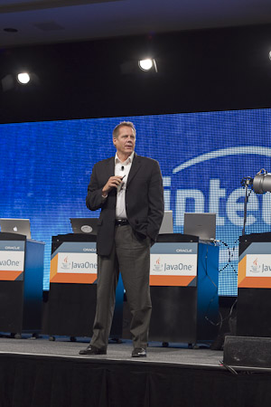
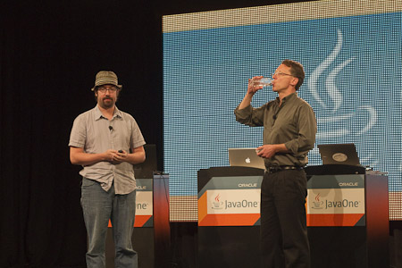
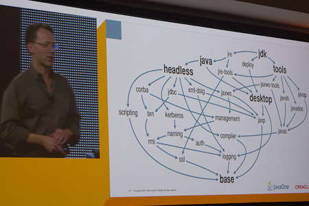
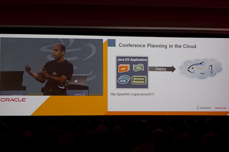

Today was keynote day. JavaOne Keynote was happening this early morning from 8:30 to 10:30 am and one more time my press pass got me into it quite early. So I had the time taking some very personal pictures from all the key players while they were getting ready and probably nervous. Ballroom A+B is quite a big room. In contrast to last year they changed the arrangement and put the stage on the long side. That brought many people closer to the happenings and it was a great feeling at all. I also partly enjoyed the little warm-up movie. Even if there was a odd feel to it seeing all the diverse people running around. Even if I am slightly overweight, I would prefer to see some very cool kids running through such a video. Anyway: Nice work. Next time please try to get the Black Eyed Peas for that ;) 
 
 <b>Intel outside please</b>
 

 

 The Keynote began with Doug Fisher, CVP Intel. He brought a number of colleagues onto stage together with their Oracle peers to reviewed Intel’s long association with Java and their optimization work for the Java platform on Intel hardware. it was all about performance gains and being x times faster than they were before. The guys seem to all read from the teleprompters and it really wasn't a great joy to watch them making jokes they were obviously practicing before. What should I tell you? Nice slides. Next slide deck please! It was boring and would have made a reasonable Open World Keynote at all. Many commercial products in it and not a word about what they really brought forward in terms of Java. This was something I wouldn't mind if it is missing next year. And this did not get better as Oracle's Ashok Joshi came onstage to very very briefly introduce Oracle's NoSQL solutions (hardly without naming it...). You can find out on the web about it. I guess all is out about this one since today. But I will skip the details here until I got my hands on it.
 
 <b>Welcome to the Future - Java 7 </b>
 
<table cellpadding="0" cellspacing="0" class="tr-caption-container" style="float: right; margin-left: 1em; text-align: right;">
 <tbody>
  <tr>
   <td style="text-align: center;"></td>
  </tr>
  <tr>
   <td class="tr-caption" style="text-align: center;">Charles Oliver Nutter - Mark Reinhold</td>
  </tr>
 </tbody>
</table> After a little confusions about who and what is next, Mark Reinhold, Chief Architect of the Java Platform Group appeared on stage and took the attendees on a ride through the recent history of Java 7. All along the way with “Plan B” and the pragmatic approach of including Project Coin (JSR 334), InvokeDynamic (JSR 292), and the Fork/Join Framework. Special guest was Charles Oliver Nutter from Engine Yard. He gave a very brief overview about the performance advantages InvokeDynamic made possible for JRuby. 
 
 Mark has a good way in presenting and he even got the hardest bits out with lightweight slides and fluent words so it was a pleasure to follow him along the benefits of these key features of Java 7. Most important for all developers is, that “Not only are these features available in Java 7 today,” noted Reinhold, “but as of last week, they are now supported in all three of the major Java IDEs.”
 
 <b>Moving forward - Java SE 8</b>
 
<table cellpadding="0" cellspacing="0" class="tr-caption-container" style="float: right; margin-left: 1em; text-align: right;">
 <tbody>
  <tr>
   <td style="text-align: center;"></td>
  </tr>
  <tr>
   <td class="tr-caption" style="text-align: center;">Mark Reinhold - Project Jingsaw</td>
  </tr>
 </tbody>
</table> Followed by what was already known since some time Mark detailed the plans for Java 8 a bit. After having the evolutionary release with Java 7 this is going to be a revolutionary one with the features far beyond those introduced with Java 7. Project Lambda (JSR 335) will bring closures to the Java programming language. And Project Jigsaw (JSR TBD) aims to define a standard module system -- not just for application code, but for the platform itself. Especially the latest makes it possible to only have the needed bits with your distribution of choice. As he states, there will be Java distributions available starting at 10 MB. A new Java Script Implementation called "Project Nashorn" will also be part of it. Followed by Type Annotations (JSR 308), the new Data/Time API (JSR 310) and Sensors which should be a way to natively connect to a device's hardware sensors available. "Plus more to come ..." is the last bullet point on this slide. So, we have to expect some more stuff beside the ones mentioned. 
 
 <b>General Availability of JavaFX 2.0</b>
 
<table cellpadding="0" cellspacing="0" class="tr-caption-container" style="float: right; margin-left: 1em; text-align: right;">
 <tbody>
  <tr>
   <td style="text-align: center;"></td>
  </tr>
  <tr>
   <td class="tr-caption" style="text-align: center;">Stunning JavaFX demos</td>
  </tr>
 </tbody>
</table> JavaFX was next. As many already expected it took quite some time away from the keynote. Richard Bair, Chief Architect, Client Java Platform, official announced JavaFX 2.0 and gave some stunning demos of the new facilities.According to him, JavaFX 2.0 was designed to offer: 
 
 - Cross Platform
 
 - Leverage Java
 
 - Advanced Tooling
 
 - Developer Productivity
 
 - Amazing User Interfaces. 
 
 
 No longer being eye-candy "user interfaces that look good and work well" are a requirement for the things we do, said Bair. The most important aspect of any UI technology are good visual development tools. Surprise was, that the early access for the JavaFX Scene Builder, which will first be made available to select partners, then expanded to a general beta, and then a full release. You can get your hands on and early build it at JavaOne at the DEMOgrounds. Most applause came from the fact, that the official demos and documentations are BSD licensed and part of the bundle, you can download. This simple stuff was followed by a series of stunning demos by Oracle's Jasper Potts. He showed the possibilities of the new client platform including animated 2D and 3D, audio EQ mapping, and a navigable 3D virtual room that featured live video. 
 
 <b>Is that Rain? - Java EE 7 in the cloud!</b>
 
<table cellpadding="0" cellspacing="0" class="tr-caption-container" style="float: right; margin-left: 1em; text-align: right;">
 <tbody>
  <tr>
   <td style="text-align: center;"></td>
  </tr>
  <tr>
   <td class="tr-caption" style="text-align: center;">Arun Gupta taking GlassFish 4.x for a ride!</td>
  </tr>
 </tbody>
</table> With all the rain going on in San Francisco some could think, Oracle did too much with all the cloud topics around. Anyway, Java EE.next as announced last year will be driven by the cloud. Linda DeMichiel, Java EE 7 SpecLead did a nice job explaining the upcoming Java EE 7 release. “We’re moving Java EE into the Cloud." DeMichiel said. The focus on this release is providing support for Platform as a Service (PaaS). Java EE will provide ways for it's users to leverage public, private and hybrid clouds. It will all be about the platform as a service itself, which will be leveraged in cloud environments. After a real short general introduction, which could lead to the impression, she is not knowing what she is talking about (which isn't true btw!) Arun Gupta came on stage. You all know him as the GlassFish and Java EE Evangelist! He demonstrated the latest GlassFish 4.0 Bits with a Java EE 7 cloud deployment. You can do this yourself following the instructions provided at: <a href="http://glassfish.java.net/javaone2011/index.html" target="_blank">http://glassfish.java.net/javaone2011/</a>
 
 <b>JavaCard</b>
 
 Finally Hinkmond Wong, of Oracle’s Java Embedded group gave an overview of the latest in JavaCard technologies. By that time attendees started moving out of the keynotes. It was a very long one with a lot of topics in general and so I can understand every single one moving out. 
 
 <b>Interpretation </b>
 
 What does all this mean? Any surprises? Anything unclear or need further thoughts? Not really. Compared to last years excitement there are hardly any exciting things on the agenda. Nobody is complaining, no big surprises. This is good. It means we have calmed down a bit. The trust is building and Oracle is obviously doing more stuff in the open (especially the works around OpenJDK should be mentioned here) and we do see a lot of technical progress in the complete platform in general. Of course, we do miss some faces from last year. And knowing a little more than you out there, I can think of a few more things to come over the next few months. But this will not be negative surprises, so it's easy for me to keep the secrets for some more time.