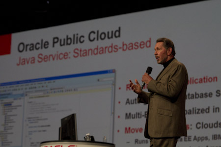

More on the Open World side of happenings one big and probably unexpected announcement was that Oracle is finally supporting the cloud movement and offering their own <a href="">public cloud service</a>. Beside the official announcements, some more or less content-less posts on The Aquarium (<a href="http://blogs.oracle.com/theaquarium/entry/oracle_public_cloud_is_here">here</a> and <a href="http://blogs.oracle.com/theaquarium/entry/oracle_public_cloud_about_the">here</a>) you don't find a lot of information what exactly to expect from the offering. With this post I am trying to bring some light to it by interpreting the publicly disclosed information. As usual: I could be right or wrong. Watch out for some more posts from <a href="">Reza Shafii</a>. He recently started blogging about the "<a href="http://blogs.oracle.com/rezashafii/entry/oracle_java_cloud_service_a">Java Cloud Service</a>".
 
 <b>Larry: 'if you need a cloud, you need a cloud'</b>
 

 

 The famous quote of Larry Ellison during his keynote simply expresses what exactly the cloud move means for Oracle. Being on a complete private "own-your-own-exa-cloud" strategy since the announcement of the Exadata maschine this shift is a huge one. 
 
 Seeing Larry presenting with slides that have the word "Java" on it over and over leaves the most of us wondering and could even scare the hell out of the rest of us. One could think, that the new <a href="http://blog.eisele.net/2011/10/java-ee-past-present-cloud-7.html">Java EE 7</a> specification and it's move toward PaaS and IaaS comes right in time for the new strategy. But before I am going to fire at will, let's get back to the initial motivation of this post: What the hell are the guys running underneath and what could you expect as a developer or customer to find in the Oracle cloud?
 
 <b>Oracle software and hardware</b>
 

 

 The official <a href="http://cloud.oracle.com//my-cloud/service_java_specs.html">specs of the Java Cloud Service</a> give a very high level overview about what to expect. WebLogic 11g is the Java EE container of choice. Meaning, that you will probably be able to deploy Java EE 5 applications only with the first version. Even the supported Java EE spec versions strongly lead into that direction (EJB 2.1, 3.0; Servlet 2.5, JSP 2.1) The database on the other hand is a 11gR2. If you look back to some other slides presented at OOW, it's not a too brave guess, that Oracle is running this stuff on a combination of Exalogic and Exadata. And I also guess, that you will be able to monitor and administrate your WebLogic Domains with the help of the new Enterprise Manager Cloud Control. Looking at the fact, that Oracle is promissing instant provisioning I also assume that they are using the <a href="http://blog.eisele.net/2010/04/oracle-introduces-java-virtualization.html">virtual assembly builder</a> in combination with some preconfigured templates to get your WebLogic Domain um and running. It would be nice to see a dedicated OVM instance for every single cloud account. The fact, that you have to target your application to a complete cluster indicates, that you will not be able to select the managed servers during deployment explicitly.
 
 <b>Development for the Oracle Cloud</b>
 
 But that will the development for the cloud be like? According to the <a href="http://cloud.oracle.com//my-cloud/service_java_features.html">public features</a>, there will be a tight integration with JDeveloper, Eclipse and NetBeans. Seeing the command line interface together with ANT I believe that the first IDE integrations will have very limited capabilities and you would probably simply be able to deploy the stuff to your cloud. I assume that in any of the three IDEs you will have a new server configuration option which handles all needed configuration (host, port, user, pwd) accordingly and a simple "run on server" will start the deployment process. The spec also mentions a whitelist (check for supported APIs) and an SDK. So it's fair to guess, that the IDEs also will do some pre-flight checks for your applications before putting them onto your cloud. Your applications obviously don't need to implement proprietary Oracle APIs (like google requires for authorization or DB access) but again by looking at the specs it seems as if you will not be able to use the complete set of WebLogic and Java EE 5 APIs. Seeing the mention of EJB with explicitly "local interfaces" could indicate, that RMI will not be in it. What that means for failover and session replication is unclear as of today. Also it seems as if you shouldn't think about deploying anything else than war and ear files. If this will include the WebLogic library mechanism is unclear. It seems as if anything else than http isn't allowed to hit your applications. Not even inbound SOAP Webservices are possible according to the specs. Nice little Oracle addon is, that you can obviously take advantage of the full ADF stack (Faces, Bussiness Components). Seeing the ADF Web Services Data Controls with a separate mention let's me believe, that there are other restrictions or versions about Data Controls in general. 
 
 <b>Conclusion</b>
 
 This is the part of the post where I probably should be very excited and tell you, that this is the most open, best and single cloud offering available today. Maybe I am a little bit too early for a general conclusion, but let's look at the plain facts as of the time writing this:
 
 <i>Contra:</i>
 
 - Only Java EE 5 (with restrictions) =&gt; That's a few years old now, right?
 
 - Pricing =&gt; Unclear until now. They could screw up the whole thing instantly!
 
 - Only WebLogic =&gt; What about GlassFish? We need an ExaFish !
 
 <i>Pro:</i>
 
 - WebLogic =&gt; that's fine. Especially as I expect the license to be included with the subscription?
 
 - Running on Exa stuff =&gt; probably the finest hardware available. Under full control of the manufacturer.
 
 - Only Java EE =&gt; No additional, proprietary stuff needed. Portable. Standards based.
 
 
 Let's lean back and relax a bit until the first official versions are available. I am very very looking forward getting my hands on this stuff.