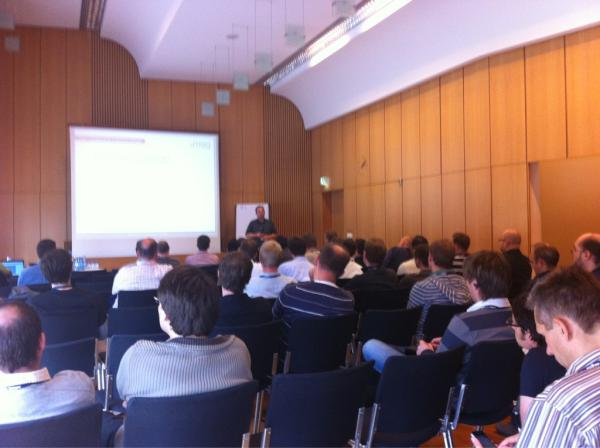

Yesterday at EclipseCon Europe 2011, I gave two talks about Java 7 use in the enterprise. Both had their attendees (around 40 to 50) and I think the input I gave was quite valuable to them. The motivation of both talks was to actually show, how and where to apply the <a href="" target="_blank">55 new things in Java 7</a> and try to write down what you need to keep in mind doing migration projects. This was also thought of as a decision helper for choosing the right Java SE version to start with these days. Thanks again for anybody attending! It was a pleasure to be there. My first time at EclipseCon Europe and I liked what I have seen. Thanks to Donald and Dalibor for jumping in on questions regarding "official dates" :)
 
 Both presentations are uploaded to slideshare. I heard that there will be an audio recording available some time soon, I'll keep you updated!
 
 

 <strong style="display: block; margin: 12px 0 4px;"><a href="http://www.slideshare.net/myfear/practical-migration-to-java-7" target="_blank" title="Practical Migration to Java 7">Practical Migration to Java 7</a></strong> <iframe frameborder="0" height="355" marginheight="0" marginwidth="0" scrolling="no" src="http://www.slideshare.net/slideshow/embed_code/10019245" width="425"></iframe>
  
 

  View more <a href="" target="_blank">presentations</a> from <a href="http://www.slideshare.net/myfear" target="_blank">Markus Eisele</a>
 

 
 

 <strong style="display: block; margin: 12px 0 4px;"><a href="http://www.slideshare.net/myfear/java-7-state-of-the-enterprise" target="_blank" title="Java 7 - State of the Enterprise">Java 7 - State of the Enterprise</a></strong> <iframe frameborder="0" height="355" marginheight="0" marginwidth="0" scrolling="no" src="http://www.slideshare.net/slideshow/embed_code/10019246" width="425"></iframe>
  
 

  View more <a href="" target="_blank">presentations</a> from <a href="http://www.slideshare.net/myfear" target="_blank">Markus Eisele</a>
 

 
 
 Donald took a picture of me, doing the talks. Thanks <a href="https://twitter.com/#!/DonaldOJDK/statuses/132089070246567936" target="_blank">Donald </a>;)
 

 

 
 UPDATE 28.11.2011:
 
 The recordings have been published:
 <a href="http://www.fosslc.org/drupal/content/java-7-state-enterprise" target="_blank">http://www.fosslc.org/drupal/content/java-7-state-enterprise</a>
 <a href="http://www.fosslc.org/drupal/content/practical-migration-java-7-small-codeexamples" target="_blank">http://www.fosslc.org/drupal/content/practical-migration-java-7-small-codeexamples</a>
 
 
 