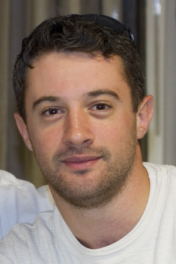

The seventh part in my Java interview series: "<a href="http://blog.eisele.net/2011/09/heroes-of-java.html">The Heroes of Java</a>".
 
 <b>Andrew Lee Rubinger</b>
 

 

 is a senior Software Engineer at JBoss by Red Hat. He is primarily tasked with development usability in Enterprise Java. He is the author of "Enterprise JavaBeans 3.1" from O'Reilly Media. Prior to employment within open source, he was an early adopter of Java EE technologies and community contributor from within the private sector. Andrew's interests are in advancing the success of open standards and easing testability. His role as Core Developer within the Application Server is supplemented by leading the Embedded and ShrinkWrap subprojects.
 
 <b>General part</b>
 <i>Who are you?&nbsp;</i>
 
 How existential. :) I'm a programmer with the JBoss Community - employed by Red Hat and tasked with development usability in Enterprise Java.
 
 <i>Your offical job title at your company?</i>
 
 I put the "gin" in Senior Software Engineer.
 
 <i>Do you care about it?</i>
 
 Not tremendously. It's an internal title they assign for use inside Red Hat, and luckily I'm employed in an environment where your ability to raise technical arguments isn't impeded or bolstered by your pay scale.
 
 <i>Do you speak foreign languages? Which ones?</i>
 
 I'm mostly limited to English.
 
 <i>How long is your daily "bootstrap" process? (Coffee, news, email)</i>
 
 Email takes close to an hour each morning. News flows through the day, and I end up doing my most focused programming work in the evening or night when things have quieted down.
 
 <b>Twitter</b>
 <i>You have a twitter handle? Why?</i>
 
 I do. <a href="https://twitter.com/#!/ALRubinger" target="_blank">@ALRubinger</a>. Twitter's been a helpful tool in terms of recruiting and communicating with our community. In open source, accessibility and limiting the barriers to entry are very important in terms of getting a project off the ground, and Twitter is a component in that equation.
 
 <i>Whom are you following in general?</i>
 
 Primarily coworkers, colleagues, and others in the Java space, with a few limited exceptions.
 
 <i>Do you have a personal "policy" for twitter?</i>
 
 Very generally speaking, Twitter is my public-facing professional persona. Rather than wrestle with privacy and visibility settings in other social media, I exposed out different personalities through separate sites. Twitter for work, Facebook for my personal life, Google+ for...well, I haven't figured how to fit that into the workflow yet.
 
 <i>Does your company restricts or encourages you with your twitter ussage?</i>
 
 JBoss has a culture that encourages us to be public advocates for our projects. This is great at keeping us honest; when your developers are on the front lines, they get feedback early on in the design process. A lot of us like to stay engaged in that manner, and it's nice to be granted the freedom to speak in our own words for the better of our projects, the greater community, and our employer all in one go.
 
 <b>Work</b>
 <i>What's your daily development setup? (OS/IDE/VC/other Tools)</i>
 
 I've been running some flavor of Linux for years now, and it's typically Fedora. I found Fedora's switch to Gnome3 a bit premature and lacking in support for programs I use, so for now I'm on Ubuntu. Eclipse is my standard IDE, though I'll dabble with IDEA from time to time. My projects are on a standard Maven build and backed by Git and GitHub.
 
 <i>Which is the tool providing most productivity to your work?</i>
 
 Oddly, GitHub. What I thought at first was a simple SCM change actually brought about a new league of community contributors. The social angle to coding worked for us very well, and the proof is in the commit logs.
 
 <i>Your prefered way of interacting with co-workers?</i>
 
 It's honestly situation-dependent. Day-to-day, it's IRC. For more involved high-level discussions, Google Hangout (video chat) is very nice. On the times we get together in person for meetings or conferences, we've typically stored up a lot of ideas and the face time is very efficiently-used. For design discussions with a larger group, I like the forums.
 
 <i>What's your favorite way of managing your todo's?</i>
 
 Pen and paper. I write down a couple of things to do that day, at minimum. Because with constant email it's easy to get thrown off course. And important emails I open in a new tab which I'll close after I've replied.
 
 <i>If you could make a wish for a job at your favorite company: What would that be?</i>
 
 I'm already here. I have a voice in affecting the direction of the technologies I love, and the freedom to work when I'm feeling most productive. I'm not bounded by geography, and my coworkers are some of the most inspiring in the business. Anything I can't accomplish at JBoss is probably my own fault.
 
 <b>Java</b>
 <i>You're programming in Java. Why?</i>
 
 I started in Java, and it hasn't lost its relevance.
 
 <i>What's least fun with Java?</i>
 
 Java the language is verbose by today's standards, and lacking some key properties we've seen in newer stabs. Reified generics, immutability by default, and compiler support for hierarchical metadata are exciting concepts.
 
 
 Java the standard library is riddled with complex or unintuitive APIs which we cannot ditch due to backwards-compatibility constraints. I also tend to dislike mechanisms which rely upon command-line options, one-time-only initialization, or other aspects which tie into the environment too tightly and make testing difficult.
 
 
 Java the runtime, however, is just now beginning to stretch its wings.
 
 <i>If you could change one thing with Java, what would that be?</i>
 
 I honestly wouldn't seek to change the language too much. It's important that Java remain a nice common denominator that's familiar to all, while at the same time we expand upon the support for other JVM languages.
 
 <i>What's your personal favorite in dynamic languages?</i>
 
 I don't have one. Rather, if there are things I like about dynamic languages, the lack of static typing is not one of them. Passing functions as arguments is something I've always liked, however.
 
 <i>Which programming technique has moved you forwards most and why?</i>
 
 When I first joined the EJB3 project under Carlo de Wolf, he spent a few years drilling into my head the importance of separation of concerns. Down to the finest level. It's about more than code reuse; it's mostly about making sure you don't overstep your bounds and bite off more than you can chew at once. You should decompose all problems into the smallest bits; then they're easy to solve. And if you're lucky, you'll find some other sap to worry about integrating them back together later. ;)
 
 <i>What was the biggest project you've ever worked on?</i>
 
 Probably the JBoss Application Server, in that it's got a near ten-year lifespan now. But as with any decent project we rebuild from time to time. But it's definitely the biggest brand with which I've been associated.
 
 <i>Which was the worst programming mistake you did?</i>
 
 Oh, there's too many to name. I have a tendency to type before I think. I'm probably a terrible coder.
 
 
 But I make up for it. With discipline. I make sure that every feature I write is tested. That's what drew me to working in development usability. Because for me, testing *is* development. And I get a lot of satisfaction seeing a little green bar in the IDE which tells me that everything is OK. I'm unsure how many true bugs have been issued against "ShrinkWrap" in total, but that number is insanely small because we prioritized the construction of a killer test suite from the project's inception.
 
 
 And that's the same kind of experience I want to bring to developers of Java Enterprise applications, and it's why I work on the areas I do. If you're anything like me, you suck at programming too. Embrace it, because with the right guards we can still do some very quality work.