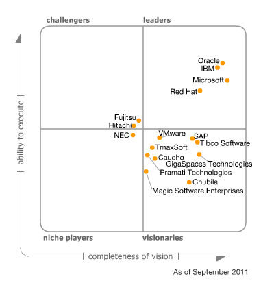

Gartner publishes their <a href="http://www.gartner.com/technology/research/methodologies/research_mq.jsp">Magic Quadrants</a> for different areas since years. They are basically good for positioning a specific technology players within a specific market. Clients often use Magic Quadrants as a first step to understanding the technology providers they might consider for a specific investment opportunity. Magic Quadrants provide a graphical competitive positioning of four types of technology providers. Leaders, Visionaries, Niche Players and Challengers. It's important to notice, that it's not only the visionary leaders which may be your only choice from a special market. Sometimes niche players or even challengers could make a better fit according to your needs. 
 
 <b>EAS - Enterprise Application Servers</b>
 
 Recently the new <a href="http://www.gartner.com/technology/reprints.do?id=1-17GUO5Z&amp;ct=110928&amp;st=sb." target="_blank">Magic Quadrant for Enterprise Application Servers</a> (EAS) was updated again. After doing a very short post about the <a href="http://blog.eisele.net/2009/10/magic-quadrant-for-enterprise.html">2009 version</a>&nbsp;and Gartner skipped one in 2010. So it's finally time to talk about the 2011 version again. Let's look at it: 
 

 

 In 2011, the leaders in the EAS market (listed in alphabetical order) are:
 
 IBM
 
 Microsoft
 
 Oracle
 
 Red Hat
 
 <b>What Changed?</b>
 
 Compared with the MQ's from 2008 2Q08 (<a href="https://www.salesforce.com/de/assets/pdf/whitepapers/GartnerMagicQuadrantEAS2008.pdf">Salesforce Link, PDF</a>) and 2009 Sept (<a href="http://www.caucho.com/articles/Caucho_Analyst_Report_2009.pdf">Caucho Link, PDF</a>) this did not change a lot. BEA was bought by Oracle and so both merged into a single "dot" on the matrix.
 
 
 In 2008, the leaders in the EAS market were:
 
 • BEA Systems
 
 • IBM
 
 • Microsoft
 
 • Oracle
 
 • Red Hat
 
 
 In 2009, the leaders in the EAS market were:
 
 • IBM
 
 • Oracle
 
 • Microsoft
 
 • Red Hat
 
 
 So. No change at all? What's this all about? It's about the details. And Market analysis. Only looking at the "visionary leaders" probably does not make sense. But there is one interesting part in here. The single vendor analysis. Let's look at the "cautions" Gartner positions for Oracle: 
<blockquote>
 Cautions 2008:
  
  • Althoug growing, industry support and market awareness of Oracle EAS technology is still lower than for its primary competitors.
  
  • Oracle EAS technology doesn't have the same amount of large business-critical projects in production as its primary competitors.
  
  • Late in devlivering support for Java EE 5 to be introduced with Oracle Application Server 11g R1 (not before 3Q08)
  
  • Announced acquisition of BEA Systems creates dualism in Oracles EAS strategy between proprietary Oracle Application Server and leading, popular BEA Systems' WebLogic Server.
  
  • Vision for SaaS-style application deployments is till in the initial stages of evolution.
  
  (Source: <a href="https://www.salesforce.com/de/assets/pdf/whitepapers/GartnerMagicQuadrantEAS2008.pdf" target="_blank">MQ EAS 2008</a>)
</blockquote>
<blockquote>
 Cautions 2009:
  
  • Both WLS and Oracle Application Server are frequently used to support opportunistically oriented products. However, pending the Sun GlassFish integration in the offering, Oracle doesn't yet have specific EAS products focused on addressing the fastproductivity, low-cost requirements of mass-market developers, nor does it support Web 2.0-style or opportunistically oriented application projects.
  
  • The demotion of Oracle Application Server to a nonstrategic role creates opportunities for both closed-source and open-source Java EE vendors. Should the transition to WLS prove too expensive or too difficult or undesirable for other technical or commercial factors, competitors may be able to attract Oracle Application Server customers (especially those not locked into Oracle via packaged applications or other OFM layers).
  
  • Despite Oracle's track record in managing acquisitions, the many potential challenges of the forthcoming acquisition of Sun may distract Oracle's management or slow down the company's EAS plans, and may create new business and technical discontinuities.
  
  (Source: <a href="http://www.caucho.com/articles/Caucho_Analyst_Report_2009.pdf" target="_blank">MQ EAS 2009</a>)
</blockquote>
<blockquote>
 Cautions 2011:
  
  • Oracle's ever-growing technology portfolio raises concerns among its largest customers about the company's excessive influence on their IT strategy. Therefore, these users may look to balance their IT investments using the offerings of Oracle's competitors. This could potentially threaten Oracle's EAS installed base, which is technically relatively easy to replace, given its compliance with the most relevant industry standards, like Java EE.
  
  • Oracle's policy to support Oracle IAS user migration to Oracle WebLogic Server in some cases requires a significant investment in software license upgrades, in addition to the application conversion costs. This, coupled with a general perception of Oracle charging high and growing costs, makes migration to closed and open-source alternatives appealing for budget constrained organizations.
  
  • Oracle Exalogic Elastic Cloud current limitations (e.g., lack of support for virtualization, likely to be available by YE11/1Q12) and the small number of real-life, production deployments to date, could hinder the adoption of the Oracle WebLogic offering for the most demanding private cloud deployments.
  
  (Source: <a href="http://www.gartner.com/technology/reprints.do?id=1-17GUO5Z&amp;ct=110928&amp;st=sb." target="_blank">MQ EAS 2011</a>)
</blockquote><b>What are the real issues with Oracle?</b>
 
 As expected in 2008, Gartner reflected on the late standards adoption and the missing market awareness of Oracles former iAS. in 2009 the announced acquisitions were the main issues they were looking at. In 2011 this changed a bit. Seeing the warnings from earlier years not coming through Gartner now focuses on the overall market power of Oracle. With all it's acquisitions and complete stack approach it's most likely, that customers are going to prevent themselves from a vendor-lock-in situation and try to make their blueprints a little less dependent on Oracle. My personal feelings tend to see the same. It's a big challenge for Oracle to be a "complete stack" and packaged applications vendor and have a broad base of individual products at hand which still could be used without "buying into the whole Oracle world". Seeing history repeating itself with regard to late Java EE spec adoption of WebLogic server and seeing (far too) many Oracle products being build on top of WebLogic I fear that the WebLogic server is going to become the new iAS. A platform for running Oracle products on. WebLogic server as the product that is influenced by internal belongings and requirements of Oracle Fusion Applications and Exa*Anything maschines. No longer the high value, highly available and stable application-server that can carry any kinds of individual Java EE applications. All this could be good, if you are an Oracle shop. If not ... you have to keep the cautions in mind before making decisions. 
 
 <b>What could Oracle do better with WebLogic Server?</b>
 
 It's not a big secret. I love this application server. Since ages. Having to wait for years to get the latest Java EE release productive with it is a big treat to me. I am glad that there is something called GlassFish which is taking over the lead in this field as a reference implementation. To me it seems as if the only product Oracle is treating as a valuable single product is the Database. I would love to see comparable attention and marketing with WebLogic server, too. Whatever else is out there and build on top could be bundled with any kind of WLS version. But both Database and application server are the core products around and both have a right to be pushed separately from the complete stack or any boxes. I personally will never ever have an Exalogic running in the cellar. And I am only partly interested in public cloud offerings which do not adopt latest Java EE specifications. What I need is different. It's a stable base for any kind of Java EE applications. Even mission critical ones. And that is, where WebLogic server is good at. Still. I hope to finally see an updated version of the WLS out in the field. Being able to bring it to customers again.