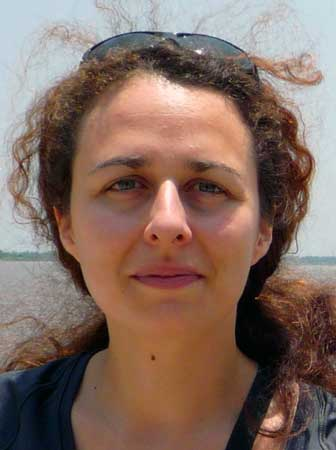

The ninth part in my Java interview series: "<a href="http://blog.eisele.net/2011/09/heroes-of-java.html">The Heroes of Java</a>".
 
 <b>Agnes Crepet</b>
 

 

 is a French Java Software Architect, involved in the community (JUGs Leader, Conference and podcast Curator). After 10 years working in France, I decided few months ago to do a break and I took a sabbatical. I started a world trip (Africa, Asia, USA...) not only to discover the world but also to meet the technical communities around the world. So, during this (awesome) trip, I do some non profit jobs (Java trainings for African students for example), some talks for local JUG (Togo, Kuala Lumpur, Jakarta) about Design Patterns, Agile practices... And I bring some help to launch new Duchess group in some countries : you can read my feedback about the launching of Duchess Africa and Duchess Indonesia... Beside Computer Science field, I'm the president of Avataria association, which curates music gigs and Linux Party!
 
 <b>General part</b>
 <i>Who are you? (Describe yourself in max three sentences)</i>
 
 I am a passionate technologist with over 10 years of software development experience as Developer, Architect, or Agile Coach. Beside my professional job, I'm also involved in the Java community : founder of the French conference Mix-IT and the podcast Cast-IT, and leader of two JUG: Duchess France and LyonJUG.
 
 <i>Your official job title at your company?</i>
 
 Currently I'm a Geek-Trotter! I'll come back to France in next April and will return to my regular job : I'm a Software Architect for the IT department of a French pharmaceutical laboratory, called Boiron, specialized in Homeopathy.
 
 <i>Do you care about it?</i>
 
 No! I care more about the job itself and its context, the latitude you have, the interests of the projects...
 
 <i>Do you speak foreign languages? Which ones?</i>
 
 French is my mother tongue and I speak English... not very well! During my world-trip, I do some technical talks for local JUGs, in English! I hope the attendees understand me... ;-)
 
 And I speak a little Spanish...
 
 <i>How long is your daily "bootstrap" process? (Coffee, news, email)</i>
 
 During my breakfast, I read news, check my mails (without answering yet), Twitter and Google+. So my breakfast might be sometimes 45 minutes long ;-) ! I then have to commute by car for another 45 minutes. I usually share the drive with a colleague of mine, which he's also a friend. We have plenty of time to speak about just everything, so I come to work very relaxed and ready to rumble! I grab a mandatory coffee at the vending machine (an other occasion to discuss with acquaintances, which is often where you learn the most valuable things about your company!), and I gather my teams to run the morning stand-up with each one.
 
 <b>Twitter</b>
 <i>You have a twitter handle? Why?</i>
 
 Yes, I do have one: <a href="" target="_blank">@agnes_crepet</a>. I use it mainly for keeping in touch with latest technical development.
 
 <i>Whom are you following in general?</i>
 
 I mainly follow people involved in technical communities I care about. I also like to follow former colleagues and people I've met during my world-trip. It's an easy way to keep in touch.
 
 <i>Do you have a personal "policy" for twitter?</i>
 
 I rarely speak about personal concerns on Twitter. I also try not to tweet to much : I don't like people who clutters my timeline, and usually unfollow them if they tweet more than thirty times a day!
 
 <i>Does your company restricts or encourages you with your twitter usage?</i>
 
 My company blocks Twitter and other social networks. What a shame! As it is now my main tool for technical watch, I'll try to make it change when I go back from my sabbatical!
 
 <b>Work</b>
 <i>What's your daily development setup? (OS/IDE/VC/other Tools)</i>
 
 My machine is a Dell Vostro V130 running with Ubuntu Oneiric, easily transportable during my travel. My IDE choice is Netbeans, and I use Git for my personal projects (on GitHub), and Subversion at work. My projects are mostly Maven-based, and under continuous integration servers like Jenkins/Hudson.
 
 <i>Which is the tool providing most productivity to your work?</i>
 
 I discovered Play!Framework 6 months ago, and I'm now hooked! Finally an easy and productive Java web framework! On the non technical side, Atlassian's bug tracker JIRA is very well thought for task managements in our teams.
 
 <i>Your preferred way of interacting with co-workers?</i>
 
 A great part of my job I really enjoy is when you have to share your knowledge with your co-workers. During some meetings, when you have to take a decision about a technical stuff, I like when each one tries to defend its point of view, takes a pen and draw its concerns on paperboard. I simply like when we build things together. With fun, because I am convinced that when people have fun, when they are passionate, they can give the best of themselves.
 
 <i>What's your favorite way of managing your todo's?</i>
 
 As work, in our projects, we use JIRA as I said. For my personal collaborative projects, it's a mix of Trello and Google Docs. And my simplier tool might just be some notes on my smartphone!
 
 <i>If you could make a wish for a job at your favorite company: What would that be?</i>
 
 I dream of a company where I can work remotely from Bali, London, or Lyon ;-) !
 
 I'd like technical watch being an acknowledged and inherent part of a developer job. A company where knowledge sharing would be a major concern. A job where you would have to learn continually.
 
 <b>Java</b>
 <i>You're programming in Java. Why?</i>
 
 I've been programming in Java for 10 years, and even if I think there are other interesting languages, I still think that Java is productive, thanks to its huge ecosystem (all those frameworks are an amazing value!).
 
 <i>What's least fun with Java?</i>
 
 I could have say verbosity, but I hope that it could change with the new trend initiated by Java 7 and its Project Coin. I'm looking forward to Java 8, and mainly Jigsaw.
 
 You can find a lot of boilerplate code in a classical Java Enterprise application! The lack of proper immutability is often an issue. It's why I think that functional languages could be interesting too...
 
 From the non-technical side, I'm a little sad that Java community may have an image of old-school legacy : I'm a little envious of the dynamic of JS community. They're really pushing things forward, with fun and motivation.
 
 <i>If you could change one thing with Java, what would that be?</i>
 
 As everyone else, a “properties” feature would be great, to avoid writing all those getters and setters. Sadly it won't happen in Java 8. And I would make official the functional approach of collections (which is planned on Coin 2/Java 8. Fortunately we already have Guava to wait for it!)
 
 <i>What's your personal favourite in dynamic languages?</i>
 
 Groovy is tightly integrated with Java, and has an already rich ecosystem. I also regret not to be more involved with JavaScript, seeing all that happen in there : I think I'm missing something!
 
 <i>Which programming technique has moved you forwards most and why?</i>
 
 Test field, specially automated tests. I have difficulties to code without unit tests, they are for me mandatory to ensure code reliability. I've also recently discovered Behavior Driven Development approach (with Jbehave). They are other types of tests, integration tests, and it's for me perfect way to ensure that we meet the Done Criteria (in Scrum thinking).
 
 <i>What was the biggest project you've ever worked on?</i>
 
 A project for Boiron laboratory (10000 man-days). It was a very challenging project for me with new tools (Enterprise Service Bus, Master Data Management, business rules engine, etc.). For me, the most interesting projects are the ones where I have to deal with new tools and new technologies. This project was very interesting, and I was lucky to work with exceptional people, might be project managers, developers, or architects.
 
 <i>Which was the worst programming mistake you did?</i>
 
 During an interview for a job in London a guy asked me how resolve the “double-checked locking” problem, with a code sample. When I saw his face and I understood that I failed ;-) It's now a running gag with my colleagues ;-).
 
 But in real applications, I've sometimes faces troubles with Spring AOP and transparent nested transactions demarcation. I've learned it's better to ever log Spring Transaction package to be sure of what happens when!