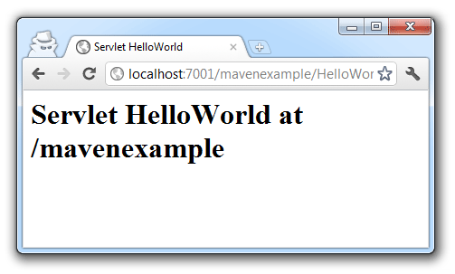

You might know, what the WebLogic Maven Plug-In is available since <a href="http://blog.eisele.net/2011/01/using-and-installing-weblogic-10340.html">WLS 10.3.4.0</a>. This nice little plug-in has been revised and updated with the recent WebLogic 12c release.
 
 <b>What changed?</b>
 
 Since the Maven support has been there for some time, it's&nbsp;interesting&nbsp;to look at what changed over time. Most notably, the old way of generating the&nbsp;weblogic-maven-plugin.jar is no longer required. You now find a pre-bundled version in $MW_HOME/wlserver/server/lib/wls-maven-plugin.jar the corresponding pom.xml is also there $MW_HOME/wlserver/server/lib/pom.xml. Since you don't have to use the jarbuilder you can simply install the dependency almost like you did before. Change to $MW_HOME/wlserver/server/lib/ and type:
 
 <code> mvn install  
  mvn install:install-file -Dfile=wls-maven-plugin.jar -DpomFile=pom.xml </code>
 
 
 Now you can use it. 
 
 <code> mvn com.oracle.weblogic:wls-maven-plugin:help</code>
 
 
 Or add the corresponding build element to your projects pom.xml. There is one thing you need to be careful of. The class name changed: it's not longer weblogic-maven-plugin but <b>wls</b>-maven-plugin. This is especially important if you already have an older plugin in place.
 
 If you don't like to use the full-qualified class name, you can add the following lines to your ~/.m2/settings.xml prior to executing the mvn install commands from above!
 <code> 
 &lt;pluginGroups&gt;  
 &nbsp; &lt;pluginGroup&gt;com.oracle.weblogic&lt;/pluginGroup&gt;  
  &lt;/pluginGroups&gt;  </code>
 <b> 
 Deployment Goals until today</b>
 
 Until today the plug-in only supports the maven goals in the following table.
 
<table>
 <tbody>
  <tr>
   <td>weblogic:deploy</td>
   <td>Deploys or redeploys an application or module.</td>
  </tr>
  <tr>
   <td>weblogic:undeploy</td>
   <td>Stops the deployment and removes staged files from target servers.</td>
  </tr>
  <tr>
   <td>weblogic:redeploy</td>
   <td>Redeploys a running application or part of a running application.</td>
  </tr>
  <tr>
   <td>weblogic:start-app</td>
   <td>Starts an application.</td>
  </tr>
  <tr>
   <td>weblogic:stop-app</td>
   <td>Stops an application.</td>
  </tr>
  <tr>
   <td>weblogic:list-apps</td>
   <td>Lists the deployment names for applications and standalone modules deployed, distributed, or installed in the domain.</td>
  </tr>
  <tr>
   <td>weblogic:update-app</td>
   <td>Updates an application's deployment plan by redistributing the plan files and reconfiguring the application based on the new plan contents.</td>
  </tr>
  <tr>
   <td>weblogic:help</td>
   <td>Lists all the deployment goals</td>
  </tr>
 </tbody>
</table>
 <b>New Goals with 12.1.1.1</b>
 
 The 12c release introduces six new goals which makes using WLS in CI environments a breeze. 
 
<table>
 <tbody>
  <tr>
   <td>mvn wls:install</td>
   <td>Automated WebLogic server installation from zip file</td>
  </tr>
  <tr>
   <td>mvn wls:uninstall</td>
   <td>Automated WebLogic server de-installation</td>
  </tr>
  <tr>
   <td>mvn wls:create-domain</td>
   <td> 
     &nbsp; Create a domain for WebLogic Server using the default domain template. 
     &nbsp; For more complex domain creation use the WLST goal.</td>
  </tr>
  <tr>
   <td>mvn wls:start-server</td>
   <td>Start WebLogic Server&nbsp;</td>
  </tr>
  <tr>
   <td>mvn wls:wlst</td>
   <td>Execute inline and external WLS scripts</td>
  </tr>
  <tr>
   <td>mvn wls:appc</td>
   <td> 
     The appc compiler generates and compiles the classes needed to deploy 
     EJBs and JSPs to WebLogic Server. It also validates the deployment 
     descriptors for compliance with the current specifications at both the 
     individual module level and the application level.</td>
  </tr>
 </tbody>
</table>
 <b>wls:install</b>
 
 This goal installs WLS into a local directory to enable it to be used execute the other goals, as well as a installation to create a WLS domain that can be used to deploy and test the application represented as the Maven project. To install, you need a distribution to install. This is specified using the &lt;artifactLocation&gt; configuration element in the wls maven plugin section of the pom.xml, or specify it using the –DartifactLocation property when Maven is invoked.
 
 You can even distribute the WLS zip install via your central maven repository. First step is to install it:
 
 <code>mvn install:install-file -Dfile=wls1211_dev.zip -DgroupId=com.oracle.weblogic -DartifactId=wls-dev -Dpackaging=zip -Dversion=12.1.1.1</code>
 
 
 The target directory for the installation is specified using the optional weblogicHome configuration element. This is set to $\{basedir\}/Oracle/Software by default. Specifying a &lt;middlewareHome&gt; value will direct the install to be performed in the specified location. The following goal will install a WLS into d:\wls12:
 <code>mvn wls:install -DartifactLocation=com.oracle.weblogic:wls-dev:zip:12.1.1.1 - DmiddlewareHome=d:\wls12</code>
 
 How cool is that? Think about the endless possibilities rolling out the WLS instances and configurations to a complete team! But we are only half through. We also need a domain:
 
 <b>wls:create-domain</b>
 
 The location of the domain is specified using the optional &lt;domainHome&gt; configuration element. By default &lt;domainHome&gt; is set to $\{basedir\}/Oracle/Domains so it will be created in an Oracle/Domains subdirectory of the root directory of the Maven project. The WLS installation to be used is specified using the optional &lt;middlewareHome&gt; configuration element. This is set to $\{basedir\}/Oracle/Software by default, so if the default location has been used to execute the install goal, it can be left out of this goal. Additionally you only need to provide a user and a password via the identical named parameters.
 
 <code>mvn wls:create-domain -DdomainHome=d:\wls12\user_projects\domain1 -DmiddlewareHome=d:\wls12 -Duser=system -Dpassword=weblogic1</code>
 
 
 Now you have setup your domain completely. 
 
 <b>wls:start-server</b>
 
 So, let's start the server. The start-server goal executes a startWebLogic command on a given domain, starting the WebLogic Server instance. This goal also uses the &lt;middlewareHome&gt; and &lt;domainHome&gt; configuration elements to specify the location of the WLS installation and domain to use. 
 
 <code>mvn wls:start-server -DdomainHome=d:\wls12\user_projects\domain1 -DmiddlewareHome=d:\wls12 </code>
 
 
 That's it, try to access: http://localhost:7001/console/ and you will see, that your newly created domain is up and running! 
 
 <b>mvn wls:wlst</b>
 
 The WLST goal enables the WebLogic Scripting Tool (WLST) to be used to execute scripts that configure resources or perform other operational actions on a WebLogic Server domain. The WLST used by the wlst Maven goal is the standard environment WebLogic Server WLST environment so all existing scripts should be able to be used. The relevant configuration elements are user, password and filename. Where the last one identifies your WLST script. 
 
 <code>mvn wls:wlst -DartifactLocation=com.oracle.weblogic:wls-dev:zip:12.1.1.1 -Duser=system -Dpassword=weblogic1 -Dfilename=create-app-ressource.py</code>
 
 
 Wonderful. Now you have your system configured with all needed resources.
 
 <b>mvn wls:appc</b>
 
 The appc goal executes the WebLogic Server application compiler tool to prepare the application for deployment. The appc compiler generates and compiles the classes needed to deploy EJBs and JSPs to WebLogic Server. It also validates the deployment descriptors for compliance with the current specifications at both the individual module level and the application level. 
 
 
 That's all! Give it a try! It is simple as Maven :) And to make this a little more handy for you I prepared a sample maven project with all you need to setup a environment for WebLogic server.
 
 all you need to do is to install the zip distribution and the wls-maven plugin to your local repository as described above. <a href="http://www.eisele.net/jar/mavenexample.zip">Download the sample maven project</a> (it can be opened in NetBeans right away) and try:
 
 <code> mvn install </code>
 
 if you want to run it on WebLogic server, simply revise the path settings in the properties section of the pom.xml (&lt;fmw.home&gt;d:\temp\wls\&lt;/fmw.home&gt;) and execute:
 
 <code> mvn install -Pdeploy </code>
 

 

<code> </code>