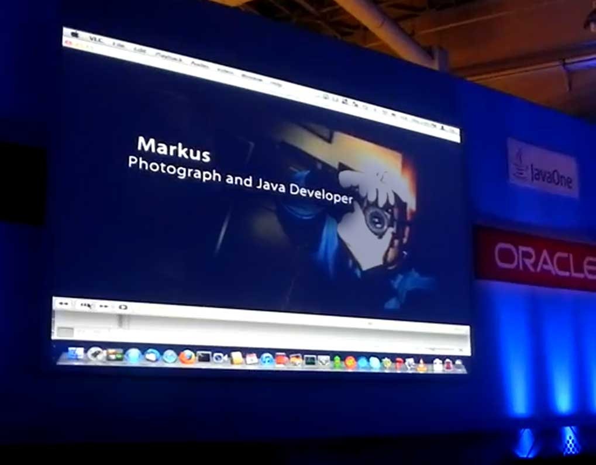

JavaOne is on the road again and just a few days back the Brazilian show ended. According to the blog-posts around it was a&nbsp;big success! I was a bit&nbsp;jealous&nbsp;about not making it there. But I was on the road quite a bit this year and I also have a daily job to do and&nbsp;family&nbsp;is important too, and, and, and ... You know how those kind of sentences end. It was a pleasure seeing <a href="">Fabiane </a>and <a href="https://twitter.com/#!/brjavaman" target="_blank">Bruno </a>doing an awesome job at the community keynote which was recorded by <a href="" target="_blank">Loaine</a>. Ok, what's the point of that post exactly? I just wanted to keep you updated with the result of a wonderful idea. At the end of November Fabiane and Bruno called out to the Java developers and<a href="http://java.net/projects/soujava/lists/noticias-list/archive/2011-11/message/3" target="_blank"> asked for their picture</a> in which they are spending precious time on their hobbies. I liked the idea and submitted a picture taken by my little 3 y/o daughter (!). And yes, thanks to the wonderful SouJava people it also made a small appearance in the JavaOneBr Community Keynote. 
 
 

 

 
 
 Here is the complete video, watch minutes 18:30 ongoing for the complete show.
 <iframe allowfullscreen frameborder="0" height="259" src="http://www.youtube.com/embed/7QhdlOU0Qno?rel=0" width="450"></iframe>
 
 
 Thanks Fabiane, Bruno, SouJava and Oracle! It was a pleasure contributing :)
 
 
 UPDATE (13.12.11)
 
 Here is a revised version of the "Real Java Geeks".
 <iframe allowfullscreen frameborder="0" height="229" src="http://www.youtube-nocookie.com/embed/BNJIjgFhpUA?rel=0" width="450"></iframe>