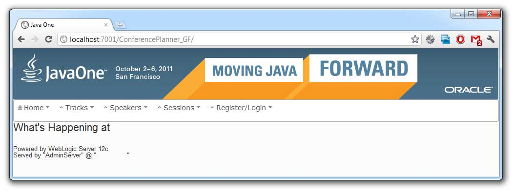

Oracle announces <a href="http://www.oracle.com/technetwork/middleware/weblogic/overview/index.html" target="_blank">Oracle WebLogic Server 12c</a>&nbsp;the latest release of the #1 application server in this very minute. In exactly one hour from now you can attend the online launch, Developer Deep-Dive, December 1, 11:00 a.m. PT (<a href="http://event.on24.com/r.htm?e=375727&amp;s=1&amp;k=108E7A597FD93F05D40355E5A6A5F60C&amp;partnerref=WLS12c_Launch_OTN" target="_blank">Register here</a>). Read the complete <a href="http://www.oracle.com/us/corporate/press/1389773" target="_blank">press release</a>. I am quoted there, too: 
 
<blockquote>
 "Oracle WebLogic Server 12c is exactly what I have been waiting for. Developing Java EE 6 applications for Oracle W! ebLogic Server has never been easier. Development, deployment, management and productivity have now been taken to the next level, which makes Oracle WebLogic Server 12c, in my opinion, the most reliable Java EE application server ever." said Markus Eisele, a German Software Architect and Consultant.
</blockquote>

 

 I had the pleasure to contribute to the beta program and give my recent developments a try with WebLogic 12.1.1.0. After long years we finally have the full Java EE 6 profile up and running on WebLogic server. Beside the <a href="http://www.oracle.com/technetwork/java/javaee/tech/index.html">Java EE 6 specs</a>, you already know, you also get a complete <a href="http://www.oracle.com/technetwork/java/javase/downloads/index.html">Java SE 7</a> certified Java EE runtime.
 
 Together with the new WLS 12c you also can start with the latest Oracle Enterprise Pack for Eclipse (<a href="http://www.oracle.com/technetwork/developer-tools/eclipse/downloads/oepe-1211-beta-1357594.html" target="_blank">OEPE 12.1.1.0 beta</a>) release which fully supports WebLogic Server 12c (12.1.1.0). Note: This is a pre-GA version of Oracle Enterprise Pack for Eclipse 12.1.1. It gives you a rich, widely-used development tool with which you can develop and test Java EE 6 applications on WebLogic Server 12c.
 
 
 The release is based on the <a href="" target="_blank">Eclipse 3.7 Indigo</a> platform. A number of Oracle developed plugins are also bundled to help you build, deploy and test applications with WebLogic Server. The "Oracle WebLogic Server tools plugin" delivers the tight integration into the IDE. You can control, deploy and debug your applications right from Eclipse. The "WebLogic Server Scripting Tools" allow you to create, execute, and debug WLST scripts. The "Coherence Tools" assist you with building, configuring, running, and debugging Coherence distributed caches. The "JPA Tools" assist you with the development of JPA 2.0 based applications. And last but not least the "Web Tier tools plugin" supports the development of Java EE 6 Web applications. 
 
 
 The coolest part of the beta was the test application. It was the <a href="http://blogs.oracle.com/arungupta/entry/java_ee_paas_using_glassfish" target="_blank">ConferencePlanner</a> which was used to demonstrate the new PaaS capabilities of GlassFish 4.0 at the JavaOne2011 Keynote.
 
 

 
  

 It has been developed by <a href="" target="_blank">Arun Gupta</a> using Java EE 6 using the Java EE 6 Reference Implementation, GlassFish 3.1. Even if I did not port it personally, I was only running it, I heard that it was a breeze doing it. WebLogic understands the GlassFish deployment descriptors and the only thing that needed to be changed was the used database. This summarizes my own experiences with the deployment of&nbsp;existing Java EE 6 GlassFish apps, too. It was comparably easy. If you have ever find yourself porting GF 2.x to WLS 10.x you know that this is a huge progress. The only thing that still is a bit tricky are the security related&nbsp;artifacts. Especially if you are using custom realms and login modules. You simply have to dig into the details. This is not the fault of either WebLogic or GlassFish but probably of the thin specification there.
 
 
 Final words: Go for it! After a very long wait for Java EE 6 support you can finally give it a try! And it's worth it! Good to see WLS back in the field of the players! Thanks Mike, thanks Steve, thanks Oracle!