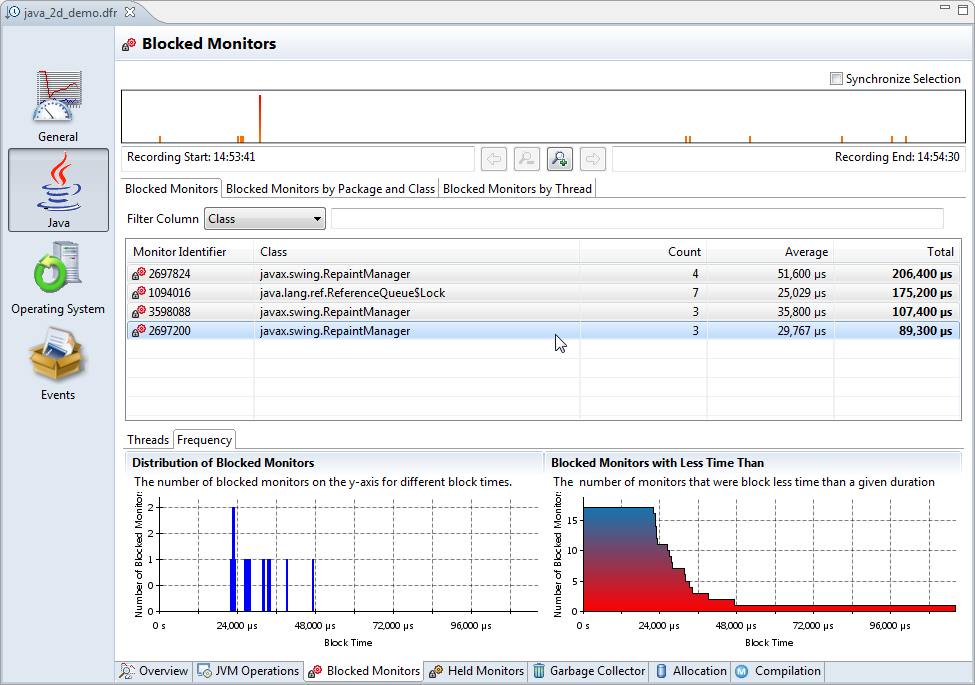
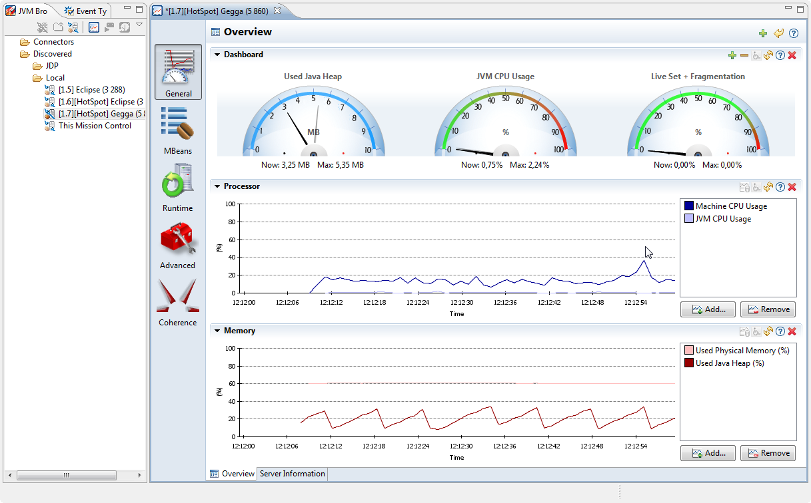
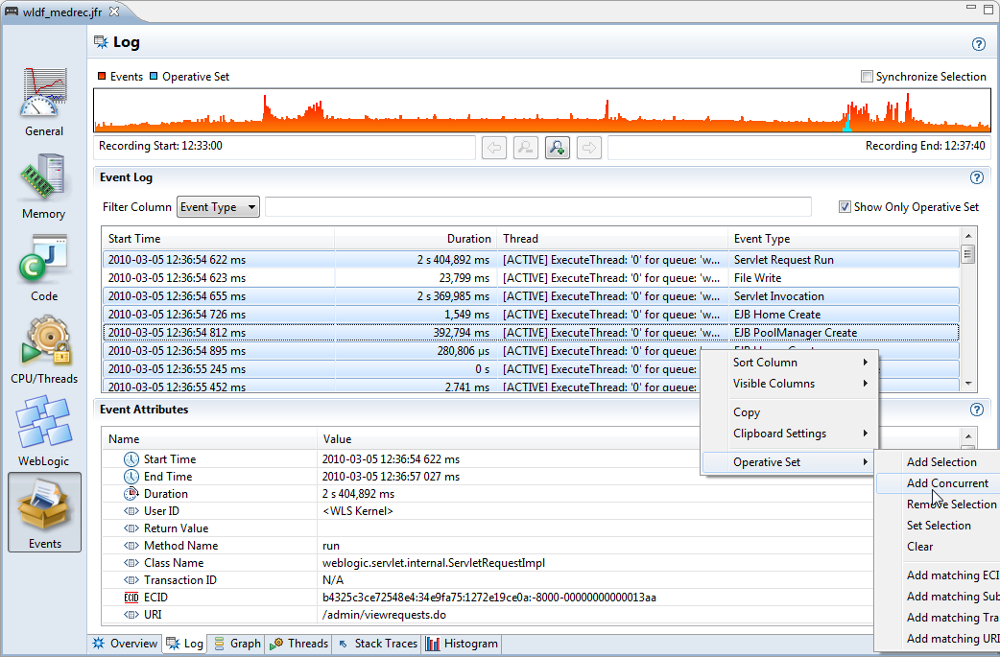
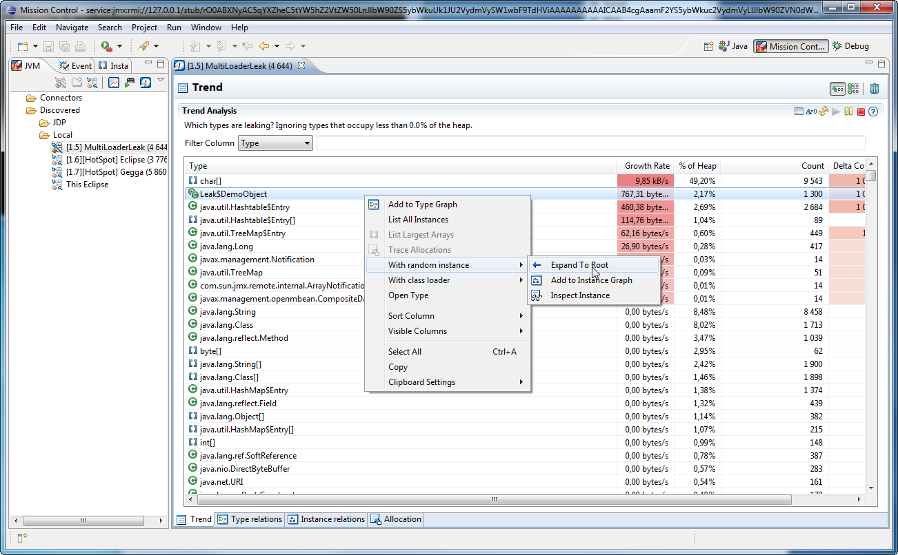

Oracle released a new version of their former JRockit-only tooling <a href="http://www.oracle.com/technetwork/middleware/jrockit/mission-control/index.html">Mission Control</a> Suite (JRMC). The 4.1 version is a minor version upgrade which directly follow the 4.0.1 which was released way back middle 2010.&nbsp;But even if the version number indicates, it's a minor upgrade, you still find tons of new features in it.
 
 JRMC is a set of plug-ins for the Eclipse IDE designed to help develop, profile and diagnose applications running on the Oracle's JVMs.&nbsp;It includes tools to monitor, manage, profile, and eliminate memory leaks in your Java application without introducing the performance overhead normally associated with tools of this type. It's functionality is always available on-demand, and the small performance overhead is only in effect while the tools are running.
 
 <b>New Platform Support</b>
 
 The Mission Control client is now built and tested on some new platforms. The new platforms are Mac OS X, Solaris x86 and Solaris SPARC. Beside that it can now be run <b>on </b>Hotspot JVM, which was not possible with earlier versions. Mission Control can also start the local management on Hotspot JDK 1.6 and later. Note that you will still need to connect to a JRockit to be able to use most of the Mission Control tools. The underlying Eclipse has been upgraded to Eclipse 3.7 (<a href="" target="_blank">Indigo</a>). 
 
 <b>New Plugins</b>
 
<table cellpadding="0" cellspacing="0" class="tr-caption-container" style="float: right; margin-left: 1em; text-align: right;">
 <tbody>
  <tr>
   <td style="text-align: center;"></td>
  </tr>
  <tr>
   <td class="tr-caption" style="text-align: center;">DTrace Analysis GUI</td>
  </tr>
 </tbody>
</table> The new Solaris support also comes with a new experimental plugin for DTrace. To install it into the stand alone version of Mission Control, go to Help | Install plug-ins... on the menu. To install it into Eclipse, first install the Eclipse plug-in version of Mission Control, then install it from the Experimental update-site. Mission Control provides a domain specific language that extends the DScript syntax to make the data self describing. The default .de script provides probes for recording both Hotspot behaviour as well as data from the operating system. This makes it easier to bring the the data into the Mission Control event model. If Mission Control is run in Eclipse, the DSL comes with an editor providing features such as syntax highlighting. Just like with flight recorder, there is an action for starting a DTrace recording. The wizard allows for configuring the parameters declared in the .de file, as well as enabling and disabling probe sets.The GUI provided with the DTrace plug-in uses the Flight Recorder components and GUI editor. There are too many tabs to describe them all in detail here, however, an example recording is provided with the plug-in which allows you to try out the GUI, even on platforms where DTrace is not available.
 
 
 There also a new Coherence plug-in available. Like all Plugins it can be installed into the stand-alone version of JRMC or into Eclipse via the update-site. It gives you memory details (Heap) about any Coherence Nodes and an overview about the configuration.
 
 
 The previous experimental "Native Memory" tab is part of the core distribution now.
 
 <b>The Management Console</b>
 
<table cellpadding="0" cellspacing="0" class="tr-caption-container" style="float: right; margin-left: 1em; text-align: right;">
 <tbody>
  <tr>
   <td style="text-align: center;"></td>
  </tr>
  <tr>
   <td class="tr-caption" style="text-align: center;">Support for new JDK7 MBean attributes</td>
  </tr>
 </tbody>
</table> - Zooming the charts will now freeze the range, and it is now possible to use the mouse wheel to zoom. Clicking the refresh toggle button after freezing the range will keep the zoom settings but realign the x-axis to always show the latest value.
 
 - File resource operations better respect the Eclipse environment. For example, if a trigger which logs to file is created when running Mission Control in Eclipse, the file will be an Eclipse file resource. If the log is opened in an editor, the editor will be refreshed whenever new content is available.
 
 - There are now default trigger rules available for deadlocks. 
 
 - There is a new tab which lists textual information that is commonly of interest. Among the listed information is the library path of the Java process, the bootclass path, and the JVM and application arguments.
 
 - Some JRockit attributes have been ported to Hotspot in JDK 7. Mission Control 4.1 supports these new attributes to provide a better experience when connecting to a Hotspot JVM. For instance, the Overview tab will be fully populated and the Threads tab will work to a greater extent than before.
 
 <b>The Flight Recorder (JFR)</b>
 
<table cellpadding="0" cellspacing="0" class="tr-caption-container" style="float: right; margin-left: 1em; text-align: right;">
 <tbody>
  <tr>
   <td style="text-align: center;"></td>
  </tr>
  <tr>
   <td class="tr-caption" style="text-align: center;">Improved operative set</td>
  </tr>
 </tbody>
</table> - The thread graph now has support for rendering thread transition information. Note: When recording with JRockits prior to R28.2, the transition arrows are currently being rendered from the thread which held the monitor at the beginning of the blocking event, to the end of the blocking event.
 
 - It is now possible to select between zooming and selection in the toolbar in the thread graph.
 
 - Since the important information in thread names is usually in the beginning and/or end of the names, the thread graph will try to crop information from the middle of the thread names and replace the missing characters with an ellipsis.
 
 - There is a new operative set action available which adds all events occurring during the same time and in the same thread as a selection of events to the operative set. This is particularly useful together with higher level events such as WLS related events. In the screen shot, events occurring at the same time as the events of a WLS transaction has been added, revealing low level IO events.
 
 - The performance of the parser as well as memory footprint has been optimized. It is now be possible to open recordings with more than 10000 threads. Also, as long as there is sufficient heap available, opening recordings with more than 20 million events should be no problem. 
 
 - Mission Control features a built in GUI editor. It can be used to redesign the GUI from within Mission Control itself. It is currently unsupported, but can be started by adding the -designer parameter to the launcher. See various blog entries or the JRockit book for more information. In 4.1 the built in GUI editor has been much improved. There is now an editing history and proper undo/redo functionality. Also container components, such as tab folders and sashes, are now properly drawn in the GUI editor. There are several new components available, such as distribution charts. Components can now be configured in three level master/slave dependencies.
 
 <b>The Memory Leak Detector</b>
 
<table cellpadding="0" cellspacing="0" class="tr-caption-container" style="float: right; margin-left: 1em; text-align: right;">
 <tbody>
  <tr>
   <td style="text-align: center;"></td>
  </tr>
  <tr>
   <td class="tr-caption" style="text-align: center;">Short cuts for selecting instances</td>
  </tr>
 </tbody>
</table> - Sometimes any instance of a certain type will be of interest. There is now a shortcut available for selecting a random instance. There is also a short cut for selecting the class loader instance of the type.
 
 - There is now an extension point available for better visualizing of instances. By default, extensions are provided by character arrays, Strings and some common collections. If the WLS plug-in is installed, visualization of app class loaders will be improved to reveal information such as application name and domain.
 
 - There are now resettable delta counters for instances available in the trend table.
 
 - There is an instance limit available that prevents the client from fetching too much data from the server. This instance limit can now temporarily be increased directly from the instance view. It can, of course, as always be changed in the preferences.
 
 - In 4.0.x the tree representations of the type and instance graphs were shown on separate tabs. Now there is a toggle switch in the toolbar to switch between the graph and tree representations.
 
 <b>What will be next? Java Mission Control 5.0!</b>
 
 According to what I know, this will be the last 4.x release. If you look through the slides by Marcus Hirt according to the future of Mission Control, the next major release will drop it's JRockit past and move on into the direction to be the Mission Control suite for the converged JVM.&nbsp;Will only be&nbsp;available&nbsp;for Hotspot, even if&nbsp;JRockit updates still will appear in the 4.x. It will contain&nbsp;the flight recorder and&nbsp;much of the MBeans. What will be missing is the&nbsp;Memory Leak Detector in JDK 7. Even if all this was presented with the usual safe harbor statement, I guess we can anticipate, that it will be available within the JDK 8 timeline.
 
 <b>Further Links and Readings</b>
 
 HotRockit Slides by Marcus Hirt from JavaOne2011
 <a href="https://oracleus.wingateweb.com/published/oracleus2011/sessions/22260/22260_Cho2634610.pdf">https://oracleus.wingateweb.com/published/oracleus2011/sessions/22260/22260_Cho2634610.pdf</a>
 
 
 What's new in JRMC 4.x by Marcus Hirt from JavaOne2011
 <a href="https://oracleus.wingateweb.com/published/oracleus2011/sessions/22261/22261_Wang2554410.pdf">https://oracleus.wingateweb.com/published/oracleus2011/sessions/22261/22261_Wang2554410.pdf</a>
 
 
 Download:
 <a href="http://www.oracle.com/technetwork/middleware/jrockit/downloads/index.html">http://www.oracle.com/technetwork/middleware/jrockit/downloads/index.html</a>
 
 
 Eclipse Update Site Information:
 <a href="">http://download.oracle.com/technology/products/missioncontrol/updatesites/base/4.1.0/eclipse/</a>
 
 
 Blog from Marcus Hirt:
 <a href="">http://blogs.oracle.com/hirt/</a>
 
 
 
 