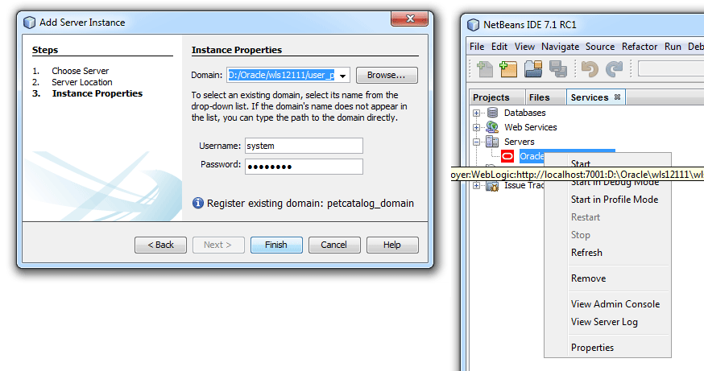
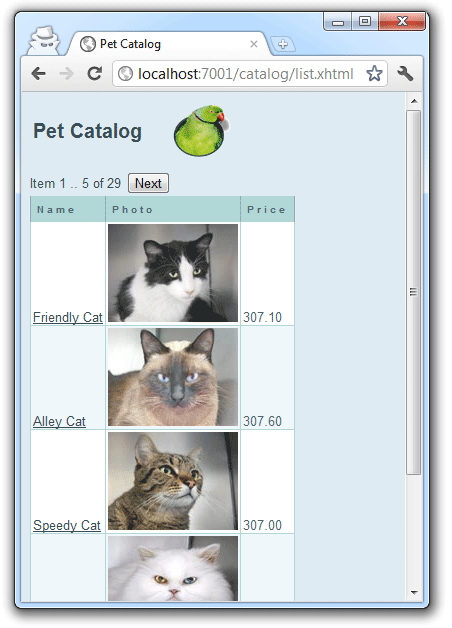

WebLogic server 12c is out since a few days. It is for "naked" Java dev - the fancy Fusion Middleware stuff will move on to 12c down the line. So, this is basically my release to run. Today I am giving you a quick start with latest NetBeans 7.1 (RC 2) and <a href="http://draft.blogger.com/oracle.com/weblogic" target="_blank">WebLogic</a> to run the <a href="http://netbeans.org/kb/samples/pet-catalog.html" target="_blank">Pet Catalog</a> example with <a href="" target="_blank">MySQL</a>. 
 
 <b>Preparation</b>
 

 

 First step is to download all required components. Grep a copy of latest <a href="">NetBeans 7.1 RC 2</a>, <a href="http://www.oracle.com/technetwork/middleware/ias/downloads/wls-main-097127.html">WebLogic 12.1.1.1</a>and <a href="">MySQL 5.5.18</a>. Install WebLogic, NetBeans and MySQL according to the instructions. Next is to create a simple WebLogic server domain. Start the configuration tool (%WL_HOME%/common/bin/config.exe|sh) and add a "petcatalog_domain" with the basic configuration. Give a admin user and password. 
 
 Fire up NetBeans and switch to the Services tab. Right click on the Servers node and select "Add Server...". Choose "Oracle WebLogic Server" and click next to enter the Server location "/Oracle/wls1211/wlserver_12.1". Click next to select or browse for the new domain (petcatalog_domain), enter the administrator username and password. Click finish and right click on the new Oracle WebLogic Server node. You can start, stop and restart a domain. In normal, profile and debug mode. A quick link to either the server log and the Admin console is also available. Now&nbsp;fire up the MySQL Administrator and create a new db (e.g. petcatalog). Make sure, that you have a db user, that has access to it.
 
 <b>Pet Catalog Example with NetBeans</b>
 
 Since late 2009 a application called the<a href="http://netbeans.org/kb/samples/pet-catalog.html"> Pet Catalog is part of NetBeans</a>. It's a Java EE 6 example that demonstrates the usage of JavaServer Faces 2.0 and the Java Persistence API based on MySQL. It's basically there to demonstrate the usage of GlassFish with MySQL. Find more <a href="http://weblogs.java.net/blog/caroljmcdonald/archive/2009/08/java_ee_6_pet_c.html">details about the application</a> on java.net. What a wonderful show-case to deploy on the new WebLogic 12c server. 
 
 Back to NetBeans: Select "New Project" and project type "Sample/Java Web/Pet Catalog". Enter a project name and location. Click finish. Confirm the "Missing Server" problem dialog and right click on your newly created project, choose "Resolve missing Server Problem...". Select "Oracle WebLogic Server" and click ok. After a short project scan and a re-build, the project is opened and has all the needed libraries. Open a mysql command line or the query browser and execute the "netbeans-projects/PetCatalog/setup/catalog.sql" script against your newly created db. If you are down there already, open the project's configuration files and open the "persistence.xml". Comment out lines 5 to 8 (all in-between and including &lt;properties&gt; and &lt;/properties&gt;).
 
 <b>Pet Catalog Data Source in WebLogic Server</b>
 

 

 Even if you also see a sun-resources.xml in your project, you can't take advantage of it.
 
 You need to create a suitable datasource in WebLogic server first. Open the <a href="">WLS console/</a>, expand the "Services" node in the left tree, click "Data Sources". Select "New" on top of the table&nbsp;and select "Generic Data Source". Give it a suitable name (e.g. "Pet Catalog Pool"), JNDI Name ("jdbc/petcatalog") and select MySQL as the Database Type. Click next and review the database driver ("com.mysql....) click next and&nbsp;select the transaction options (leave default for now). Click next and enter the connection properties Database Name (e.g.&nbsp;petcatalog), Host Name (e.g. localhost), Port (3306), Database Username, Password and Password Confirmation. Click next and select "Test Configuration" on top. A green "Connection test succeeded" message should appear on top &nbsp; (compare screenshot). Click next, select Admin Server as target and click finish. Now your all set. The petcatalog Data Source is all set up.
 
 <b>Run it!</b>
 
 All finished. Right click your project in NetBeans and select "Run". You see that the WebLogic server is started and the project is getting deployed. If everything is finished, your system browser is opened and you are redirected to the applications start page:
 
 

 

 <b>Adding Primefaces</b>
 
 That's all. Nothing more to do! So, we have a new sample application for WebLogic server :) But let's make this a little bit more fancy. Let's add <a href="">Primefaces </a>to it. Right click your NetBeans project and select "Properties". Select category "Frameworks" and select tab "Components" where you can select "Primefaces 2.2.1". Click ok to update your project. Now open your list.xhtml and add the primefaces namespace
 <code> xmlns:p="http://primefaces.prime.com.tr/ui" </code> to the &lt;html&gt; element. 
 
 Next is to change the list.xhtml to use the <a href="http://www.primefaces.org/showcase/ui/datagrid.jsf" target="_blank">Primefaces DataGrid</a> example. And add a public List&lt;item&gt; getAllItems() method to Catalog.java. Same place introduce a selectedItem property with getters and setters. And if you have done everything the right way, you have your primefaceified Pet Catalog running on WebLogic Server 12c! Congratulations!
 
 

 

 