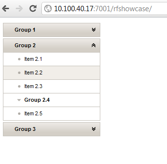

You might have noticed, that I simply love JSF. Not only the <a href="http://jcp.org/en/jsr/detail?id=245" target="_blank">specification</a> and the reference implementation <a href="" target="_blank">Mojarra</a>&nbsp;but also the most creative component suites on the market. This is my all-time favorite <a href="" target="_blank">PrimeFaces</a> and of&nbsp;course <a href="http://www.jboss.org/richfaces/download/stable" target="_blank">RichFaces</a>. This is the reason why you find "running xxx on xxx" posts here :) Today is my RichFaces and WebLogic day, so a little followup on my <a href="http://blog.eisele.net/2011/04/running-richfaces-400final-showcase-on.html" target="">earlier post</a> this is more an update on how to get it running on latest WebLogic 12c. Here we go:
 
 <b>Preparation</b>
 
 Download the IDE of your choice. I will use <a href="" target="_blank">NetBeans 7.1 RC 2</a> for this post. <a href="http://www.oracle.com/technetwork/middleware/ias/downloads/wls-main-097127.html" target="_blank">Download</a> and install WebLogic Server 12c. Either with the platform installer of your choice or from the ZIP distribution. Go on with creating a domain and adding the server to NetBeans. (For more <a href="http://blog.eisele.net/2011/12/quickstart-weblogic-12c-with-netbeans.html">details see my earlier post</a>.) Go back to NetBeans,&nbsp;check your maven settings and create a new Maven Web Application project. Let's call it&nbsp;rfshowcase for now. Enter the missing stuff (Group, Version and Package). Select or add your local Oracle WebLogic server as your runtime environment. Add the JBoss Maven repository and the magic richfaces-bom to your pom.xml:
 
 
<pre class="brush: java">&lt;repositories&gt; &nbsp;&lt;repository&gt; &nbsp;&lt;id&gt;jboss&lt;/id&gt; &nbsp;&lt;name&gt;JBoss Repository&lt;/name&gt; &lt;url&gt;http://repository.jboss.org/nexus/content/groups/public/&lt;/url&gt; &nbsp;&lt;/repository&gt; &lt;/repositories&gt;&nbsp;</pre>
 
<pre class="brush: java">&lt;properties&gt; &nbsp;&lt;org.richfaces.bom.version&gt;4.1.0.Final&lt;/org.richfaces.bom.version&gt; &nbsp;&lt;!-- ... --&gt; &lt;/properties&gt; &lt;dependencyManagement&gt; &lt;dependencies&gt; &lt;dependency&gt; &lt;groupId&gt;org.richfaces&lt;/groupId&gt; &lt;artifactId&gt;richfaces-bom&lt;/artifactId&gt; &lt;version&gt;$\{org.richfaces.bom.version\}&lt;/version&gt; &lt;scope&gt;import&lt;/scope&gt; &lt;type&gt;pom&lt;/type&gt; &lt;/dependency&gt; &lt;!-- ... --&gt; &lt;/dependencies&gt; &lt;/dependencyManagement&gt; </pre>
 
 Add the RichFaces dependencies:
 
 
<pre class="brush: java">&lt;dependency&gt; &nbsp;&lt;groupId&gt;org.richfaces.ui&lt;/groupId&gt; &nbsp;&lt;artifactId&gt;richfaces-components-ui&lt;/artifactId&gt; &lt;/dependency&gt; &lt;dependency&gt; &nbsp;&lt;groupId&gt;org.richfaces.core&lt;/groupId&gt; &nbsp;&lt;artifactId&gt;richfaces-core-impl&lt;/artifactId&gt; &lt;/dependency&gt; </pre>
 
 And you are done! Unlike with earlier version of WLS (compare my older post) JSF 2.x and JSTL 1.2 have been incorporated directly into the server's classpath. Applications deployed to WebLogic Server can seamlessly make use of JSF 2.x and JSTL 1.2 without requiring developers to deploy and reference separate shared libraries. So, you can actually start implementing your application.
 
 <b>Some simple tests</b>
 
 Let's go and add an index.xhtml to your Web Pages folder. Add the RichFaces namespaces to your html tag:
 
 
<pre class="brush: java">xmlns:a4j="http://richfaces.org/a4j" xmlns:rich="http://richfaces.org/rich" </pre>
 

 

 And start using your needed components. In my little example I stripped down the rich:panelMenu taken from the <a href="" target="_blank">showcase.richfaces.org</a>&nbsp;. Now right click on your project and "Run" it! NetBeans is starting your WLS instance and deploys your application. After this is done it should open a browser which points you to http://localhost:7001/rfshowcase/ and you see your application up and running. That's all. Nothing more to do. No library deployment, nothing else. That's what I would call a good progress. Compared to the stupid library deployment that was needed with earlier versions of WLS you know have the freedom to use whatever comes your way. Even if you feel like using another RI you could simply revert the classloader by specifying the prefer-application-packages tag in your weblogic.xml
 
 
<pre>13.12.2011 20:48:43 org.richfaces.application.InitializationListener onStart INFO: RichFaces Core Implementation by JBoss, a division of Red Hat, Inc., version v.4.1.0.Final</pre>
 <b>Clazzloading or Oracle and RedHat vs. Google</b>
 
 If you look at your application from a <a href="http://blog.eisele.net/2011/01/using-new-weblogic-classloader-analysis.html">classloader point of view</a> you will see, that you have a good number (705) of classes in conflict. In the case of RichFaces all these are in the com.google.common.* package. The reason for that is, that WLS is distributing a com.google.common_1.0.0.0_0-6.jar which conflicts with the RichFaces dependency com.google.guava.guava.r08. Running my small tests this doesn't seem to do any harm at all. But it would be best to configure a so called FilteringClassLoader which provides a mechanism for you to configure deployment descriptors to explicitly specify that certain packages should always be loaded from the application, rather than being loaded by the system classloader. So&nbsp;you should change your project to be an EAR module and add this little paragraph to your weblogic-application.xml (ear level):
 
<pre class="brush: java">&lt;prefer-application-packages&gt; &lt;package-name&gt;com.google.common.*&lt;/package-name&gt; &lt;/prefer-application-packages&gt; </pre>