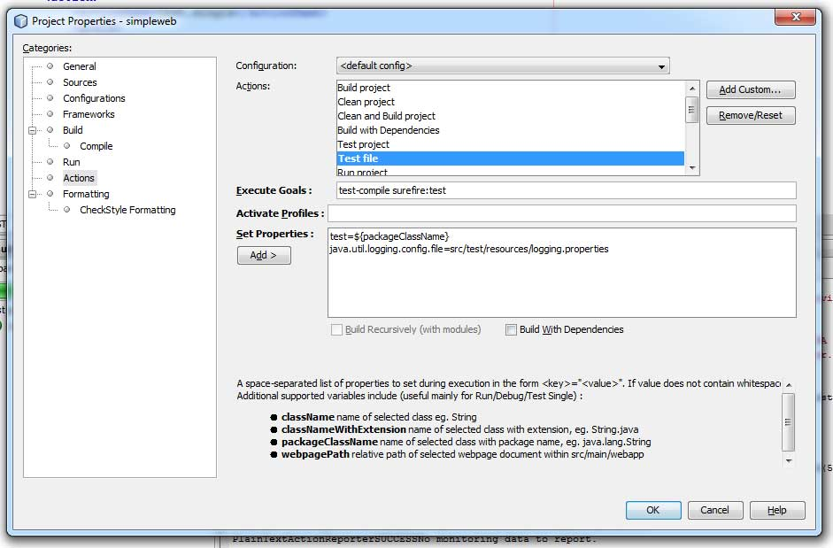

This is an, let's call it accidental post. I was looking into transactional CDI observers and playing around with GlassFish embedded to run some integration tests against it. But surprisingly this did not work too well and I am still figuring out, where exactly the problems are while using the plain embedded GlassFish for that. In the meantime I switched to <a href="http://www.jboss.org/arquillian" target="_blank">Arquillian</a>. After I looked at the Arquillian 1.0.0.Alpha4 a bit more detailed <a href="http://blog.eisele.net/2010/11/arquillian-test-in-container-with.html">last year</a>, it was time to see, what the guys prepared for 1.0.0 final. Some stuff changed a bit and I was surprised to only find some basic examples on the net. That was the main reason I started writing this post. To have a more complete example of all the three technologies working together.
 
 <b>Getting Started</b>
 
 First of all, get yourself a fresh copy of latest <a href="http://netbeans.org/downloads/index.html" target="_blank">NetBeans 7.1</a>. It's out since a few weeks and it really looks good. If you like, you can download a copy of the Java EE version, which comes with latest GlassFish OSS Edition 3.1.1 pre bundled. Install it and fire it up. Also grep a copy of <a href="" target="_blank">MySQL Community Edition</a> and install it. Back in NetBeans, setup a new Maven Webapplication via the new Project Wizard. Let's call it "simpleweb" and we tell it to run on GF 3.1.1 (if you haven't done so, you should create a Services&gt;Server&gt;GlassFish instance before or do it during the project setup).
 
 <b>Implement your Application</b>
 
 Even if this isn't test-driven, I like to use this approach because I still believe, that this is the most common case you find out there in your projects. You have a lot of stuff ready to run and you are looking for some kind of automated integration tests. So, let's assume you have a very basic entity, we call it "com.mycompany.simpleweb.entities.AuditLog". You can create it with the NetBeans new Entity wizard. The third step during the Entity creation is the provider and database setup. Define a new Datasource and name it "jdbc/auditlog". As a connection specification use MySQL J driver and I assume you have a database up and running (let's assume this is called auditlog). Test the connection and finish the wizard.
 
 

 

 
 If you are using the wizard, you get some free gifts. Beside the fact, that you now have your AuditLog entity in the source tree, you also find a META-INF/persistence.xml file in your src/main/resources and a glassfish-resources.xml in src/main/setup. This is needed later on, keep it in mind. Add some additional properties to your entity. For now I add "String account". And don't forget to define a Version field "Timestamp timestamp". And it's also nice to have a little named query to get a list of all AuditLogs
 
<pre class="brush: java">@NamedQuery(name = "findAllAuditLogs", query = "SELECT OBJECT (e) FROM AuditLog e") @Version private Timestamp timestamp; </pre> If you are using the wizard, make sure to check your pom.xml. The wizard is adding some eclipselink dependencies in scope provided, so this shouldn't make a big difference here. Next is to add a com.mycompany.simpleweb.service.AuditRepositoryService EJB. This should be responsible for all CRUD operations on the AuditLog entity.
 
 Add some code to it to insert an AuditLog: 
 
<pre class="brush: java">@PersistenceContext private EntityManager em; public void writeLog(String account) \{ AuditLog log = new AuditLog(); log.setAccount(account); em.persist(log); \} </pre> And some more code to find out the total number of entries in your table: 
 
<pre class="brush: java">public int findAll() \{ TypedQuery&lt;AuditLog&gt; query = em.createNamedQuery("AuditLog.findAllAuditLogs", AuditLog.class); return query.getResultList().size(); \} </pre> That's all for now. 
 
 <b>Adding Basic Test Dependencies</b>
 
 Next we are going to add some very basic test dependencies. Open your projects pom.xml file and add the following sections for Arquillian to your project: 
 
<pre class="brush: xml"> &lt;repository&gt; &lt;id&gt;JBoss&lt;/id&gt; &lt;name&gt;JBoss Repository&lt;/name&gt; &lt;url&gt;https://repository.jboss.org/nexus/content/groups/public/&lt;/url&gt; &lt;/repository&gt; &lt;dependencymanagement&gt; &lt;dependencies&gt; &lt;dependency&gt; &lt;groupid&gt;org.jboss.arquillian&lt;/groupid&gt; &lt;artifactid&gt;arquillian-bom&lt;/artifactid&gt; &lt;version&gt;1.0.0.Final-SNAPSHOT&lt;/version&gt; &lt;scope&gt;import&lt;/scope&gt; &lt;type&gt;pom&lt;/type&gt; &lt;/dependency&gt; &lt;/dependencies&gt; &lt;/dependencymanagement&gt; &lt;dependencies&gt; &lt;dependency&gt; &lt;groupid&gt;org.jboss.arquillian.container&lt;/groupid&gt; &lt;artifactid&gt;arquillian-glassfish-embedded-3.1&lt;/artifactid&gt; &lt;version&gt;1.0.0.Final-SNAPSHOT&lt;/version&gt; &lt;scope&gt;test&lt;/scope&gt; &lt;/dependency&gt; &lt;dependency&gt; &lt;groupid&gt;org.jboss.arquillian.junit&lt;/groupid&gt; &lt;artifactid&gt;arquillian-junit-container&lt;/artifactid&gt; &lt;scope&gt;test&lt;/scope&gt; &lt;/dependency&gt; &lt;/dependencies&gt; </pre> Beside that, you also need the embedded Glassfish dependency. 
 
<pre class="brush: xml"> &lt;dependency&gt; &lt;groupid&gt;org.glassfish.extras&lt;/groupid&gt; &lt;artifactid&gt;glassfish-embedded-all&lt;/artifactid&gt; &lt;version&gt;3.1&lt;/version&gt; &lt;scope&gt;test&lt;/scope&gt; &lt;/dependency&gt; </pre> We also need the MySQL J driver: 
 
<pre class="brush: xml"> &lt;dependency&gt; &lt;groupid&gt;mysql&lt;/groupid&gt; &lt;artifactid&gt;mysql-connector-java&lt;/artifactid&gt; &lt;version&gt;5.1.18&lt;/version&gt; &lt;scope&gt;test&lt;/scope&gt; &lt;/dependency&gt; </pre>
 <b>Configuring Arquillian</b>
 
 After we have all the needed dependencies in place, we need to further configure Arquillian. This is done via the arquillian.xml which has to be placed in the src/test/resources folder (you might need to create it outside NetBeans before) and should look like this:
 
<pre class="brush: xml">&lt;arquillian xmlns:xsi="http://www.w3.org/2001/XMLSchema-instance" xsi:schemalocation="http://jboss.org/schema/arquillian http://jboss.org/schema/arquillian/arquillian-1.0.xsd"&gt; &lt;engine&gt; &lt;property name="deploymentExportPath"&gt;target/arquillian&lt;/property&gt; &lt;/engine&gt; &lt;container default="true" qualifier="glassfish"&gt; &lt;configuration&gt; &lt;property name="sunResourcesXml"&gt;src/main/setup/glassfish-resources.xml&lt;/property&gt; &lt;/configuration&gt; &lt;/container&gt; &lt;/arquillian&gt; </pre> The engine parameter tells Arquillian to place a packaged version of your test archive to a target/arquillian folder. This is quite useful for hunting down problems. The container qualifier points the testrunner to the glassfish-resources.xml which was created by the entity creation wizard. All done. One single thing I would like to suggest is to make a copy of your persistence.xml and place it to the test/resources folder renamed to something like test-persistence.xml. I consider it a best practice to have an option to configure your test JPA a bit different than the productive one. To make a simple example, we would like to see some more logging output during the tests, so the copied version should additionally contain the needed parameters. I also like to change the table generation strategy for testing to drop-and-create-tables: 
 
<pre class="brush: xml"> &lt;property name="eclipselink.ddl-generation" value="drop-and-create-tables" /&gt; &lt;property name="eclipselink.logging.level.sql" value="FINEST" /&gt; &lt;property name="eclipselink.logging.parameters" value="true" /&gt; </pre> Let's take a look at the the tests. 
 
 <b>Add a Testcase</b>
 
 Lets add a test. This is easy with NetBeans: Right click on your EJB and select "Tools&gt;Create JUnit Tests". Select JUnit 4.x and accept the name proposal "com.mycompany.simpleweb.service.AuditRepositoryServiceTest". Now your project has a new "Test Packages" folder. As you can see, the test is in error. NetBeans assumes, that you want to do a test based on embedded EJBContainer. Nice guess, but we would like to add some Arquillian here. Remove the EJBContainer import and strip the class down to this:
 
<pre class="brush: java">@RunWith(Arquillian.class) public class AuditRepositoryServiceTest \{ \} </pre> Now it's time to define the deployment archive for the test using ShrinkWrap. The deployment archive for the test is defined using a static method annotated with Arquillian's @Deployment annotation.
 
<pre class="brush: java">@Deployment public static JavaArchive createTestArchive() \{ return ShrinkWrap.create(JavaArchive.class, "test.jar").addPackage(AuditLog.class.getPackage()).addPackage(AuditRepositoryService.class.getPackage()).addAsManifestResource( new ByteArrayAsset("&lt;beans&gt;".getBytes()), ArchivePaths.create("beans.xml")).addAsManifestResource( "test-persistence.xml", ArchivePaths.create("persistence.xml")); \} </pre> After the packages which should be contained are added, an empty beans.xml (which should be enough for now) is added and the test-persistence.xml is added as a manifest resource named persistence.xml. Great. One last thing is to define the test itself.
 
<pre class="brush: java">@EJB AuditRepositoryService repository; @Test public void insertLog() throws Exception \{ repository.writeLog("Markus"); int numberOfLogs = repository.findAll(); Assert.assertEquals(1, numberOfLogs); \} </pre> We are inserting a simple test entity and are getting the count back from the database which is checked via assertEquals. That's all. Fire up your tests. (Right click on the AuditRepositoryServiceTest class and select "Test File (Strg+F6). 
 
 <b>Examining what's happening</b>
 
 The output window shows the Std.out of a starting GlassFish. If you examine the output further you see, that the JDBC connection pool and the JDBC resource are created: 
 
<pre>INFO: command add-resources result: PlainTextActionReporterSUCCESSDescription: add-resources AdminCommandnull JDBC connection pool mysql_auditlog_rootPool created successfully. JDBC resource jdbc/auditlog created successfully. </pre> and the "test" application was deployed: 
 
<pre>INFO: WEB0671: Loading application [test] at [/test] 17.01.2012 10:12:39 org.glassfish.deployment.admin.DeployCommand execute INFO: test was successfully deployed in 6.461 milliseconds. </pre> Scanning through the output does point you to some EclipseLink stuff, but the additional sql logging doesn't seem to be in effect. This is because EclipseLink needs to know to which logger to point the output to. Normally the log output is redirected to the server logger which is auto-discovered. We didn't do any logging configuration until now and simply rely on what is default for Java Logging. So, let's add a little logging configuration. Put an empty logging.properties file to src/test/resources and add some simple lines to it: 
 
<pre>handlers=java.util.logging.ConsoleHandler java.util.logging.ConsoleHandler.formatter=java.util.logging.SimpleFormatter java.util.logging.ConsoleHandler.level=FINEST </pre> add the maven sure-fire plugin to the build section of your pom.xml: 
 
<pre class="brush: xml"> &lt;plugin&gt; &lt;groupid&gt;org.apache.maven.plugins&lt;/groupid&gt; &lt;artifactid&gt;maven-surefire-plugin&lt;/artifactid&gt; &lt;version&gt;2.11&lt;/version&gt; &lt;configuration&gt; &lt;includes&gt; &lt;include&gt;com/mycompany/simpleweb/service/*&lt;/include&gt; &lt;/includes&gt; &lt;systempropertyvariables&gt; &lt;java.util.logging.config.file&gt;$\{basedir\}/src/test/resources/logging.properties&lt;/java.util.logging.config.file&gt; &lt;/systempropertyvariables&gt; &lt;/configuration&gt; &lt;/plugin&gt; </pre> If you now issue a clean and build, you see, that the desired log output is shown in the NetBeans build output.
 
<pre>FEIN: INSERT INTO AUDITLOG (ID, ACCOUNT, TIMESTAMP) VALUES (?, ?, ?) bind =&gt; [1, Markus, 2012-01-17 11:02:54.0] </pre> In fact, if you use Strg+F6 you still only see INFO level messages. To fix this, you need to change your NetBeans run action settings. Right click your project and select "Properties". Select "Actions" and "Test file". Add the following as a new line within "Set Properties" area: 
 
<pre>java.util.logging.config.file=src/test/resources/logging.properties </pre>
 

 

 
 Now you also see the desired log-level output with a single test-run. That was it. You can download the <a href="http://www.eisele.net/jar/simpleweb.zip">complete sample maven project (as ZIP-File)</a> with the mentioned classes and play around a bit. Have fun!
 
 <b>[UPDATE: 18.01.2012]</b>
 
 Static <a href="http://blog.eisele.net/2012/01/arquillian-with-netbeans-glassfish_18.html" target="_blank">weaving problem explained in another</a> post.