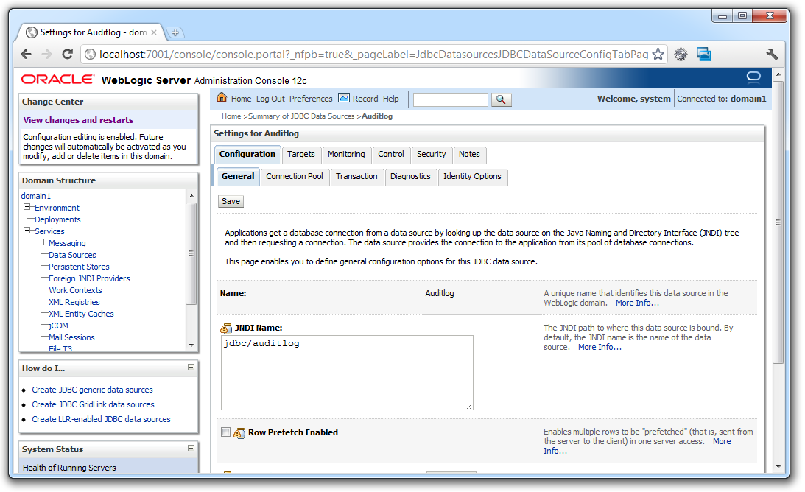

You probably followed my posts about testing more complex scenarios with embedded GlassFish (<a href="http://blog.eisele.net/2012/01/arquillian-with-netbeans-glassfish.html">Part I</a> / <a href="http://blog.eisele.net/2012/01/arquillian-with-netbeans-glassfish_18.html">Part II</a>). Next on my list of things to do was to get this setup working with latest WebLogic 12c. 
 
 <b>Getting Started</b>
 

 

 Follow the steps in the getting started part of my first two posts. There are only a few things you have to change to get this working. Obviously you need a WebLogic 12c. Grep a copy from the <a href="http://www.oracle.com/technetwork/middleware/fusion-middleware/downloads/index.html" target="_blank">OTN download-page</a>. Read and accept the license and download either the ZIP installer or the full blown installer for your OS. Arun Gupta has a nice post about <a href="http://blogs.oracle.com/arungupta/entry/get_started_with_oracle_weblogic" target="_blank">getting started with the ZIP installer</a>. This basically is about downloading, extracting, configuring, creating your domain. Assume you have a domain1 in place. Make sure to copy the mysql-connector-java-5.1.6-bin.jar to domain1/lib and fire up the server by startWebLogic.cmd/.sh in your domain1 root directory. Next you need to configure the appropriate connection pool. You also could do this using some WLST magic or with the <a href="http://blog.eisele.net/2011/12/installing-and-using-new-weblogic-12.html">new WebLogic Maven Plugin</a> but I assume you are doing this via the admin console. Go to Domain &gt; Services &gt; Data Sources and create a MySQL Datasource AuditLog with jndi name "jdbc/auditlog". Make sure the server is running while you execute your tests!
 
 <b>Modifying the sampleweb Project</b>
 
 Now open the sampleweb project's pom.xml and remove the glassfish-embedded-all dependency together with the arquillian-glassfish-embedded-3.1 and the javaee-api. Now add the wls-remote-12.1 container and the jboss-javaee-6.0 dependencies: 
 
 
<pre class="brush: xml"> &lt;dependency&gt; &lt;groupId&gt;org.jboss.arquillian.container&lt;/groupId&gt; &lt;artifactId&gt;arquillian-wls-remote-12.1&lt;/artifactId&gt; &lt;version&gt;1.0.0.Alpha2&lt;/version&gt; &lt;scope&gt;test&lt;/scope&gt; &lt;/dependency&gt; &lt;dependency&gt; &lt;groupId&gt;org.jboss.spec&lt;/groupId&gt; &lt;artifactId&gt;jboss-javaee-6.0&lt;/artifactId&gt; &lt;version&gt;1.0.0.Final&lt;/version&gt; &lt;type&gt;pom&lt;/type&gt; &lt;scope&gt;provided&lt;/scope&gt; &lt;/dependency&gt; </pre>
 
 Now open your arquillian.xml descriptor and change the container settings to use the wls container:
 
<pre class="brush: xml"> &lt;container qualifier="wls" default="true"&gt; &lt;configuration&gt; &lt;property name="adminUrl"&gt;t3://localhost:7001&lt;/property&gt; &lt;property name="adminUserName"&gt;weblogic1&lt;/property&gt; &lt;property name="adminPassword"&gt;weblogic1&lt;/property&gt; &lt;property name="target"&gt;AdminServer&lt;/property&gt; &lt;property name="wlsHome"&gt;X:\path\to\wlserver\&lt;/property&gt; &lt;/configuration&gt; </pre>
 
 Make sure to use the right target server and point to the correct wlsHome.&nbsp;Right-click the AuditRepositoryServiceTest in NetBeans and run "Test File". You will see the remote container doing some work:
 
 
<pre>22.01.2012 22:40:34 org.jboss.arquillian.container.wls.WebLogicDeployerClient deploy INFO: Starting weblogic.Deployer to deploy the test artifact. 22.01.2012 22:40:46 org.jboss.arquillian.container.wls.WebLogicDeployerClient forkWebLogicDeployer INFO: weblogic.Deployer appears to have terminated successfully. 22.01.2012 22:40:53 org.jboss.arquillian.container.wls.WebLogicDeployerClient undeploy INFO: Starting weblogic.Deployer to undeploy the test artifact. 22.01.2012 22:41:00 org.jboss.arquillian.container.wls.WebLogicDeployerClient forkWebLogicDeployer INFO: weblogic.Deployer appears to have terminated successfully. </pre>
 
 And the test going green! If you look at the domain log, you can see, that the test.war module is successfully deployed and undeployed.
 
 <b>Remarks and Thoughts</b>
 
 Looking at what we have with WebLogic 12c (especially the new maven plugin) this all seems very hand-crafted. What would a WebLogic developer have done prior to that in a maven based project? He would have pushed the weblogic.jar to his local repository and use it instead of using any jboss-javaee-6.0 or javaee-api dependencies. If you try this with the Arquillian wls container you start seeing some weird exceptions like the following: 
 
<pre>Loading class: javax.transaction.SystemException Exception in thread "main" java.lang.ClassFormatError: Absent Code attribute in method that is not native or abstract in class file javax/transaction/SystemException </pre> This is basically because only the wlfullclient.jar contains all needed classes for remote management via JMX. The magic weblogic.jar does have some additional class-path entries in it's manifest which could not be resolved if you put it to your local m2 repository. So you simply have two options left. Use the wlfullclient.jar (<a href="http://docs.oracle.com/cd/E24329_01/web.1211/e24378/jarbuilder.htm#BABCGHFH" target="_blank">see how to build it in the docs</a>) for testing and the weblogic.jar for your development or stick to the jboss-javaee-6.0 dependency for development and testing (scope provided). Both are valid alternatives. As you can see, the WebLogic container is still undocumented in the <a href="http://docs.jboss.org/arquillian/reference/latest/en-US/html_single/#containers" target="_blank">Arquillian documentation</a>. You can find a more detailed documentation looking at the <a href="https://github.com/arquillian/arquillian-container-wls" target="_blank">wls-container project</a> on github.
 <a href="http://www.eisele.net/jar/simpleweb-wls.zip" target="_blank">Download the simpleweb-wls.zip</a> project as a reference to get you started.
 
 Thanks to Vineet and Aslak for the help!