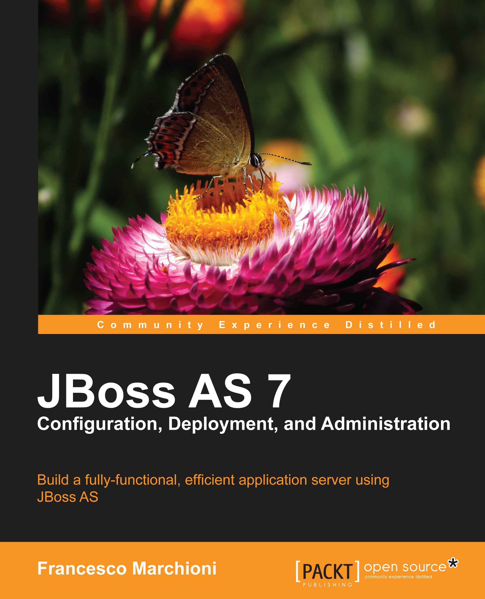

Packt was so kind to hand their latest publication to me for a review. <a href="http://www.packtpub.com/jboss-as-7-configuration-deployment-administration/book?utm_source=touilleur-express.fr&amp;utm_medium=bookrev&amp;utm_content=blog&amp;utm_campaign=mdb_009643" target="_blank">JBoss AS 7 Configuration, Deployment and Administration</a> promises to give you an expert's understanding of the single components that makes up the JBoss application server. Showing you how to use them, helping you to cut down the learning curve for this exciting product and guide you through configuration, management, deployment and advanced administration of JBoss AS 7. 
 

 

 
 Abstract:&nbsp;As the Java EE standard has evolved and matured, the API has become increasingly rich and complex. The next generation of application servers needs to be modular and configurable to run only specific services or containers. JBoss AS 7 promises to meet those requirements but the configuration of a complex application server is composed of a mix of administrative and management tasks which often overlap, generating confusion.
 
 
 JBoss AS 7 Configuration, Deployment and Administration will give you an expert's understanding of every component that makes up the JBoss application server, and will show you how to use them, helping you to dramatically cut down the learning curve for this exciting product.
 
 
 This book will guide you through configuration, management, deployment and advanced administration in a logical order to avoid the common pitfalls of setting up a new AS. The book dives into the new application server structure and shows you how to install it. You will learn how to configure the core AS services, including thread pools, the messaging system, and the transaction service. Finally, you will learn how to deploy and manage your applications and then tune the performance of your AS to achieve an efficient, indispensible application server.
 
 
 Book: <a href="http://www.packtpub.com/jboss-as-7-configuration-deployment-administration/book?utm_source=touilleur-express.fr&amp;utm_medium=bookrev&amp;utm_content=blog&amp;utm_campaign=mdb_009643" target="_blank">JBoss AS 7 Configuration, Deployment and Administration</a>
 
 Language : English
 
 Paperback : 380 pages [ 232mm x 186mm ] 
 
 Release Date : December 16, 2011
 
 ISBN-10: 1849516782
 
 ISBN-13: 978-1849516785
 
 <b>About the Author</b>
 
 Francesco Marchioni (<a href="http://twitter.com/mastertheboss">@mastertheboss</a>) is a Sun Certified Enterprise Architect employed by an Italian company based in Rome. He started learning Java in 1997, and since then he has followed the path to the newest Application Program Interfaces released by Sun. He joined the JBoss Community in 2000, when the application server was running the release 2.X.
 
 He has spent many years as a software consultant, where he has overseen many successful software migrations from vendor platforms to open source products such as JBoss AS, fulfilling the tight budget requirements of current times.
 
 Over the last five years, he started authoring technical articles for O'Reilly Media and running an IT portal focused on JBoss products (<a href="" target="_blank">http://www.mastertheboss.com</a>).
 
 <b>The Content</b>
 
 The book has 380 pages. Chapter one starts with page 26, chapter 11 sumary ends on page 333. That's not too much overhead and the main part actually cover good content. 
 
 
 Chapter 1 <i>is about installing JBoss AS 7</i>. 
 
It gives a basic introduction to the new application server, depicting its most important features and shows how to install it on your machine. 
 
 
 Chapter 2 <i>covers the Application Server's configuration.</i>
 
Beside the main configuration file and some core parts of it, such as like the Thread pool configuration it also looks into the Logging subsystem. 
 
 
 Chapter 3,<i> talks about configuring Enterprise Services</i>
 
 and dives into modeling the core Java Enterprise services using the standalone configuration file.
 
 
 Chapter 4, covers the <i>JBoss Web Server Configuration</i>
 
 and completes the standalone server configuration by looking at the Web subsystem. This chapter also covers a full Java EE example.
 
 
 Chapter 5, is about the <i>JBoss AS Domain configuration</i>
 
 and teaches the reader how to shape the domain server configuration and the criteria behind the choice of a standalone or domain server configuration.&nbsp; 
 
 
 Chapter 6, <i>Deploying Applications on JBoss AS</i>
 
 covers all the details of application deployment. A dive into class loading mechanism is also included.
 
 
 Chapter 7, <i>Managing the Application Server</i>
 
 Covers the related management tools used to control the application server instances.
 
 
 Chapter 8, talks about <i>Clustering&nbsp;</i>
 
 All the AS 7 clustering capabilities that provide scalability and high availability to Java EE applications.
 
 
 Chapter 9, <i>Load Balancing Web Applications</i>
 
 Covers another concern of clustering, which is the ability to make several servers participate in the same service and do the same work.
 
 
 Chapter 10, <i>Securing JBoss AS 7</i>
 
 covers the foundation of JBoss Security framework and how to secure Enterprise applications and the server management interfaces.
 
 
 Chapter 11, <i>Taking JBoss AS 7 into the cloud</i>
 
 The mandatory chapter these days covers AS 7 and Red Hat OpenShift platform. 
 
 <b>Writing and Style</b>
 
 The general writing is easy to follow, at least for non native speakers like me. I was also feeling very comfortable with the terms used through the book. So no big surprises if you are experienced in the Java EE area. Hints and extra information is placed at the suitable and helpful positions and I also like the examples (configuration and more) a lot. Most of the more complex stuff is additionally explained with images and concept drawings which is also very helpful. 
 
 <b>Conclusion and recommendation</b>
 
 This book doesn't require any existing knowledge of AS7 and introduces you from the ground up. Nevertheless, there are hints about upgrading existing installations all over the book. So, it has a lot to offer for both experienced and beginners. The structure is good and beside the mandatory cloud chapter I really enjoyed reading and playing along with the examples. Also very appreciated is the fact that there is not too much Java EE source code in the book and the author really tries to focus on deployment and administration. So don't be afraid about having to read a complete Java EE 6 tutorial along the way. Another point to mention is, that this book is far more complete than any available online documentation today. Especially the clustering and load-balancing parts are very interesting to read and also cover the various load balancing mechanisms. You are with JBoss? Go with this book!