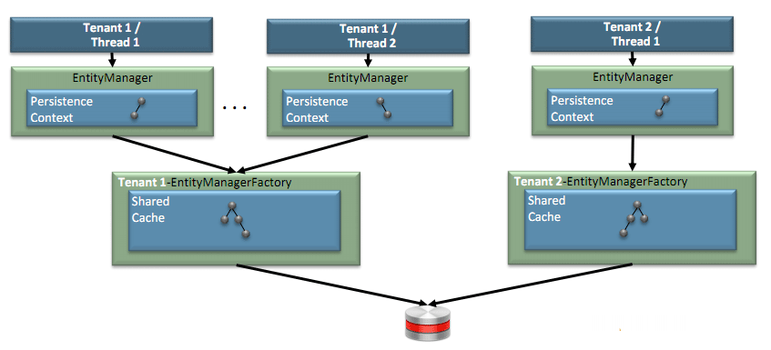
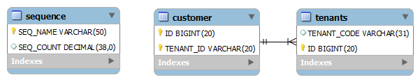

The Aquarium is a great source of inspiration and most recent information about Java EE progress across all relevant specifications and reference implementations. They picked up a presentation by Oracle's Shaun Smith (<a href="" target="_blank">blog</a>/<a href="" target="_blank">twitter</a>) about the status and future of EclipseLink as an open source project. He covers all the new features which are going to be in EclipseLink 2.4 which will be availabke along with the June Eclipse Juno Release. In detail these are REST, NoSQL and Multitenancy. (details refer to the <a href="http://marsjug.org/download/Shaun%20Smith-The%20Evolution%20of%20Java%20Persistence.pdf" target="_blank">complete slide-deck (PDF)</a> from the marsjug event.)
 
 I like to see that EclipseLink still is the center of innovation in Java persistence and they are trying hard to adopt latest buzz timely. Working for a more conservative industry in general the main new feature I am looking for is multitenancy. What you can guess from the slides is, that something in this field should already be working with latest EclipseLink 2.3.0. 
 
 <b>What is Multitenancy going to look like?</b>
 
 Let's start looking at what Oracle's Linda DeMichiel announced at last years JavaOne (compare <a href="http://blog.eisele.net/2011/10/java-ee-past-present-cloud-7.html">blog-post</a>) and also let's look at what the <a href="http://download.oracle.com/otn-pub/jcp/persistence-2_1-edr-spec/persistence-2_1-edr-spec.pdf">early draft (PDF)</a> of the JPA 2.1 specification has to offer. The easier part is the early draft. Not a single line mentions "Multitenan[t|cy]" in any context. So, this is obviously still a big to do for further iterations. A bit more could be found in the <a href="https://oracleus.wingateweb.com/published/oracleus2011/sessions/37761/02_Tuesday_JavaOne%20Session_FINAL.pdf%20(PDF)" target="_blank">JavaOne Strategy Keynote</a> (Slides 41,42) and the <a href="https://oracleus.wingateweb.com/published/oracleus2011/sessions/37760/37760b_Cho.pdf" target="_blank">JavaOne Technical Keynote (PDF)</a> (Slide 25). The general Java EE 7 approach will be to have support for separate isolated instances of the same app for different tenants. The mapping should be done by the container and be available to apps in some way. This is all very vague until today and the only concrete code examples available from the slides refer to some obvious JPA related examples using two annotations @Multitenant and @TenantDiscriminatorColumn. Hmm. Doesn't this look familiar to you? 
 
 <b>What is possible today?</b>
 
 It does! EclipseLink (as of 2.3.0 - Indigo) supports shared multitenant tables using tenant discriminator column(s), allowing an application to be re-used for multiple tenants and have all their data co-located. All tenants share the same schema without being aware of one another and can use non-multitenant entity types as per usual. But be aware of the fact, that this is only one possible approach to multitenancy for data. This is commonly referred to as "dedicated database" because all tenant's data go into one single db! The basic principles for the following are:
 
 - application instances handle multiple tenants
 
 - caching has to be isolated for every tenant by JPA
 
 You can look at all the details on a dedicated EclipseLink <a href="http://wiki.eclipse.org/EclipseLink/Examples/JPA/Multitenant" target="_blank">wiki page</a>. Want to give it a test drive? let's start. Prerequisites as usual (NetBeans, GlassFish, MySQL, compare <a href="http://blog.eisele.net/2012/01/arquillian-with-netbeans-glassfish.html">older posts</a> if you need more help.). Make sure to have the right EclipseLink dependencies (at least 2.3.0)! Create a new entity via the wizard, setup your datasource and persistence.xml and call it e.g. Customer. 
 
<pre class="brush: java">@Entity public class Customer implements Serializable \{ //... \} </pre> If you start your app you see EclipseLink creating something like this in your database. 
 

 

 Let's make this a multitenant entity. Add the following annotations:
 
<pre class="brush: java">@Entity @Multitenant @TenantDiscriminatorColumn(name = "companyId", contextProperty = "company-tenant.code") public class Customer implements Serializable \{ //... \} </pre> There are multiple usage options available for how an EclipseLink JPA persistence unit can be used in an application with @Multitenant entity types. Since different tenants will have access to only its rows the persistence layer must be configured so that entities from different tenants do not end up in the same cache. If you compare the detailed approaches (Dedicated PC, PC per tenant, PU per tenant) in more detail, you see, that as of today you end up having two possible options with container managed injection of either the PC or the PU. Let's try the simplest thing first. 
 
 <b>Dedicated Persistence Unit</b>
 
 In this usage there is a persistence unit defined per tenant and the application/container must request the correct PersistenceContext or PersistenceUnit for its tenant. There is one single persistence unit and nothing is shared. Go with the above example and add the following property to your persistence.xml:
 
<pre class="brush: xml">&lt;property name="company-tenant.code" value="TENANT1" /&gt;</pre> Give it a try and compare the tables.
 

 

 As you can see, you now have your companyId column. If you insert some data it will always be filled with the property value you assigned in the persistence.xml. Use either a &nbsp;@PersistenceContext or a&nbsp;&nbsp;@PersistenceUnit to access your entities. Using this approach you have a shared cache as usual for your application.
 
 
<table align="center" cellpadding="0" cellspacing="0" class="tr-caption-container" style="margin-left: auto; margin-right: auto; text-align: center;">
 <tbody>
  <tr>
   <td style="text-align: center;"></td>
  </tr>
  <tr>
   <td class="tr-caption" style="text-align: center;">@PersistenceContext with Shared Cache (Source: S.Smith)</td>
  </tr>
 </tbody>
</table>
 <b>Persistence Context per Tenant</b>
 
 If you don't want to have a single tenant per application you could decide to have a single persistence unit definition in the persistence.xml and a shared persistence unit (EntityManagerFactory and cache) in you application. In this case the tenant context needs to be specified per EntityManager at runtime. In this case you have a shared cache available for regular entity types but the @Multitenant types must be protected in the cache. You do this by specifying some properties:
 
<pre class="brush: java">@PersistenceUnit EntityManagerFactory emf; Map props = new HashMap(); props.put("company-tenant.code", "TENANT2"); props.put(PersistenceUnitProperties.MULTITENANT_SHARED_EMF, true); EntityManager em = emf.createEntityManager(props); </pre>
 
<table align="center" cellpadding="0" cellspacing="0" class="tr-caption-container" style="margin-left: auto; margin-right: auto; text-align: center;">
 <tbody>
  <tr>
   <td style="text-align: center;"></td>
  </tr>
  <tr>
   <td class="tr-caption" style="text-align: center;">Shared @PersistenceUnit per tentant (Source: S.Smith)</td>
  </tr>
 </tbody>
</table>
 <b>Discriminator Approaches</b>
 
 The above examples work with a single discriminator tenant column. You can add the discriminator column to the PK by specifying a primaryKey attribute like the following:
 
<pre class="brush: java">@TenantDiscriminatorColumn(name = "companyId", contextProperty = "company-tenant.code", primaryKey = true) </pre> It's also possible to have multiple tenant discriminator columns using multiple tables if you do something like this: 
 
<pre class="brush: java">@Entity @SecondaryTable(name = "TENANTS") @Multitenant @TenantDiscriminatorColumns(\{ @TenantDiscriminatorColumn(name = "TENANT_ID", contextProperty = "company-tenant.id", length = 20, primaryKey = true), @TenantDiscriminatorColumn(name = "TENANT_CODE", contextProperty = "company-tenant.code", discriminatorType = DiscriminatorType.STRING, table = "TENANTS") \}) </pre>
 
 This leads to a secondary tenants table.
 
 

 

 <b>Additional Goodies</b>
 
 As always you can do the complete configuration within your persistence.xml only, too. For a reference please look at the already mentioned wiki page. One last thing is of interest. You could also map the tenant discriminator column with your entity. You simple have to make sure it isn't updated or inserted.
 
<pre class="brush: java"> @Basic @Column(name = "TENANT_ID", insertable = false, updatable = false) private int tenantId; public int getTenantId() \{ return tenantId; \} </pre> Looking at the debug output you can see what is happening behind the scenes: 
<pre> INFO: Getting EntityManager INFO: Inserting Test Customer FEIN: INSERT INTO CUSTOMER (ID, TENANT_ID) VALUES (?, ?) bind =&gt; [1, 2] FEIN: INSERT INTO TENANTS (ID, TENANT_CODE) VALUES (?, ?) bind =&gt; [1, TENANT2] FEIN: SELECT t0.ID, t1.TENANT_CODE, t0.TENANT_ID, t1.ID FROM CUSTOMER t0, TENANTS t1 WHERE (((t1.ID = t0.ID) AND (t1.TENANT_CODE = ?)) AND (t0.TENANT_ID = ?)) bind =&gt; [TENANT2, 2] </pre>
 
 Curious for more Java EE 7 and JPA 2.1 goodies? Keep updated with the <a href="http://wiki.eclipse.org/EclipseLink/Development/JPA_2.1" target="_blank">development status wiki page</a> for the EclipseLink JPA 2.1 project.