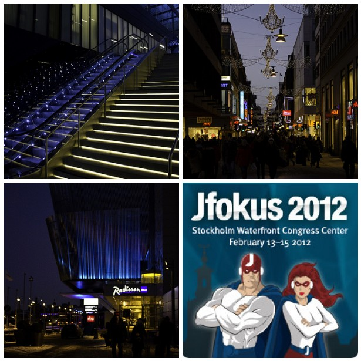

After some very stressful weeks since the beginning of the year, I am going to add another one. This one should be far more fun however :) It's <a href="" target="_blank">Jfokus</a> time in Stockholm and it's my pleasure to join the awesome line-up of speakers this year. 
 

 

 After a surprisingly short flight of about 2 hours I took the <a href="" target="_blank">Arlanda Express</a> to central Stockholm. This added another 20 minutes to the total travel time. What I like most is, that they have a strong commitment to caring for the <a href="http://www.arlandaexpress.com/environment.aspx" target="_blank">environment</a>. The electrically powered trains do not produce any environmentally harmful emission at all and all Arlanda Express trains have been powered by environmentally labelled electricity from renewable energy sources since the spring of 2001. Even if a resident told me, that it is one of the most expensive ways to get to Stockholm, I like this far better than using a car or even the bus.
 
 
 The short walk around the hotel after arrival was fun. The <a href="http://www.radissonblu.com/waterfronthotel-stockholm" target="_blank">Radisson Blu Waterfront</a> is an awesome venue and the&nbsp;collocated&nbsp;<a href="" target="_blank">Stockholm Waterfront Congress Center</a> looks most impressive with it's blue lights in the evening. I took very few first pictures to kick off my <a href="" target="_blank">flickr.com Jfokus photoset</a> tonight. And I learned that there is an <a href="" target="_blank">official Jfokus 2012 group on Flickr</a> also! So, if you are curious what is going on over here, follow <a href="http://twitter.com/myfear" target="_blank">my twitter stream</a>, the related conference account <a href="http://twitter.com/Jfokus" target="_blank">@Jfokus</a> or the <a href="http://twitter.com/#!/search/Jfokus" target="_blank">#Jfokus</a> hash-tag via a public twitter search.
 
 

 

 
 I wish everybody a wonderful conference! Looking forward meeting many many interesting people here! I'm honored to be part of it this year!