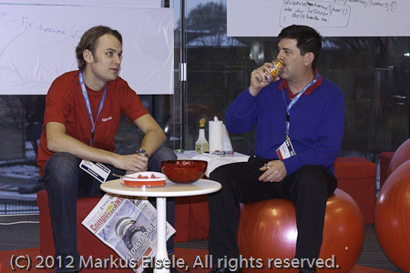

This was my first ever <a href="" target="_blank">Jfokus</a> and I wasn't really sure what to expect. What I know from my <a href="http://blog.eisele.net/2011/09/jfokus-data-analysis-about-speakers.html">data analysis about their speakers</a> from last year, that it is a wonderful fresh conference with big names on the speakers list year after year.
 

 

 And of course I knew the head behind it, Mattias, who is the lead of the Stockholm JUG and a well known Java Champion. so I was really excited as the acceptance email arrived. After arranging a few things I was all set to travel. Traveling to Sweden is very comfortable and short at least for me as a German. Roughly two hours by plane from MUC are enough to reach Stockholm's Arlanda Airport and additional 20 minutes on top to travel to the city center with the Arlanda Express Train. The venue is next to the upper exit of the central station. So this is a "wheels down and be there" experience. I really really like this kind of stuff. Traveling in Europe is easy as hell in general. No passport, only your ID card. Compared to German conferences this still has the feel of "traveling a decent distance" and this is what makes the location special for me.
 
 
<table cellpadding="0" cellspacing="0" class="tr-caption-container" style="float: right; margin-left: 1em; text-align: right;">
 <tbody>
  <tr>
   <td style="text-align: center;"></td>
  </tr>
  <tr>
   <td class="tr-caption" style="text-align: center;">@myfear, @arungupta,@matkar (Picture by A.Gupta)</td>
  </tr>
 </tbody>
</table><b>Monday - Tutorial Day</b>
 
 No, I wasn't giving one but I promised to (try) to be a helping hand for Arun Gupta who was giving his famous Java EE 6 Hands On Lab (Building an end-to-end application using Java EE 6 and NetBeans) for roughly 30 attendees. The room was packed. Proudly wearing my ACE Director Polo I was even able to help a bit with questions and development setups. If you are&nbsp;interested&nbsp;in the slides and some more impressions from the lab see&nbsp;<a href="https://blogs.oracle.com/arungupta/entry/jfokus_2012_trip_report" target="_blank">Arun's trip report</a>&nbsp;on his blog. It's amazing what this guy knows about NetBeans, Derby, GlassFish and Java EE. Most if not all of the attendees stayed for the 3.5 hrs. Arun got a lot of positive feedback afterwards and even if this was roughly the 10th time he was giving the lab the attendees still found room for suggestions on additional troubleshooting tips and sadly some NetBeans 7.1 bugs/improvement ideas came in the way also.
 

 

 It was all about doing an end-to-end example. Starting with simple Servlets and digging the way down through CDI, EJBs, JPA, REST. Enhancing all this with Bean Validation and CDI Events. A well thought over lab which crossed my desk a few months back as it was&nbsp;initially presented at JavaOne 2011. Combined with all the early feedback from the reviewers and from the field this has gotten a very good and complete sample of digging through the Java EE 6 technologies with latest NetBeans and GlassFish.
 
 The revised hands-on lab document is&nbsp;<a href="https://blogs.oracle.com/arungupta/resource/javaee6-hol-feb2012.pdf">available here</a>&nbsp;and the&nbsp;<a href="https://blogs.oracle.com/arungupta/resource/JavaEE6SampleApp-Nov2011.zip">complete application here</a>. 
 
 
 The supporting hotel was wonderful. A shame that you will not spend to much time there, because of the packed conference program. After &nbsp;a nice and light breakfast the sessions started at 9:00am every day. This was early enough for the attendees and even the speakers got a good chance to make final updates to their slides. The rooms were distributed over seven (7!) levels.
 

 

 What sounds like it is a lot&nbsp;truly feels more like three levels. The main entrance was directly on level 4 (exhibition hall) and it was easy to go upstairs for the two big A rooms. Look at the map to the right to get a good impression (this was taken from the program handout, hope nobody minds. It probably has some kind of copyright on it, let me know if I have to take the plan down again.)
 
 If you want to get some impressions about how all this looked from the inside, take a look at my <a href="" target="_blank">flickr photoset</a>. It starts with some impressions from the overall venue and also shows some speakers and party impressions.&nbsp;This wonderful first day was closed by one of the most amazing speaker dinners I ever attended. It happened in the&nbsp;<a href="" target="_blank">F12 Restaurang</a>. I don't have the words to describe the perfect atmosphere, dinner, drinks and laughs we had at our table! Closing down near midnight, I was looking forward to the next day which sadly already was my departure day.
 
 <b>Tuesday -&nbsp;My Big Day</b>
 
 Scheduled for 13pm I was prepared to talk about "Java 7 Adoption in the Enterprise". I can't deny that I was a little surprised to see an A-room assigned to that talk. Both A2 and A4 can handle roughly 500 attendees and the excitement was building since I discovered that. The talk has been recorded for publishing on Parleys.com so I expect to updated this post whenever this is done. In the meantime you have to take a look at the slides I was using. I published them on slideshare.
 
 

 <strong style="display: block; margin: 12px 0 4px;"><a href="http://www.slideshare.net/myfear/java-7-state-of-the-enterprise-11585775" target="_blank" title="Java 7 - State of the Enterprise">Java 7 - State of the Enterprise</a></strong> <iframe frameborder="0" height="355" marginheight="0" marginwidth="0" scrolling="no" src="http://www.slideshare.net/slideshow/embed_code/11585775?rel=0" width="425"></iframe>
  
 

  View more <a href="" target="_blank">presentations</a> from <a href="http://www.slideshare.net/myfear" target="_blank">Markus Eisele</a>
 

 
 The talk went well and the feedback I got was pretty good. It was a pleasure doing it! I spend almost the rest of the conference day with taking pictures, dipping into different talks and speaking with attendees and other speakers I haven't met in a while. It was a pleasure to meet (in no particular order): <a href="">Gerrit</a>, <a href="">Sharat</a>, <a href="">Fabiane</a>, <a href="">Dalibor</a>, <a href="">Vinicius</a> and <a href="">Yara</a>, <a href="">Marcus</a>, <a href="">Klara</a>, <a href="">Bert</a>, <a href="https://twitter.com/#!/pbakker">Paul</a>, <a href="">Mattias</a>, <a href="">Masoud</a>, <a href="">Robert</a>, <a href="https://twitter.com/#!/ennru">Enno</a>, <a href="">Lars</a>, <a href="">Cecilia</a>,&nbsp;<a href="https://twitter.com/#!/Stephan007">Stephan</a>, <a href="http://twitter.com/binkyscave" target="_blank">Roger</a> and many many more names, that I forgot to include! Thanks for a wonderful inspiring conference!
 
 <b>Wednesday - Departure Day</b>
 
 One of those days where one surprise comes after another. Starting with an unexpected but awesome breakfast with <a href="" target="_blank">Greg</a>&nbsp;which was followed by his session, I sneaked into some other sessions until noon which was my intended checkout time. I honestly always try to make the best out of departure days, but it simply doesn't work for me. So, the rest was basically following twitter, chatting in the awesome Oracle Community Corner and trying to catch up with new faces.
 
 

 

 
 The yellow Arlanda Express took me back to the airport. I was still enjoying all the impressions and thoughts which floated through the air being part of the conference. So the delayed flight back home wasn't a big issue for me. I finally reached MUC around 9pm and as usual, coming back also is a good part of taking part in conferences. Thanks to Mattias and his crew for hosting one of the best European conferences I have seen so far. It has exactly the right size for me and I enjoyed running into people everywhere. I will try hard to make it to Jfokus 2013 again!!