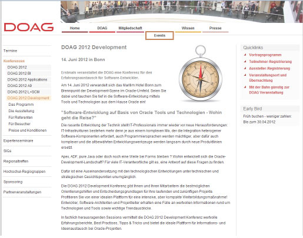

For the first time ever, <a href="" rel="nofollow" target="_blank">DOAG e.V.</a> is organizing a conference for the exchange of experiences for software developers. On 14 June 2012, the Maritim Hotel Bonn hosts the German Oracle development scene. Be there and dive deep into the software development using tools and technologies from Oracle!
 
 

 

 The conference covers the following four tracks: "PL/SQL and Apex", "Java and Open Source", "Forms, Reports, ADF, BI-Publisher", "BPM and Softwarearchitecture".
 
 Find the complete <a href="http://mydoag.doag.org/formes/servlet/DocNavi?action=getFile&amp;did=3359605&amp;file=2012-Dev_Programm.pdf" rel="nofollow" target="_blank">conference program as PDF</a> online.
 
 
 I am going to give a session in the Java and Open Source track. It will be from 12:00 - 12:45 and covers the latest developments in Java EE 7 and has the title "Entwickeln für die Wolken" (Development for the Clouds). 
 
 
 Find out more about it and <a href="https://www.doag.org/termine/anmeldung.php?tid=438372" rel="nofollow" target="_blank">register online</a> on the <a href="http://www.doag.org/termine/termine.php?tid=438372" rel="nofollow" target="_blank">DOAG e.V. website</a>.
 
 <b>UPDATE 10.06.</b>
 
 I will NOT make it! I have trouble with customer appointments and can't join you guys. Sorry for that.