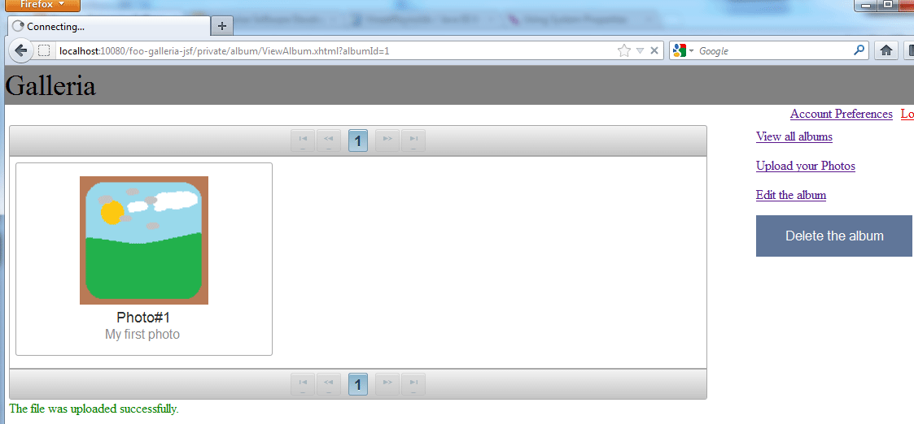

Time to move on with Vineet's Java EE 6 Galleria Example. After <a href="http://blog.eisele.net/2012/03/java-ee-6-galleria-example-part-1.html">some introduction</a>, a basic <a href="http://blog.eisele.net/2012/03/java-ee-6-running-galleria-on-glassfish.html">getting started guide</a>&nbsp;on GlassFish&nbsp;and the <a href="http://blog.eisele.net/2012/03/java-ee-6-example-running-galleria-on.html">WebLogic 12c deployment</a> it finally is time to dive into testing. I skipped this part in the earlier posts because of two reasons. The first one obviously was that I wanted to write a separate post about it. The second one was that there was work to do to get this up and running on latest GlassFish 3.1.2. Vineet and team did a great job releasing Arquillian GlassFish Remote Container CR3 a few days back which now also covers GlassFish 3.1.2. Time to get you started with testing the Galleria Example.
 
 <b>What you are going to test</b>
 
 The Galleria was build to achieve comprehensive test coverage through the use of both unit and integration tests, written in JUnit 4. The unit and integration tests for EJBs and the domain model rely on the EJB 3.1 container API. The integration tests for the presentation layer relies on the Arquillian project and its Drone extension (for execution of Selenium tests).
 
 Please make sure to update to the latest sources from the <a href="https://bitbucket.org/VineetReynolds/java-ee-6-galleria" target="_blank">Galleria Project</a> because Vineet updated the Arquillian GlassFish container to CR3 and the Selenium stuff to support latest FireFox browser. 
 
 <b>Unit-Testing the Domain Layer</b>
 
 The tests for the domain layer fall into five separate categories. The first three (Bean Verification tests, Mutual Registration verification tests, Tests for the Constructor, equals and hashcode methods) cover the basic needs for nearly any JPA based application. If you take a walk down the&nbsp;galleria-ejb\src\test sources you can see them covered in the&nbsp;info.galleria.domain package. Every domain object is covered by a suite class which includes all three kinds of unit tests.
 
 Lets start with looking at the&nbsp;Bean Verification tests.&nbsp;The behavior associated with the getters and setters in the properties of JavaBeans are fairly easy to verify. All one needs to do, is to invoke the setter first, then the getter, and verify whether the instance returned by the getter is equal to the instance passed to the setter. The project uses the <a href="https://bitbucket.org/VineetReynolds/java-ee-6-galleria/wiki/BeanVerification" target="_blank">BeanVerifier</a> class (under the src/tests/java root of the galleria-ejb module) for this. The&nbsp;AlbumBeanVerifier test simply is a&nbsp;parameterized test which tests every single property. The only exception in this case is the&nbsp;coverPhoto property which has a special&nbsp;behavior&nbsp;beyond the simple JavaBean pattern.
 
 Next on the list are the&nbsp;tests for the constructor, equals and hashcode methods.&nbsp;Constructors for the domain entities are tested by merely creating new instances of the classes, while asserting the validity of the properties that would be set by the constructor.&nbsp;The equals and hashcode methods are verified via the use of the EqualsVerifier class from the <a href="" target="_blank">EqualsVerifier project</a>.
 

 

 The last category of the more basic tests are the&nbsp;<a href="http://www.two-sdg.demon.co.uk/curbralan/papers/MutualRegistration.pdf" target="_blank">mutual registration</a>&nbsp;(PDF) verification tests. You simply want to check if&nbsp;modifications to the relationships between the entities, actually result in changes to both the parent and the child properties. See the <a href="https://bitbucket.org/VineetReynolds/java-ee-6-galleria/wiki/MutualRegistrationVerification" target="_blank">comprehensive wiki page</a> for more details about the implementation. All these are executed during the unit-testing phase and are covered by&nbsp;**/*Suite.java classes.
 
 In addition to the basic tests you also find one-off tests written for specific cases where the basic test-models are insufficient or unsuitable. In such instances, the one-off tests verify such behavior through hand-written assertions. You find them in **/*Tests.java classes in the same package.
 
 The domain layer tests finish with the JPA repository tests. Each of the *RepositoryTest.java classes test the CRUD behavior of the&nbsp;handled&nbsp;domain objects. The common AbstractRepositoryTest handles the test data and resets the database after every test-run. The database creation itself is handled by the&nbsp;maven-dbdeploy-plugin. Looking at the pom.xml you can see, that it is bound to two Maven lifecycle phases (process-test-resources and&nbsp;pre-integration-test) which makes sure it gets called twice. First time before the unit-tests and second before the integration testing (compare below).
 
 All those unit-tests are executed with surefire. If you issue a mvn test on the galleria-ejb project you can see a total of 138 tests passing. These are the four **/*Suite tests, the four **/*RepositoryTests and two additional tests. If you briefly look at the console output you see, that this is all happening in a Java SE environment. No container tests have been done until now.
 
 <b>Integration Testing the Domain Layer</b>
 
 So this really only covered the basics which everybody should do and probably knows. Doing integration testing is another story. This is done by the&nbsp;**/*IntegrationSuite tests. The name intentionally does not use the default naming conventions in order to prevent them from running during Maven's unit-testing phase. To hook into the&nbsp;integration-test phases of Maven the Galleria example makes use of the&nbsp;<a href="" target="_blank">Maven Failsafe Plugin</a>. &nbsp;You can find the integration test Suite in the&nbsp;info.galleria.service.ejb package. The&nbsp;AbstractIntegrationTest takes care about handling the test data (comparable what the&nbsp;AbstractRepositoryTest) did for the unit-tests. The Suite contains a *ServiceIntegrationTest for every domain object. You can walk through the single tests in every *IntegrationTest and get a feeling for what is happening here. The&nbsp;ServicesIntegrationSuite takes care of starting and stopping the EJBContainer by using the&nbsp;AbstractIntegrationTest.startup();. This method is comparably unspectacular and simple:
 
<pre class="brush:java">logger.info("Starting the embedded container."); Map&lt;String, Object&gt; props = new HashMap&lt;String, Object&gt;(); props.put("org.glassfish.ejb.embedded.glassfish.installation.root", "./glassfish-integrationtest-install/glassfish"); container = EJBContainer.createEJBContainer(props); context = container.getContext(); datasource = (DataSource) context.lookup("jdbc/galleriaDS"); </pre> The most important point here is, that the embeddable EJBContainer is configured via an existing GlassFish domain which can be found directly in the galleria-ejb\glassfish-integrationtest-install folder. If you look at the glassfish\domains\domain1\config\domain.xml you can see, that all the configuration is already done for you. But where does the deployment come from? This is easy to answer. By default the&nbsp;&nbsp;embeddable EJBContainer&nbsp;searches your classpath for ejb-jar jarfiles or folders and deploys them. If you want to see a little bit more verbose output from the EJBContainer you have to provide a customlogging.properties file in src/test/resources and add some simple lines to it: 
 
<pre>handlers=java.util.logging.ConsoleHandler java.util.logging.ConsoleHandler.formatter=java.util.logging.SimpleFormatter java.util.logging.ConsoleHandler.level=FINEST #add some more packages if you need them info.galleria.service.ejb.level=FINE </pre> add the following to the maven-failsafe-plugin configuration section of your pom.xml: 
 
<pre class="brush:xml">&lt;systemPropertyVariables&gt; &lt;java.util.logging.config.file&gt;$\{basedir\}/src/test/resources/customlogging.properties&lt;/java.util.logging.config.file&gt; &lt;/systemPropertyVariables&gt; </pre> The integration tests should finish successfully and maven should print something comparable to the following: 
 
<pre>Tests run: 49, Failures: 0, Errors: 0, Skipped: 0, Time elapsed: 61.726 sec </pre> Notice, that the integration tests take significantly longer than the normal unit-tests. This is no surprise at all and you should make sure to only execute them when needed so you are not slowed down with your development.
 
 <b>Integration Testing the Presentation Layer</b>
 
 The domain layer is covered with tests. What is missing is the presentation layer. You can find the presentation layer tests in the galleria-jsf project. Start with examining the pom.xml. You find a couple of new dependencies here. Namely Arquillian, Selenium and Drone.
 
 
 First some configuration again. Scroll down to the profile section you can see a&nbsp;integration-test profile which makes use of the&nbsp;maven-glassfish-plugin and controls a container which is configured with a couple of properties. Add the definition &nbsp;to the properties section on the top of the pom:
 
<pre class="brush:xml">&lt;galleria.glassfish.testDomain.user&gt;admin&lt;/galleria.glassfish.testDomain.user&gt; &lt;galleria.glassfish.testDomain.passwordFile&gt;D:/glassfish-3.1.2-b22/glassfish3/glassfish/domains/test-domain/config/local-password&lt;/galleria.glassfish.testDomain.passwordFile&gt; &lt;galleria.glassfish.testDomain.glassfishDirectory&gt;D:/glassfish-3.1.2-b22/glassfish3/glassfish/&lt;/galleria.glassfish.testDomain.glassfishDirectory&gt; &lt;galleria.glassfish.testDomain.domainName&gt;test-domain&lt;/galleria.glassfish.testDomain.domainName&gt; &lt;galleria.glassfish.testDomain.adminPort&gt;10048&lt;/galleria.glassfish.testDomain.adminPort&gt; &lt;galleria.glassfish.testDomain.httpPort&gt;10080&lt;/galleria.glassfish.testDomain.httpPort&gt; &lt;galleria.glassfish.testDomain.httpsPort&gt;10081&lt;/galleria.glassfish.testDomain.httpsPort&gt; </pre> You can copy this from the development profile of the galleria-ejb project as <a href="http://blog.eisele.net/2012/03/java-ee-6-running-galleria-on-glassfish.html">described in part 2</a>. You also should already have the domain in place. Next down to the&nbsp;maven-surefire-plugin you can see, that it follows the same conventions that the galleria-ejb project has. But looking at the test-classes you can see, that there isn't a single unit-test here. So you can directly move on to the&nbsp;maven-failsafe-plugin which handles the integration tests. There is one single&nbsp;AllPagesIntegrationTest which covers the complete testing. Let's go there.
 
 It is an Arquillian Testcase which is executed as a client against a remote instance. Beside the definition of the deployment (@Deployment) you also again see a couple of setUp and tearDown methods which do some initialization and destruction. One thing has to be handled separately. You also see a writeCoverageData() method in there which obviously connects to some kind of Socket and reads data from it. This is the <a href="" target="_blank">JaCoCo</a> (Java Code Coverage Library) hook which can produce a coverage data set of the tests. To make this work you will have to download the package and extract it to a place of you choice. Next go to your GlassFish test-domain\config\domain.xml and open it. Find the server-config - java-config and add the following there: 
 
<pre class="brush:xml">&lt;jvm-options&gt;-javaagent:D:\path\to\jacoco-0.5.6.201201232323\lib\jacocoagent.jar=output=tcpserver&lt;/jvm-options&gt; </pre> This enables the coverage agent for GlassFish. All configuration done now. Back to NetBeans, select the integration-test profile (in NetBeans you can do this by selecting the entry from the dropdown box next the the little hammer in the icon area or by using -Pintegration-test as a maven command line switch. The console output tells you, that the GlassFish domain is started and the info.galleria.view.AllPagesIntegrationTest is running. Be warned, a FireFox instance is popping up during this run and the Arquillian Drone extension is driving your Selenium Tests. 
 

 

 Seeing a browser remote controlled in this way looks and feels weird if you haven't seen this before. If everything works you should now see this in the console output:
 
<pre>Tests run: 30, Failures: 0, Errors: 0, Skipped: 0, Time elapsed: 138.014 sec </pre>
 

 

 If you are using another locale than en for your browser you may have completely failed tests. So there is additional need to configure <a href="https://docs.jboss.org/author/display/ARQ/Drone" target="_blank">Drone to support it</a>. Drone allows you to specify a Firefox profile via arquillian.xml. You can create a Firefox profile that is configure to send accept-language headers with en/en-US as the value.
 
 To create a new profile, start Firefox Profile manager with the following command (you might need to close all running instances): firefox -profilemanager (on Windows you need to execute the command "d:\complete\path\to\firefox.exe" -profilemanager) in a cmd shell. Remember the location on the disc where this profile is created - you'll need it later. To configure the created profile, in Firefox, go to Options (menu) -&gt; Content (tab) -&gt; Languages (fieldset) -&gt; Choose to add the English language (and move it top, as the preferred one). Now navigate the galleria-jsf\src\test\resources\arquillian.xml, you can then add a property: 
 
<pre class="brush:xml">&lt;extension qualifier="webdriver"&gt; &lt;property name="implementationClass"&gt;org.openqa.selenium.firefox.FirefoxDriver&lt;/property&gt; &lt;property name="firefoxProfile"&gt;location of the Firefox profile for English&lt;/property&gt; &lt;/extension&gt; </pre> All done now. You should be able to run the complete clean and build process now without any test failing. A big "green bar" :)
 <a href="http://blog.eisele.net/2012/03/java-ee-6-example-enhance-security-with.html">Read on</a> to learn more about how to <a href="http://blog.eisele.net/2012/03/java-ee-6-example-enhance-security-with.html">enhance security</a> with the Galleria example. 
 