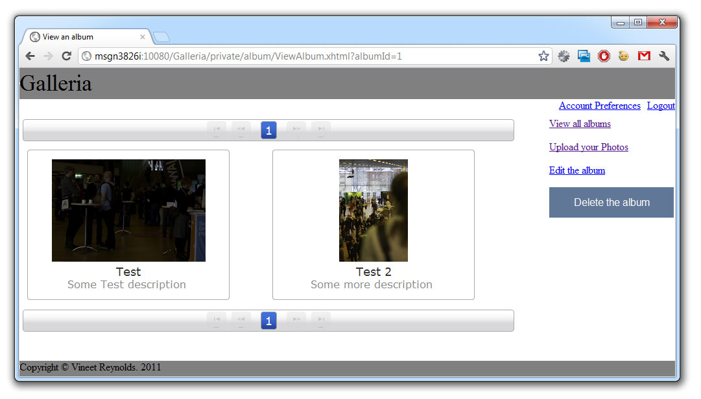

Have you ever been wondering where to find some good end-to-end examples build with Java EE 6? I have. Most of the stuff you find on the net is very basic and doesn't solve the real world problems. This is true for the Java EE 6 tutorial. All the other stuff, like most of what Adam Bien publishes are a very tight scoped examples which also doesn't point you to a more complete solution.
 
 So, I was very pleased to stumble over a more complex example done by Vineet Reynolds. It's called "<a href="https://bitbucket.org/VineetReynolds/java-ee-6-galleria">Java EE 6 Galleria</a>" and you can download the source code from bitbucket. Vineet is a software engineer contributing to the Arquillian project; more specifically, he contributed bugs fixes and worked on a few feature requests for Arquillian Core, and the GlassFish, WebLogic and Tomcat integrations for Arquillian. This is where I first came across his name. And following the Arquillian guys and him a little closer directly send me to this example. A big thanks to Vineet for a helping hand during my first tries to get this up and running. Follow him if you like on twitter <a href="http://www.twitter.com/VineetReynolds" target="_blank">@VineetReynolds</a>.
 
 Here is a brief explanation about it's background and this is also kicking of a series about running it in different settings and pointing you to a few more details under the hood. This is the basic introduction.
 
 There is more to discover: Read about <a href="http://blog.eisele.net/2012/03/java-ee-6-running-galleria-on-glassfish.html">running it on GlassFish</a>, <a href="http://blog.eisele.net/2012/03/java-ee-6-example-running-galleria-on.html">running it on WebLogic</a>, <a href="http://blog.eisele.net/2012/03/java-ee-6-example-testing-galleria-part.html">testing it</a>, <a href="http://blog.eisele.net/2012/03/java-ee-6-example-enhance-security-with.html">enhanced security</a> and about <a href="http://blog.eisele.net/2012/04/java-ee-6-example-gracefully-dealing.html">dealing gracefully with exceptions</a>.
 
 <b>About the Galleria</b>
 
 The high level description of the project is the following: The Java EE 6-Galleria is a demo application demonstrating the use of JSF 2.0 and JPA 2.0 in a Java EE project using Domain Driven Design. It was written to serve as a showpiece for domain driven design in Java EE 6. The domain model of the application is not anemic, and is constituted of JPA entities. The entities are then used in session EJBs that act as the application layer. JSF facelets are used in the presentation tier, using Mojarra and PrimeFaces. The project seeks to achieve comprehensive coverage through the use of both unit and integration tests, written in JUnit 4. The unit and integration tests for EJBs and the domain model rely on the EJB 3.1 container API. The integration tests for the presentation layer relies on the Arquillian project and its Drone extension (for execution of Selenium tests).
 
 <b>Domain driven design using Java EE 6</b>
 
 DDD as an architectural approach, is feasible in Java EE 6. This is primarily due to the changes made in EJB 3.x and in the introduction of JPA. The improvements made in the EJB 3.x and JPA specifications allow for a domain and application layer to be modeled in Java EE 6 using DDD. The basic idea here is to design an application ensuring that persistence services are injected into the application layer, and used to access/persist the entities within a transactional context established by the application layer.
 
 <b>Domain Layer</b>
 
 The application contains four domain entities for now - User, Group, Album and Photo which are the same as the JPA entities in the <a href="https://bitbucket.org/VineetReynolds/java-ee-6-galleria/wiki/DataModel" target="_blank">logical data model</a>. 
 
 

 

 <b>Repository Layer</b>
 
 On top of the logical data model you can find four repositories - UserRepository, GroupRepository, AlbumRepository and PhotoRepository. Each for one of the four domain entities. Even if the DDD requires&nbsp;that you only have repositories for an aggregated root, and not for all domain entities it is designed this way to allow the application layer to access the Album and Photo domain entities without having to navigate Albums and Photos via the UserRepository.&nbsp;The repositories are Stateless Session Beans with a no-interface view and are constructed using the <a href="http://www.adam-bien.com/roller/abien/entry/generic_crud_service_aka_dao">Generic CRUD Service pattern published by Adam Bien</a>.
 
 <b>Application layer</b>
 
 The application layer exposes services to be consumed by the presentation layer. It is also responsible for transaction management, while also serving as a fault barrier for the below layer(s). The application layer co-ordinates with the domain repositories and the domain objects to fulfill the desired objectives of the exposed services. In a way, this layer is the equivalent to a service layer in traditional applications.&nbsp;The application layer exposes it's services through the UserService, GroupService, AlbumService and PhotoService interfaces and is also responsible for validating the providing domain objects from the above layers, before co-ordinating actions among objects in the domain layer. This is done via JSR-303 constraints on the domain objects.
 
 <b>How it looks like</b>
 
 And this is, how this example looks like if you are running it on latest GlassFish 3.1.2. Curious to set this up yourself? Wait for the next post or give it a try yourself ;)
 
 

 

 
 The <a href="http://blog.eisele.net/2012/03/java-ee-6-running-galleria-on-glassfish.html">second part</a> guides you through the setup on GlassFish. <a href="http://blog.eisele.net/2012/03/java-ee-6-running-galleria-on-glassfish.html">Read on!</a>
 
 If you are interested in running this on latest WebLogic 12. <a href="http://blog.eisele.net/2012/03/java-ee-6-example-running-galleria-on.html">Read the third part!</a>