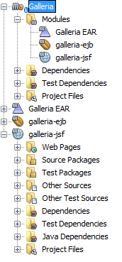
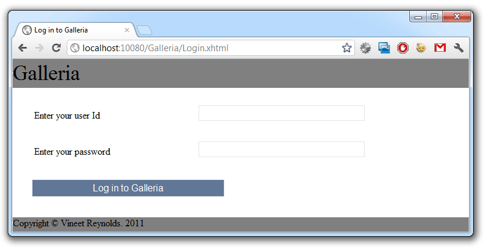

You hopefully have seen my <a href="http://blog.eisele.net/2012/03/java-ee-6-galleria-example-part-1.html">last post</a> about Vineet's DDD Java EE 6 example. If not, take a look. It introduces you to the overall example and might be helpful with this and the following posts. Today we are going to setup the example as it is directly with latest GlassFish 3.1.2, Hibernate and Derby.
 
 <b>Preparation</b>
 
 Get yourself in the mood for some configuration. Grep the latest <a href="http://netbeans.org/downloads/index.html" target="_blank">NetBeans 7.1</a> (the Java EE edition already includes the needed <a href="http://glassfish.java.net/public/downloadsindex.html#top" target="_blank">GlassFish 3.1.2</a>) and install it. I also assume you have a decent <a href="http://www.oracle.com/technetwork/java/javase/downloads/index.html" target="_blank">Java SDK 7</a> (6 would do the job, too) in place somewhere. Depending on the development strategy you also need a Mercurial Client and Maven. At least Maven is also included in NetBeans, so ... I mean ... why make your life harder than it already is? ;)
 
 <b>Environments</b>
 
 Some few more words about the environments. This example was setup for supporting different environments. Starting with the plain "development" environment you also need to configure your "test" and last but not least the "production" environment. All of the different environments are handled by maven profiles, so you might have to configure a bit during the following minutes.
 
 <b>Create the Database instances</b>
 
 First thing to do is to decide where to put all your stuff. The examples use derby out of the box and therefore you should either have the Java DB installed (part of the JDK) or use the GlassFish derby instance which is pre-configured with NetBeans. Let's make it harder here and assume we use the Java DB installation that comes with your JDK. Go ahead, open a CMD prompt and navigate to your %JAVA_HOME% folder and further down the db folder/bin. Execute the "startNetWorkServer" script and watch out for the derby instance to start. Now open another CMD prompt also navigate to the db/bin folder and execute the "ij" script. This should come up with a prompt " ij&gt;. Now enter the following connect string:
 
<pre class="brush: java">connect 'jdbc:derby://localhost:1527/GALLERIATEST;create=true'; </pre>
 
 This command connects you to the derby instance and creates a GALLERIATEST database if it doesn't already exist. The Galleria example uses a handy little tool called <a href="" target="_blank">dbdeploy</a> as a database change management tool. It let's you do incremental updates to the physical database model which get tracked in a changelog table. (More about this later in the series). You have to create the changelog table: 
 
<pre>CREATE TABLE changelog ( change_number DECIMAL(22,0) NOT NULL, complete_dt TIMESTAMP NOT NULL, applied_by VARCHAR(100) NOT NULL, description VARCHAR(500) NOT NULL ); ALTER TABLE changelog ADD CONSTRAINT Pkchangelog PRIMARY KEY (change_number); </pre> You can redo the steps for any other instance you need (production, etc.) by simply changing the database name in the connect statement. And don't forget to create the changelog table in every instance. 
 
 And if you don't like this approach. Fire up NetBeans, switch to the services tab, select "New Connection" and add a new Java DB Network Connection with host:localhost, port:1527 and Database: GALLERIATEST;create=true. Set both user and password to "APP" and click "Test Connection". Select APP as the schema for your new DB. And you are done! 
 
 

 

 
 <b>Create the GlassFish domain</b>
 
 We are running this from latest GlassFish. First thing to do now is to create a new domain. navigate to your GlassFish installation directory and goto glassfish3/bin and execute the following: 
 
<pre>asadmin create-domain --portbase 10000 --nopassword test-domain </pre> This creates a new test-domain for you. Now navigate to that domain folder ("glassfish3/glassfish/domains/test-domain") and open the config/domain.xml file.
 
 We are now going to add the created derby database as a connection pool to you newly created GlassFish domain.&nbsp;Navigate to the&nbsp;&lt;resources&gt; element and add the following connection pool and jdbc-resource under the last closing&nbsp;&nbsp;&lt;/jdbc-connection-pool&gt; element:
 
 
<pre class="brush:xml">&nbsp;&lt;jdbc-connection-pool driver-classname="" datasource-classname="org.apache.derby.jdbc.ClientDataSource40" res-type="javax.sql.DataSource" description="" name="GalleriaPool" ping="true"&gt; &nbsp; &nbsp; &nbsp; &lt;property name="User" value="APP"&gt;&lt;/property&gt; &nbsp; &nbsp; &nbsp; &lt;property name="DatabaseName" value="GALLERIATEST"&gt;&lt;/property&gt; &nbsp; &nbsp; &nbsp; &lt;property name="RetrieveMessageText" value="true"&gt;&lt;/property&gt; &nbsp; &nbsp; &nbsp; &lt;property name="Password" value="APP"&gt;&lt;/property&gt; &nbsp; &nbsp; &nbsp; &lt;property name="ServerName" value="localhost"&gt;&lt;/property&gt; &nbsp; &nbsp; &nbsp; &lt;property name="Ssl" value="off"&gt;&lt;/property&gt; &nbsp; &nbsp; &nbsp; &lt;property name="SecurityMechanism" value="4"&gt;&lt;/property&gt; &nbsp; &nbsp; &nbsp; &lt;property name="TraceFileAppend" value="false"&gt;&lt;/property&gt; &nbsp; &nbsp; &nbsp; &lt;property name="TraceLevel" value="-1"&gt;&lt;/property&gt; &nbsp; &nbsp; &nbsp; &lt;property name="PortNumber" value="1527"&gt;&lt;/property&gt; &nbsp; &nbsp; &nbsp; &lt;property name="LoginTimeout" value="0"&gt;&lt;/property&gt; &nbsp; &nbsp; &lt;/jdbc-connection-pool&gt; &nbsp; &nbsp; &lt;jdbc-resource pool-name="GalleriaPool" description="" jndi-name="jdbc/galleriaDS"&gt;&lt;/jdbc-resource&gt; </pre> Now find the :&nbsp;&lt;config name="server-config"&gt; element and inside it look for the last&nbsp;&nbsp;&lt;resource-ref entry. Add the following line there:
 
<pre class="brush:xml">&nbsp; &lt;resource-ref ref="jdbc/galleriaDS"&gt;&lt;/resource-ref&gt; </pre> One last thing to do until we are ready to fire up our instance. We need to add the JDBC Realm for the Galleria example. again, find the&nbsp;&lt;config name="server-config"&gt; and inside it, look for a&nbsp;&lt;/auth-realm&gt;. Under this, put the following:
 
<pre class="brush:xml">&nbsp; &lt;auth-realm classname="com.sun.enterprise.security.auth.realm.jdbc.JDBCRealm" name="GalleriaRealm"&gt; &nbsp; &nbsp; &nbsp; &lt;property name="jaas-context" value="jdbcRealm"&gt;&lt;/property&gt; &nbsp; &nbsp; &nbsp; &lt;property name="encoding" value="Hex"&gt;&lt;/property&gt; &nbsp; &nbsp; &nbsp; &lt;property name="password-column" value="PASSWORD"&gt;&lt;/property&gt; &nbsp; &nbsp; &nbsp; &lt;property name="datasource-jndi" value="jdbc/galleriaDS"&gt;&lt;/property&gt; &nbsp; &nbsp; &nbsp; &lt;property name="group-table" value="USERS_GROUPS"&gt;&lt;/property&gt; &nbsp; &nbsp; &nbsp; &lt;property name="charset" value="UTF-8"&gt;&lt;/property&gt; &nbsp; &nbsp; &nbsp; &lt;property name="user-table" value="USERS"&gt;&lt;/property&gt; &nbsp; &nbsp; &nbsp; &lt;property name="group-name-column" value="GROUPID"&gt;&lt;/property&gt; &nbsp; &nbsp; &nbsp; &lt;property name="digest-algorithm" value="SHA-512"&gt;&lt;/property&gt; &nbsp; &nbsp; &nbsp; &lt;property name="user-name-column" value="USERID"&gt;&lt;/property&gt; &nbsp; &nbsp; &lt;/auth-realm&gt; </pre> Be sure not to put the new realm under the default-config. This will not work. Fine. Let's get the sources :)
 
 <b>Getting the Source and opening it in NetBeans</b>
 

 

 Vineet is hosting the Galleria example on bitbucket.org. So, you have to go there and visit the <a href="https://bitbucket.org/VineetReynolds/java-ee-6-galleria" target="_blank">java-ee-6-galleria</a> project. There are three ways you can bring the sources to your local HDD. Either via the hg command line:
 
<pre>hg clone https://bitbucket.org/VineetReynolds/java-ee-6-galleria </pre> or via the website download (upper right "get sources") or directly via NetBeans. You need a Mercurial client for your OS for the first and the third option. I am using <a href="" target="_blank">TortoiseHg </a>for Windows. You should have this <a href="http://netbeans.org/kb/docs/ide/mercurial.html" target="_blank">installed and configured with NetBeans</a> before doing the following. Lets try the last alternative here. Select "Team &gt; Clone Other". Enter the Repository URL and leave user/password empty. Click "next" two times (we don't need to change default paths ;)) and select a parent directory to put the stuff in. Click "Finish" and let the Mercurial client do the work. You are asked to open the found projects after it finished. This should look similar to the picture on the right. If you run into connection troubles make sure to update your proxy settings&nbsp;accordingly.
 
 If you try to build the project you will run into trouble. It is still missing some configuration which we are going to do next.
 
 <b>Adding a Development Profile</b>
 
 Next is to add some stuff to the Maven pom.xml of the galleria-ejb project. Open it and scroll down to the&nbsp;&lt;profiles&gt; section. You find two (sonar and production). We are going to add a development profile by adding the following lines to it (make sure to adjust the GlassFish paths to your environment):
 
<pre class="brush: xml">&lt;profile&gt; &lt;id&gt;development&lt;/id&gt; &lt;activation&gt; &lt;activeByDefault&gt;true&lt;/activeByDefault&gt; &lt;/activation&gt; &lt;properties&gt; &lt;galleria.derby.testInstance.jdbcUrl&gt;jdbc:derby://localhost:1527/GALLERIATEST&lt;/galleria.derby.testInstance.jdbcUrl&gt; &lt;galleria.derby.testInstance.user&gt;APP&lt;/galleria.derby.testInstance.user&gt; &lt;galleria.derby.testInstance.password&gt;APP&lt;/galleria.derby.testInstance.password&gt; &lt;galleria.glassfish.testDomain.user&gt;admin&lt;/galleria.glassfish.testDomain.user&gt; &lt;galleria.glassfish.testDomain.passwordFile&gt;D:/glassfish-3.1.2-b22/glassfish3/glassfish/domains/test-domain/config/local-password&lt;/galleria.glassfish.testDomain.passwordFile&gt; &lt;galleria.glassfish.testDomain.glassfishDirectory&gt;D:/glassfish-3.1.2-b22/glassfish3/glassfish/&lt;/galleria.glassfish.testDomain.glassfishDirectory&gt; &lt;galleria.glassfish.testDomain.domainName&gt;test-domain&lt;/galleria.glassfish.testDomain.domainName&gt; &lt;galleria.glassfish.testDomain.adminPort&gt;10048&lt;/galleria.glassfish.testDomain.adminPort&gt; &lt;galleria.glassfish.testDomain.httpPort&gt;10080&lt;/galleria.glassfish.testDomain.httpPort&gt; &lt;galleria.glassfish.testDomain.httpsPort&gt;10081&lt;/galleria.glassfish.testDomain.httpsPort&gt; &lt;/properties&gt; &lt;/profile&gt; </pre> Ok. As you can see a couple of stuff is defined here. And the profile is activated by default. That's it. For now.
 
 <b>Testing the ejb-Galleria Project</b>
 
 Lets try to run the testcases in the ejb-Galleria project. &nbsp;Right click it and issue a &nbsp;"clean and build".Follow the console output to see what is actually going on. We are going to investigate this a little bit further with one of the next posts. Today we are only doing this to make sure, you have everything setup the right way. It should finish with: 
 
<pre>Tests run: 49, Failures: 0, Errors: 0, Skipped: 0 BUILD SUCCESS </pre> That is a "Green-Bar" :-) Congratulations!
 
 <b>Build and Deploy the Project</b>
 
 Now go to NetBeans "Tools &gt; Options &gt; Miscellaneous &gt; Maven" and check the box that says: "Skip Tests for any build executions not directly related to testing". Return to the main window and right click the Galleria project and make a clean and build there. 
 
<pre>Reactor Summary: Galleria ................................. SUCCESS [0.431s] galleria-ejb ............................. SUCCESS [5.302s] galleria-jsf ............................. SUCCESS [4.486s] Galleria EAR ............................. SUCCESS [1.308s] ------------------------------------------------------------ BUILD SUCCESS ------------------------------------------------------------ Total time: 11.842s </pre>
 
 Fine. Now lets fire up the GlassFish domain. Switch to your GlassFish installation and find the glassfish3/bin folder. Open a command line prompt there and run:
 
<pre>asadmin start-domain test-domain </pre> You can see the domain starting up. Now open a browser and navigate to <a href="" target="_blank">http://localhost:10048/</a>. After a few seconds this is going to show you the admin console of your GlassFish server. Now you need to install Hibernate. Select the "Update Tool" (bottom left) and switch to the "Available Add-Ons" tab. Select "hibernate" and click install (top right). Stop the server after you installed it and restart it with the command above. Open the admin console again and click on "Applications". Click the little "deploy" button on top and browse for the "java-ee-6-galleria/galleria-ear/target/galleria-ear-0.0.1-SNAPSHOT.ear". Click on "OK" (top right). You are done after a few seconds. Now switch to&nbsp;<a href="" target="_blank">http://localhost:10080/Galleria/</a>&nbsp;and you will see the welcome screen. Congratulations. You setup the Galleria example on GlassFish! Sign up, Login and play with the application a bit!
 
 

 

 
 
 The next parts in the series will dive you into the details of the application. I am going to cover the tests and overall concepts. And we are also going to change both JPA provider and database in a future post.
 
 
 Want to know what it takes to get it <a href="http://blog.eisele.net/2012/03/java-ee-6-example-running-galleria-on.html">up and running</a> on latest WebLogic 12c ? <a href="http://blog.eisele.net/2012/03/java-ee-6-example-running-galleria-on.html">Read on!</a>