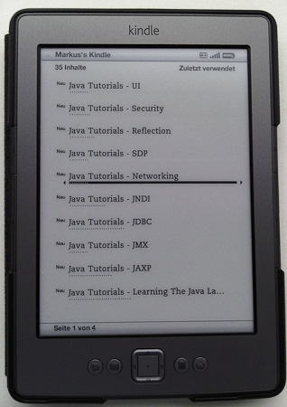
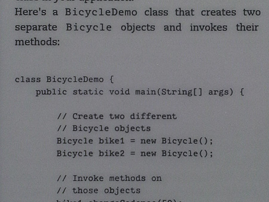

The news has been out since a few days. You now have the option to get all the Java SE tutorials as eBooks on either your iPad, Nook or eReader (capable of reading ePub files) or the Kindle (reading .mobi files).
 
 All this happened with the March 2nd, 2012 release and you can directly download all the eBook files from <a href="http://www.oracle.com/technetwork/java/javase/downloads/java-se-7-tutorial-2012-02-28-1536013.html" target="_blank">otn.oracle.com</a> after you accepted the Java SE Tutorial License Agreement. A total of 20 parts can be downloaded separately with a total of roughly 20.5 MB in the .mobi format. Ok. Let's have a look at how this works out on a Kindle.
 

 

 As you can see, the separate downloads appear as separate books on your Kindle. This feels like an easy way to jump right where you need to go. Compared to <a href="http://docs.oracle.com/javase/tutorial/index.html" target="_blank">The Java Tutorials</a> website the overall order is screwed up. So, you need to know which one to look at first, or know the order in which you are willing to walk through. But anyway, if you are used to navigating the Kindle you have a quick and easy way of finding the content you need. I find it quite comfortable to read in general. A lot of this feeling is caused by the Kindle. It is very light, has a good contrast and I can put it in the back pocket of my jeans if I am traveling. So this is my new always with me gadget. Even if I am a very late follower on this, I really appreciate the fact that I have tons of books with me wherever I am.
 
 Now lets look at the contents. Especially the source code. To be honest, I find it very readable. Even the images and charts are very clear.(Compare pictures of my Kindle below).
 

 

 

 

 
 The only thing you probably will miss is the fact, that you can't copy and past the stuff from your kindle to your computer :) Everything else is very nice and I really like the way, the tutorials have been reworked for eBook-Readers in general.