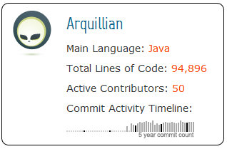

Red Hat, Inc. and the JBoss Community <a href="" target="_blank">today announced</a> the 1.0.0.Final release of <a href="" target="_blank">Arquillian</a>, its <a href="https://blogs.oracle.com/javaone/entry/and_the_winners_are_the" target="_blank">award-winning</a> testing platform built to run on the Java Virtual Machine (JVM). Arquillian substantially reduces the effort required to write and execute Java middleware integration and functional tests. It even enables test engineers to address scenarios previously considered untestable or too expensive to test.
 
 

 

 The 1.0.0.Final release of <a href="" target="_blank">Arquillian Drone</a>, a key add-on to the platform, is included in this release. Final versions of select container adapters will be released later in the week. <a href="http://www.jboss.org/shrinkwrap" target="_blank">ShrinkWrap</a>, a key component of Arquillian, announced its 1.0.0.Final release last week.
 
 
 Arquillian originated from the test harness developed for the CDI 1.0 (JSR-299) specification in 2009. It spun off as an independent project and has evolved into an extensible testing platform. Coming full circle, the test suite in CDI 1.1 (JSR-346), the next iteration of the CDI specification, has migrated to Arquillian. Other specifications are expected to follow. Arquillian is also used by numerous open source projects, including Hibernate, JBoss AS 7, Drools, RHQ, JClouds and Apache DeltaSpike.
 
 <b>Newest features</b>
 
 Arquillian can manage <a href="https://docs.jboss.org/author/display/ARQ/Container+adapters" target="_blank">more than a dozen container vendors</a>, including JBoss AS, GlassFish, WebLogic and Tomcat, and supports running tests in cloud services. The container support allows developers to target a variety of technology platforms, including Java EE 5 and 6, Servlet environments, OSGi, Embedded EJB and standalone CDI. Additional new features include: Orchestration of multiple deployments across multiple containers and domain controllers in a single test Descriptor deployment Assertions for deployment exceptions A new configuration schema that supports multiple configurations per container EL-like evaluation in properties and configuration overrides via Java properties Configuration of protocol used for test execution Explicit ordering of test methods Fine-grained control over the container lifecycle Arquillian’s extensibility is reflected in its growing ecosystem of extensions. The most mature extension, Arquillian Drone, is included in today’s release. Drone is an abstraction over browser controllers such as Selenium and WebDriver that enables the developer to write browser-based tests without having to fuss with the typical setup and plumbing. Other extensions under active development include an Android test controller, DBUnit integration, a SeamTest replacement for testing Seam 2, BDD runners (Spock and JBehave), performance metrics, code coverage (Jacoco) and Arquillian Graphene (a type-safe Selenium API). Expect more extensions to emerge now that the platform has reached a stable release.
 
 <b>GlassFish embedded and managed containers</b>
 
 The complete support for both <a href="https://docs.jboss.org/author/display/ARQ/GlassFish+3.1+-+Embedded" target="_blank">embedded</a> and <a href="https://docs.jboss.org/author/display/ARQ/GlassFish+3.1+-+Managed" target="_blank">managed/remote</a> GlassFish instances is ready and has been updated to 3.1.2. And also latest WebLogic 12c is supported!
 
 <b>How to get it?</b>
 

 

 The Arquillian platform and extensions are available in the <a href="http://search.maven.org/#search%7Cga%7C1%7Cg%3A%22org.jboss.arquillian%22" target="_blank">Maven Central</a> and <a href="" target="_blank">JBoss Community artifact repositories</a>. For a brief overview about what it takes to get your GlassFish project up and running with Arquillian have a look at some of <a href="http://blog.eisele.net/search/label/Arquillian" target="_blank">my recent blog posts about it</a>!
 
 
 The Arquillian project hosts a couple of <a href="" target="_blank">guides in different languages</a> to get you started. See the complete <a href="https://docs.jboss.org/author/display/ARQ/Reference+Guide">Reference Guide</a> for all the details. Arquillian is released under the Apache License, v2.0.