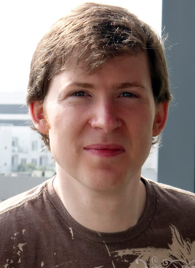

Time to catch up with my "<a href="http://blog.eisele.net/2011/09/heroes-of-java.html">Heroes of Java</a>" interview series. This is interview number 15 already and I am glad it is David this time. You might have read the name before. He is the Java EE hero in person.
 
 <b>David Blevins</b>
 

 

 is a founder of the Apache TomEE, OpenEJB and Geronimo projects. David was a member of the EJB 3.0, EJB 3.1, and Java EE 6 Expert Groups, current member of the EJB 3.2 (JSR 345) and Java EE 7 (JSR 342) Expert Groups, and contributing author to Component-Based Software Engineering: Putting the Pieces Together from Addison Wesley.
 
 <b>General Part</b>
 <i>Who are you?</i>
 
 You can blame me, in whole or part, for the creation of OpenEJB (1999), Geronimo (2003), TomEE (2011, yay!), a handful of small projects like Swizzle, XBean and the short-lived distributed GBuild system, as well as meddling in other projects like OpenWebBeans, Axis, and (if I can find the time) the newly created DeltaSpike. 
 
 I've been involved with the EJB spec since 3.0, Java EE since 6, and consider the Embeddable EJBContainer API and "EJBs in WARs" to be two of my favorite contributions to the standards space, with hopefully more on the way. Overall, Java EE and especially the goal of embeddable and testable JavaEE has been a passion of mine for many years, though I'll say I've really just hit my stride in the last couple years. 
 
 <i>Your offical job title at your company?</i>
 
 I think my title is "Software Architect", though I often fill out conference badges with "Open Source Guy" for fun. I was part of Gluecode which was a Geronimo-focused company purchased by IBM in 2005. My official role there pertains to WebSphere CE which is Geronimo-based. So I guess, technically speaking, I worked on three servers that reached Java EE 6 certification last year; TomEE, Geronimo, WebSphere CE. It was a very busy year! 
 
 <i>Do you care about it?</i>
 
 I'm incredibly passionate about everything I do and will do it if the title matches or not. No one, including me, has a "Developer of TomEE" job title, yet it exists and has a community of people who love it and pursue it with intensity.
 
 
 Participating in the JCP on Java EE specs is also not my title, but something I do out of a strong desire to both prove it and see it improve. Java EE, especially EJB, took it on the chin in the Spring heyday and that seems to have infused a great deal of stubbornness in me to prove that while implementations can be heavy, specifications are ideas that can be improved and be implemented as light as anyone might want. No technology is as bad as anyone might say as long as there are people who are willing to listen and improve it.
 
 
 But above all, I like to make things. Difficult things that you can’t do by yourself. I like the making of it more than the thing itself. What keeps me working on something are the people who find enjoyment in what you have created and the people with whom you find enjoyment in doing the creating.
 
 <i>Do you speak foreign languages? Which ones?</i>
 
 Fluent Spanish, thanks to my beautiful wife Ameila, all my wonderful in-laws in Ecuador and Spain. I've never had to use it in a technical setting, though, and I really admire people who have to work in their second language. I’ve been learning Italian and some day I’d like to add Portuguese to the list.
 
 <i>How long is your daily "bootstrap" process? (Coffee, news, email)</i>
 
 Every morning I go straight from bed to the espresso maker, make a cappuccino for the wife and myself and go straight in on the queue. It’s too long to get through in one day. Between openejb, tomee, java ee7, ejb 3.2 and other mailing lists and just plain work, it can be quite late before I get to any coding myself.
 
 
 I find I have to just focus on a couple topics a day and just keep rotating. That’s great for maintenance, but&nbsp;doesn't&nbsp;really get you those large leaps forward. I find when I'm most productive it tends to be in blackout periods where I ignore all inputs, all meetings, sleep very little and do nothing but code on one thing. I call it going into a black hole. Seems to be the only way to get certain things done. At the end of the year I can go back and pinpoint major developments to "black hole" periods.
 
 
 &nbsp;<b>Twitter</b>
 <i>You have a twitter handle? Why?</i>
 
 Mostly because I consider it irresponsible to encourage people to devote time, energy and large portions of their life to something and not to talk about it. 
 
 At least that’s what I told myself when I convinced myself to open it up. I don’t really spent a lot of time celebrating my successes and am always right onto the next thing. Spending time promoting something or calling it “the best” is really hard for me. It feels narcissistic and egotistical and that’s just not me.
 
 
 That O’Reilly interview with me at JavaOne on YouTube sat there for three months before I mentioned to anyone it existed. That’s how bad I am.
 
 
 There’s zero doubt in my mind it’s my largest personal flaw something I’m really trying to work on. The “if you build it, they will come” say is simply not true. You’ve got to build it and promote it with just as much passion as you built it. Something I seem to only be good at in bursts. But as I say, I’m working on it. :)
 
 <i>Whom are you following in general?</i>
 
 Almost exclusively tech people. Most are friends from other app servers and other projects. I adore the JBoss and Glassfish guys in particular, lots of friends in who tweet often in companies like FuseSource, Sonatype, MuleSoft and similar. Few people understand how hard it is to do the things you do other than people who also do it. Friends and family will always love you, but there are just some things only your fellow colleagues understand. It’s nice to be able to see how everyone is doing and what they’re working on.
 
 
 The [tech- David <a href="https://twitter.com/#!/dblevins" target="_blank">@dblevins</a>] non-tech David to follow @TheOnion, @chelseahandler, @alyankovic and @thensoncompany (who doesn't love the muppets!)
 
 <i>Do you have a personal "policy" for twitter?</i>
 
 No real policy, though I tend to be more tech on twitter and more personal on facebook.
 
 <i>Does your company restricts or encourages you with your twitter ussage?</i>
 
 Neither. 
 
 <b>Work</b>
 <i>What's your daily development setup? (OS/IDE/VC/other Tools)</i>
 
 OSX, Intellij, Maven, SVN (only just started playing with Git).
 
 <i>Which is the tool providing most productivity to your work?</i>
 
 The above, definitely. When there is no tool, filling in the gaps with regular expressions, bash, perl and other command-line hackery are my go-to for ad-hoc tools. I’m a big fan of reducing the size or repetitiveness of tasks through writing cheap tools.
 
 <i>Your prefered way of interacting with co-workers?</i>
 
 80% IRC, 19% other IM, 1% phone/skype. Face to face when I can, though that is a rare treat.
 
 <i>What's your favorite way of managing your todo's?</i>
 
 I've tried all sorts of software, but for some reason I default to pen and paper at my busiest times. I keep an open notebook next to my computer. When things are crazy, all the mess in my head goes there.
 
 <i>If you could make a wish for a job at your favorite company: What would that be?</i>
 
 I’d love to see a company focused on TomEE and be in a position to offer some of the really hard-working people on the project jobs doing what they love.
 
 
 TomEE is a unique beast in that it's the first Java EE app server to reach certification without corporate backing. It is filled with people who work all day at full-time jobs and then come home and hack on TomEE. People who will take vacation to get together and hack once a year. It's an incredibly special community.
 
 <b>Java</b>
 <i>You're programming in Java. Why?</i>
 
 I did my first major work in Java on version 1.1.2 and have used it steadily since. The the evolution of the language has played a major part in keeping it fun and enjoyable for me. But I have to say I wouldn’t still be using Java if tools like Intellij or Eclipse hadn’t been invented, which I view as “structure” editors rather than text editors. They read in and understand the bytecode and can fundamentally edit logic. You can digest and transform a massive codebase with ease if you know what you’re doing.
 
 
 The thought of going to another language where this is not possible and you have to deal with a large program as plain text seems like going back to the stone age.
 
 <i>What's least fun with Java?</i>
 
 I guess it would be that even a small program is still large. Not a serious issue as the inverse is also true; large programs in Java can be quite small. But there are definitely problems too small for Java.
 
 <i>If you could change one thing with Java, what would that be?</i>
 
 I've blogged about it, so I guess I should keep my stance that I think 'final' should be the default and there should be a 'mutable' or some other keyword. In practice it's far rarer to actually need to re-initialize an already initialized variable. It's too late to make that change, though.
 
 
 One thing that isn't too late is I'd love an "import org.acme.Foo as Bar;" syntax. I hate needlessly long and ugly class names, which I would describe as "preemptively ugly" for the sake of not conflicting with other classes. If two class names conflict, let me import them with different names of my choosing that makes my source more readable. Imports are not represented in bytecode and are little more than syntactic sugar. Making that sugar a bit sweeter would be great.
 
 <i>What's your personal favorite in dynamic languages?</i>
 
 I rarely get a chance to play with that kind of tech, though I find it interesting.
 
 <i>Which programming technique has moved you forwards most and why?</i>
 
 Hard to pick just one with so many tools in the toolbox. Less of a technique and more of a philosophy, but a big one, is I tend to avoid design overhead as much as possible. Java programmers in general tend to over-abstract and over-design. Time tends to prove the things you think you’ll need are not what you will eventually need. Adapting to change then becomes an act of removing things you don’t need only to add what you do need. The more complexity, the harder it is to unravel it and adapt. Today’s abstractions are tomorrow’s restrictions.
 
 
 Employing minimalism in design and architecture, keeping code honest, and not attempting to solve problems before you actually have them are keys to a 10 year codebase.
 
 <i>What was the biggest project you've ever worked on?</i>
 
 I laugh everytime I think of it, but during the late 90’s boom I worked on a project that spent the equivalent of two Lunar Rover’s in just 3 years, only to scrap it when they bought and merged with another company in the industry.
 
 <i>Which was the worst programming mistake you did?</i>
 
 To be quite honest, not sticking to my guns when I knew what I was working on was the better vision and goal.
 
 
 The equivalent of what became OpenEJB 3 and TomEE 1 where there in rough form in 2003. The concepts of Embedded EJB container and JavaEE add-on for Tomcat worked fine, but unfortunately it was one major EJB spec revision behind. The codebase was dropped in 2003 when Geronimo launched, which is something I protested but ultimately allowed. It became clear that it would never be possible to re-add these features with the new codebase, so in 2006 I quietly resurrected the old codebase and this is what became OpenEJB 3 and eventually, TomEE.
 
 
 If I had stuck to my guns, we might have had Embeddable EJB and “JavaEE for Tomcat” a few years earlier. But you never know with these things, it might never happened at all. Regardless, of when it happened, I’m glad I didn’t give up and both eventually came to life.
 
 
 I’m not sure how it looks from the outside, but I can say on a personal level releasing OpenEJB 3 final in 2008 and TomEE in 2011 were two of the hardest things I’ve ever done. I don’t mean that in any technical sense. Their existence isn’t the act of having an idea, but the sheer force of will and dedication it takes to make it happen and keep doing it. You face a lot of challenges and uncertainty and it’s a constant test to every part of your character.
 
 
 Of course therein lies the fun :)