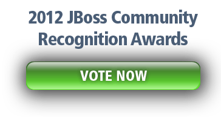

Each year, the JBoss project leads are asked to nominate contributors that they feel have make significant and leading contributions to the JBoss.org Community over the past year. Now it’s that time again, and those nominations are now complete. 
 
 Big news: I am nominated for the 2012 JBoss Community Recognition Award in the category documentation. A big "Thank you!" goes out to Aslak Knutsen (<a href="http://twitter.com/aslakknutsen" target="_blank">@aslakknutsen</a>) for nominating me! - so let the voting begin!
 
 

 

<a href="http://www.jboss.org/jbcra/2012nominees.html" target="_blank">Review the Nominees</a> then place your <a href="" target="_blank">Votes NOW</a>!
 
 <b>Markus Eisele - Arquillian</b>
 
 Markus, a very active blogger in the JavaEE space, has taken an interest in <a href="" target="_blank">Arquillian</a> and has written <a href="http://blog.eisele.net/search/label/Arquillian" target="_blank">multiple blogs about the project</a> and how to use it with alternative containers. He helped translate the <a href="" rel="nofollow" target="_blank">Getting started guide to German</a>, which gives Arquillian native language support in on of it’s biggest supported areas.