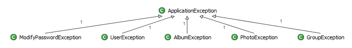
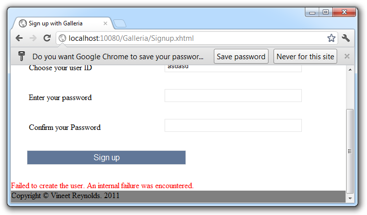
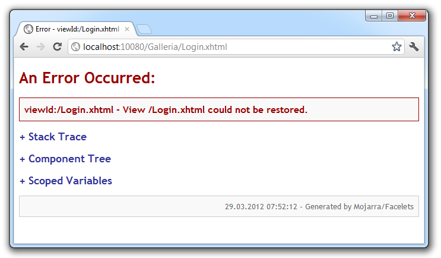

The <a href="https://bitbucket.org/VineetReynolds/java-ee-6-galleria" target="_blank">Galleria Java EE 6 example</a> app is growing . Today I am going to write about how to gracefully deal with errors. A lot has been done about user input validation already but there are still a lot of failure situations which are not handled but should be. If you are curious about what happened in the past look at the first parts of the series:&nbsp;<a href="http://blog.eisele.net/2012/03/java-ee-6-galleria-example-part-1.html">The basics </a>, <a href="http://blog.eisele.net/2012/03/java-ee-6-running-galleria-on-glassfish.html">running it on GlassFish</a>, <a href="http://blog.eisele.net/2012/03/java-ee-6-example-running-galleria-on.html">running it on WebLogic</a>, <a href="http://blog.eisele.net/2012/03/java-ee-6-example-testing-galleria-part.html">testing it</a> and <a href="http://blog.eisele.net/2012/03/java-ee-6-example-enhance-security-with.html">enhanced security</a>.
 
 <b>General Exception Mechanism</b>
 
 The application uses checked exceptions to communicate errors between the layers. The&nbsp;ApplicationException is the root of all possible&nbsp;business exceptions.
 
 

 

  

 Those business exceptions&nbsp;communicate validation violations and all known errors between the domain and the presentation layer. The &lt;domain&gt;Manager (e.g. AlbumManger) classes in the galleria-jsf view project catch them and use the ExceptionPrecessor to populate the error messages to the view. The other kind of Exceptions that could&nbsp;occur between those two layers are RuntimeExceptions. Those get wrapped into an EJBException by the container and are also caught by the&nbsp;The &lt;domain&gt;Manager&nbsp;classes. Those generate a more general error message which is shown to the user.
 
 

 

 
 I am not going to jump in on checked vs. unchecked exceptions here (Google&nbsp;<a href="https://www.google.com/search?sourceid=chrome&amp;ie=UTF-8&amp;q=google+checked+vs.+unchecked+exceptions" target="_blank">a bit about it</a>&nbsp;if you are curious). I tend to use checked exceptions when the application has a chance to recover from the error. Unchecked are thrown when something happens which isn't recoverable. That is the reason, I am not happy with the exception handling mechanism build in at the moment. I am going to get into this a little later.
 
 <b>What is missing? ViewExpired and more.</b>
 
 Seems as if everything is handled right now. But only on the first impression. Open the login screen and&nbsp;wait a bit and let your http session timeout. You are now greeted with a not so nice ViewExpired exception screen.
 

 

 
 If you are trying this as a loged-in user you are simply redirected to the login page. Anyway, the same error page could come up for some other&nbsp;unexpected conditions in the presentation layer. So, let's fix this. Most obvious thing to do is to simply introduce a dedicated error-page.
 
<pre class="brush:xml"> &lt;error-page&gt; &lt;exception-type&gt;javax.faces.application.ViewExpiredException&lt;/exception-type&gt; &lt;location&gt;/viewExpired.xhtml&lt;/location&gt; &lt;/error-page&gt; </pre> Now you redirect your users to a dedicated page which could tell him/her something nice about workplace security and not leaving the app unattended for such a long time. This works for most of the applications out there. If you are willing to have some additional information on the page or simply want to catch more than one exception and handle them individually without having to configure them statically, you need something called an&nbsp;ExceptionHandler. This is new in JSF 2 and all you need to do is to implement an ExceptionHandler and it's factory. The factory itself is configured in the facex-config.xml because there isn't any annotation for it.
 
 
 Open the faces-config.xml and add the following lines at the bottom: 
 
<pre class="brush:xml"> &lt;factory&gt; &lt;exception-handler-factory&gt;info.galleria.handlers.GalleriaExceptionHandlerFactory&lt;/exception-handler-factory&gt; &lt;/factory&gt; </pre> Now we are going to implement the <a href="http://www.eisele.net/jar/GalleriaExceptionHandlerFactory.java" target="_blank">GalleriaExceptionHandlerFactory</a> in the dedicated package. The interesting method here is the: 
 
<pre class="brush: java"> @Override public ExceptionHandler getExceptionHandler() \{ ExceptionHandler result = parent.getExceptionHandler(); result = new GalleriaExceptionHandler(result); return result; \} </pre> This is called once per request must return a new ExceptionHandler instance each time it's called. Here the the real ExceptionHandlerFactory is called and asked to create the instance, which is then wrapped in the custom <a href="http://www.eisele.net/jar/GalleriaExceptionHandler.java" target="_blank">GalleriaExceptionHandler</a> class. This is where the real interesting stuff happens. 
 
<pre class="brush: java"> @Override public void handle() throws FacesException \{ for (Iterator&lt;ExceptionQueuedEvent&gt; i = getUnhandledExceptionQueuedEvents().iterator(); i.hasNext();) \{ ExceptionQueuedEvent event = i.next(); ExceptionQueuedEventContext context = (ExceptionQueuedEventContext) event.getSource(); Throwable t = context.getException(); if (t instanceof ViewExpiredException) \{ ViewExpiredException vee = (ViewExpiredException) t; FacesContext fc = FacesContext.getCurrentInstance(); Map&lt;String, Object&gt; requestMap = fc.getExternalContext().getRequestMap(); NavigationHandler nav = fc.getApplication().getNavigationHandler(); try \{ // Push some stuff to the request scope for later use in the page requestMap.put("currentViewId", vee.getViewId()); nav.handleNavigation(fc, null, "viewExpired"); fc.renderResponse(); \} finally \{ i.remove(); \} \} \} // Let the parent handle all the remaining queued exception events. getWrapped().handle(); \} </pre> Iterate over the unhandler exceptions using the iterator returned from getUnhandledExceptionQueuedEvents().iterator(). The ExeceptionQueuedEvent is a SystemEvent from which you can get the actual ViewExpiredException. Finally you extract some extra information from the exception and place it in request scope to access it via EL in the page later on. Last thing to do here for a ViewExpiredException is to use the JSF implicit navigation system ("viewExpired" is resolved to "viewExpired.xhtml") and navigate to the "viewExpired" page via the NavigationHandler. Don't forget to remove the handled exception in the finally block. You don't want this to be handled again by the parent exception handler. Now we have to create the viewExpired.xhtml page. Do this inside the galleria-jsf\src\main\webapp folder. 
 
<pre class="brush:xml">&lt;?xml version='1.0' encoding='UTF-8' ?&gt; &lt;!DOCTYPE composition PUBLIC "-//W3C//DTD XHTML 1.0 Transitional//EN" "http://www.w3.org/TR/xhtml1/DTD/xhtml1-transitional.dtd"&gt; &lt;ui:composition xmlns:ui="http://java.sun.com/jsf/facelets" template="./templates/defaultLayout.xhtml" xmlns:f="http://java.sun.com/jsf/core" xmlns:h="http://java.sun.com/jsf/html" &gt; &lt;ui:define name="title"&gt; &lt;h:outputText value="#\{msg['Exception.page.title']\}" /&gt; &lt;/ui:define&gt; &lt;ui:define name="content"&gt; &lt;h:form&gt; &lt;h:outputText value="#\{msg['Exception.page.message']\}" /&gt; &lt;p&gt;You were on page #\{currentViewId\}. Maybe that's useful.&lt;/p&gt; &lt;p&gt;Please re-login via the &lt;h:outputLink styleClass="homepagelink" value="#\{request.contextPath\}/Index.xhtml" &gt;&lt;h:outputText value="Homepage" /&gt;&lt;/h:outputLink&gt;.&lt;/p&gt; &lt;/h:form&gt; &lt;/ui:define&gt; &lt;/ui:composition&gt; </pre> Please note that I added new message properties here, so you need to make sure to place them in galleria-jsf\src\main\resources\resources\messages.properties and translations.
 
 Until now this obviously only handles one special instance of exception. You could extend it to handle others as well. Now that we have the basic mechanism in place you are free to do this.
 
 

 

 <b>Refactoring the RuntimeException handling</b>
 
 As I said, I am not happy with the way the application is handling RuntimeExceptions. Now that we have a nice central exception handling in place we can move those stuff around a bit and refactor the *Manager classes. Delete all those &nbsp; &nbsp;catch (EJBException ejbEx) \{ blocks from all of them. We are going to take care of them in the GalleriaExceptionHandler in a minute. Simply add an another check to the GalleriaExceptionHandler and redirect the user to another page if any other exception than a ViewExpiredException is thrown.
 
 
<pre class="brush: java"> // check for known Exceptions if (t instanceof ViewExpiredException) \{ ViewExpiredException vee = (ViewExpiredException) t; // Push some stuff to the request scope for later use in the page requestMap.put("currentViewId", vee.getViewId()); \} else \{ forwardView = "generalError"; Locale locale = fc.getViewRoot().getLocale(); String key = "Excepetion.GeneralError"; logger.error(Messages.getLoggerString(key), t); String message = Messages.getString(key, locale); FacesMessage facesMessage = new FacesMessage(FacesMessage.SEVERITY_ERROR, message, null); fc.addMessage(null, facesMessage); \} </pre> This approach has some advantages. It reduces the needed code in the *Manager classes and we finally have a central place to take care of those unrecoverable exceptions. This still is not very enterprise like. Imagine your first level support team needs to look after customers and they start complaining that the only message they get is a "GeneralError". That is not very helpful. You support team would need to escalate it and second or third level would need to check the logs and and and .. All this because of an error, that we could have know. First thing to do is to find out about the causing error. Parsing stack traces isn't big fun. Especially not of RuntimeExceptions that are wrapped in EJBExceptions and further on in FacesExceptions. Thank god for the Apache Commons <a href="http://commons.apache.org/lang/api-2.4/org/apache/commons/lang/exception/ExceptionUtils.html" target="_blank">ExceptionUtils</a>. Open your galleria-jsf pom.xml and add them as dependency: 
 
<pre class="brush: xml"> &lt;dependency&gt; &lt;groupId&gt;commons-lang&lt;/groupId&gt; &lt;artifactId&gt;commons-lang&lt;/artifactId&gt; &lt;version&gt;2.6&lt;/version&gt; &lt;/dependency&gt; </pre> Now you can start to examine the root cause: 
 
<pre class="brush: java"> \} else \{ forwardView = "generalError"; // no known instance try to specify Throwable causingEx = ExceptionUtils.getRootCause(t); if (causingEx == null) \{ causingEx = t; \}</pre>
<pre class="brush: java"> //... logger.error(Messages.getLoggerString(key), t); requestMap.put("errorCode", errorCode); </pre> Don't forget to also log the complete stack-trace (t and not only causingEx) here. In general it's a bad thing to let users know about exceptions. Nobody really wants to see errors happen (because we do hate making mistakes) and after all exception stack-traces could disclose sensitive information which you wouldn't like to see on a screen somewhere. So you need to find a way to display something&nbsp;meaningful&nbsp;to the user without disclosing too much. That is where the famous error-codes come into play. Use the root-cause exception as message key or make your own decisions on what&nbsp;effort you are going to put in here. It might be a system of categories of errors (db, interface systems, etc.) which give the first-level support a good hint about what was causing the error. I would stick to a simpler solution from the beginning. Simply generate a UUID for every caught exception and trace it to both the log and the UI. A very simple one could be the following.
 
 
<pre class="brush: java">String errorCode = String.valueOf(Math.abs(new Date().hashCode())); </pre>
 
 This should also be added to the message properties and don't forget that you need another one for the generalError template. If slf4j would use the same message format than jdk logging does you would only need one property .. anyway:
 
 
<pre></pre>
<pre>Exception.generalError.log=General Error logged: \{\}.</pre>
<pre>Exception.generalError.message=A general error with id \{0\} occured. Please call our hotline.</pre>
 
 Add this to the generalError.xhtml and see how the error code is passed to the message template.
 
 
<pre class="brush: xml"> &lt;h:outputFormat value="#\{msg['Exception.generalError.message']\}" &gt; &lt;f:param value="#\{errorCode\}"/&gt; &lt;/h:outputFormat&gt; </pre>
 

 

 
 There is still a lot to improve on here. You could use the&nbsp;javax.faces.application.ProjectStage to lookup the current mode the application is running in. If you are running in ProjectStage.Development you could also put the complete stack-trace to the UI and make debugging live a bit easier. The following snippet is trying to get the ProjectStage from JNDI.
 
 
<pre class="brush:java">public static boolean isProduction() \{ ProjectStage stage = ProjectStage.Development; String stageValue = null; try \{ InitialContext ctx = new InitialContext(); stageValue = (String) ctx.lookup(ProjectStage.PROJECT_STAGE_JNDI_NAME); stage = ProjectStage.valueOf(stageValue); \} catch (NamingException | IllegalArgumentException | NullPointerException e) \{ logger.error("Could not lookup JNDI object with name 'javax.faces.PROJECT_STAGE'. Using default 'production'"); \} return ProjectStage.Production == stage; \} </pre>
 <b>What about the 3-digit Http Error Pages?</b>
 
 That is another thing to take care of. All those remaining 3-digit http error codes which return one of those not nice looking error pages. The only thing to do this is to map them in the web.xml like shown in the following:
 
<pre class="brush:xml">&lt;error-page&gt; &lt;error-code&gt;404&lt;/error-code&gt; &lt;location&gt;/404.xhtml&lt;/location&gt; &lt;/error-page&gt; </pre> You should make sure to have those mappings in place and present a meaningful error to your users. It should become best practice to always offer a way to navigate further from there.