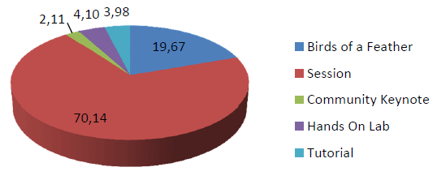
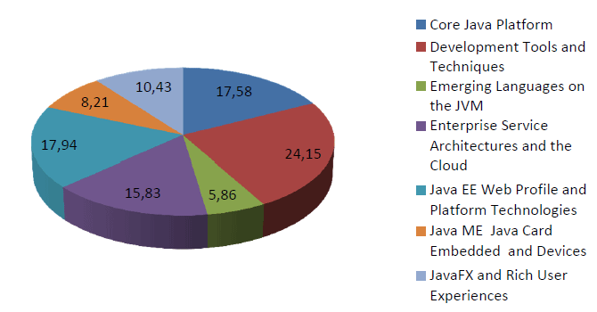
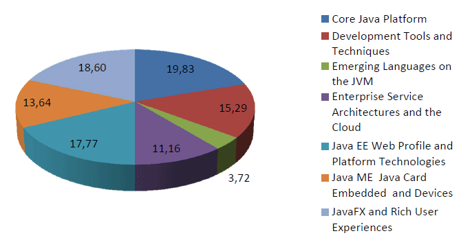

Beginning some time last year I started to have a closer look at conferences and their speakers. My main interest was to find out who was speaking how often. One conference was missing in this analysis because I really was not sure what can be published without breaking the confidentiality of the information. Being a member of the program committee for the second time this year and seeing all those wonderful sessions forced me to take another look at it and finally today I have at least some percentages to show to you. A big thank you goes out to Oracle's <a href="http://twitter.com/#!/sharat_chander" target="_blank">Sharat Chander</a> for giving the permission to do that!
 
 Based on the complete data for what has been submitted to <a href="" target="_blank">JavaOne 2012 in San Francisco</a> I will let you have a look at types, distribution and speakers. Every number given here is a percentage and the numbers behind them are still confidential. And again: This is an analysis of the complete submitted data. This doesn't tell you anything about what is going to be selected! The voting is still ongoing and the <a href="http://www.oracle.com/javaone/quick-links/program-committee/index.html" target="_blank">different program committees</a> are hard at work reviewing every single proposal. 
 
 <b>Submission Types</b>
 
 First of all let's look at the general distribution of submitted types independently of any track. Speakers could select any of five different types for their submission. The classic session, a BoF (Birds of a feather) a tutorial, a HoL (Hands on Lab) and for the first time this year a community keynote.
 
 Not a big surprise that most of the submissions are sessions (70,14%). Second most proposed content are BoFs. Followed by tutorials, HoLs and some community keynote proposals. Even if this sounds very concrete, there is still some motion in here. Some BoFs might become sessions and the other way around.
 
 
<table align="center" cellpadding="0" cellspacing="0" class="tr-caption-container" style="margin-left: auto; margin-right: auto; text-align: center;">
 <tbody>
  <tr>
   <td style="text-align: center;"></td>
  </tr>
  <tr>
   <td class="tr-caption" style="text-align: center;">Submission Types</td>
  </tr>
 </tbody>
</table><b>Submissions per Track</b>
 
 Next most interesting figure is the general distribution of submissions per track. <a href="http://www.oracle.com/javaone/program/schedule/tracks/index.html" target="_blank">Seven tracks</a> are there to chose from. Starting with the Core Java Platform and finishing with Java on Card and Devices. It is good to see a very evenly distributed number of proposals for every track. Lead by the Development Tools and Techniques track (24,15%) both Java ME, Java Card Embedded and Devices (8,21%) and Emerging Languages (5,86%) are the bottom end. Very few proposals are moved around from track to track during the voting process but it happens. I don't expect the final distribution to differ heavily from the one shown below.
 
<table align="center" cellpadding="0" cellspacing="0" class="tr-caption-container" style="margin-left: auto; margin-right: auto; text-align: center;">
 <tbody>
  <tr>
   <td style="text-align: center;"></td>
  </tr>
  <tr>
   <td class="tr-caption" style="text-align: center;">Distribution per Track</td>
  </tr>
 </tbody>
</table><b>Internal vs. External Submissions</b>
 
 The no 1 question discussed a lot in the past is the number of sessions given by Oracle employees. even if I would love to make an educated guess here, anything I can show you is the distribution with regards to the proposals. I have looked at the first speaker of every session and assigned it an internal or external flag (yes, that took some time ;)). More than 2/3rd (71%) of the submissions come from external (aka non-Oracle)&nbsp;speakers. Even if I have seen some combined proposals also this is a clear sign, that JavaOne is a community driven conference.
 
<table align="center" cellpadding="0" cellspacing="0" class="tr-caption-container" style="margin-left: auto; margin-right: auto; text-align: center;">
 <tbody>
  <tr>
   <td style="text-align: center;"></td>
  </tr>
  <tr>
   <td class="tr-caption" style="text-align: center;">External vs. Internal Speakers</td>
  </tr>
 </tbody>
</table> But where exactly is Oracle jumping in? Are there differences in submissions per track if we look at the internal speakers? Internal proposals have a stronger focus on Embedded Java, the Core Platform and JavaFX compared with the external submissions.
 
 
<table align="center" cellpadding="0" cellspacing="0" class="tr-caption-container" style="margin-left: auto; margin-right: auto; text-align: center;">
 <tbody>
  <tr>
   <td style="text-align: center;"></td>
  </tr>
  <tr>
   <td class="tr-caption" style="text-align: center;">Submission Distribution by <b>internal</b> speakers</td>
  </tr>
 </tbody>
</table>
 
 
<table align="center" cellpadding="0" cellspacing="0" class="tr-caption-container" style="margin-left: auto; margin-right: auto; text-align: center;">
 <tbody>
  <tr>
   <td style="text-align: center;"></td>
  </tr>
  <tr>
   <td class="tr-caption" style="text-align: center;">Submission Distribution by <b>external</b> speakers</td>
  </tr>
 </tbody>
</table> What do we learn from all that? JavaOne is going to be a great, community driven conference with a lot of awesome sessions to come! If you haven't done so <a href="" target="_blank">take a look</a> and <a href="http://www.oracle.com/javaone/register/packages/index.html" target="_blank">register for it</a>! The final program is going to be announced in a few weeks and there still is plenty of time to find a flight and <a href="http://www.oracle.com/javaone/get-started/registration/hotel/index.html" target="_blank">a hotel near by</a>.
 
 
 