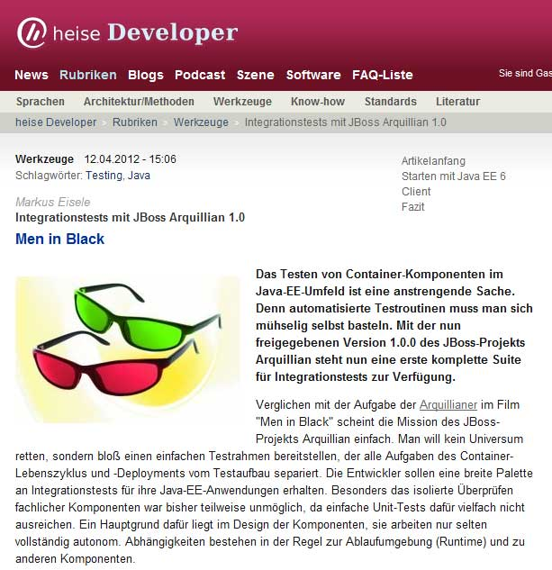

A short reminder for my German readers. <a href="" target="_blank">Heise.de Developer Channel</a> published an updated version of my Arquillian article from last year. It now covers the new features from 1.0.0-Final and also introduces you to use the Drone Extension with Selenium to do some very basic UI tests.
 
 

 

 The good news is that this is available for free. The bad news: It's only available in German. But don't forget to visit the new <a href="" target="_blank">arquillian.org</a> for latest <a href="" target="_blank">guides</a> and how-to's to get you started in many many other languages.
 
 
 If you still need more information check out the complete <a href="https://docs.jboss.org/author/display/ARQ/Reference+Guide" target="_blank">Reference Guide for the Arquillian</a> project. Or the <a href="https://community.jboss.org/en/arquillian/faq" target="_blank">FAQ</a>.