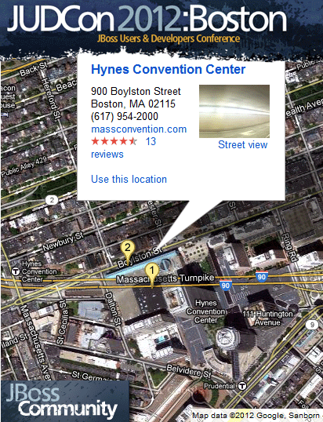

Huge news yesterday: The voting for the <a href="http://www.jboss.org/jbcra" target="_blank">JBoss Community Recognition Award</a> has been closed and the final winner have been announced! And I won the documentation category! A big thank you goes out to everybody who voted for me. It's a real pleasure working with the JBoss Arquillian Team and I have to thank Aslak, Dan, Vineet and Lincoln for supporting me since my early tries with Arquillian (beginning in late 2010).
 
 

 

 There are a couple of reasons I am proud to receive this award. First and foremost<b> I enjoy being part of the broad Java EE ecosystem</b>. Seeing the JBoss guys doing their work with joy and passion is a big proof that standards and the JCP in general are anything but boring. Java EE and the supporting technologies deliver a pool of knowledge and creativity to make life easier for every developer.
 
 
 Second most important reason is, that it shows how you can contribute to open source&nbsp;successfully&nbsp;or more general to the technology you admire without contributing code. There are a couple of reasons which prevent me from contributing code to OSS. But as in one of my favorite slogans: "Power is nothing without control", <b>code is nothing without documentation</b>. But you <a href="http://blog.eisele.net/2012/04/5-areas-to-contribute-to-glassfish.html" target="_blank">don't have to be a&nbsp;rock star&nbsp;programmer or genius</a> to push things. Providing guidance and tutorials, articles ... all that kind of stuff is at least equally important when great software comes to the masses. (Some product documentation still shows this day by day.) Given the fact that this blog&nbsp;and even some magazine articles are&nbsp;written in English forces me to also thank my former English teachers for transforming a D student into someone being able to express his thoughts reasonable. 
 
 
 You probably know me as an Oracle/GlassFish/WebLogic advocate, so the third and last reason for being proud is that it is possible for a guy like me to receive a JBoss award. If not that, what else could be a better proof for a<b> big and working technology family</b>. Even if the kids pick on each other from time to time work and play is fun for everybody.
 
 <b>My congratulations go out to the other winners: </b>
 
 Esteban Aliverti - New Features Drools (<a href="" target="_blank">@ilesteban</a>)
 
 George Gastaldi - Bug Fixes Seam (<a href="" target="_blank">@gegastald</a>)
 
 Bartosz Majsak - Issue / JIRA Arquillian (<a href="" target="_blank">@majson</a>)
 
 Hantsy Bai - Wiki Arquillian
 
 
 Hope to see you soon at <a href="http://www.jboss.org/events/JUDCon/2012/boston" target="_blank">JUDCon 2012</a> Boston June 25th and 26th when I am awarded! Thank you!