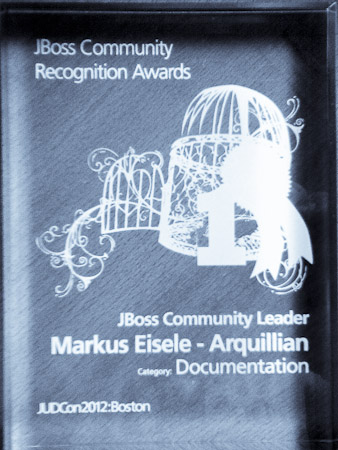
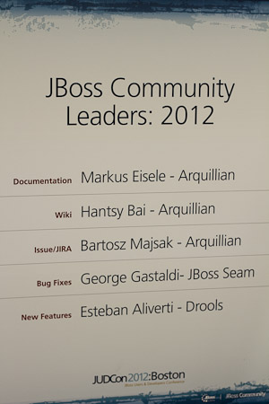
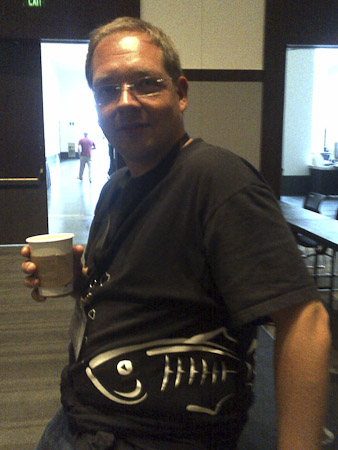

What an intense week. I left Germany Saturday to visit Boston, MA and join the fellow JBoss and RedHat guys for their annual <a href="">JUDCon</a>, the JBoss Users and Developers Conference. Back in April <a href="http://blog.eisele.net/2012/04/thank-you-im-jboss-community-leader.html">I received the JBoss Community Leader Award</a> for my work with the Arquillian project in the category documentation and JUDCon should be the place to finally pick this up. 
 

<table cellpadding="0" cellspacing="0" class="tr-caption-container" style="float: right; margin-left: 1em; text-align: right;">
 <tbody>
  <tr>
   <td style="text-align: center;"></td>
  </tr>
  <tr>
   <td class="tr-caption" style="text-align: center;">The award! Awesome!</td>
  </tr>
 </tbody>
</table> I had a direct flight to Bosten which was surprisingly short. Arriving in the States has become very convenient without having to fill in a&nbsp;dozen forms anymore. Even the immigration lines were acceptable long and I truly enjoyed getting a first impression of the city while driving to the <a href="">Marriott Copley Place</a>. Unplanned but nice I meet Andrew and Bartosz this evening and they joined me and Heiko for a nice dinner at <a href="">Solas</a>. If you ever go there, make sure to visit Solas. Really nice place to spend some jet-lagged hours! With JUDCon beginning on Monday I accepted Heiko's wonderful invitation to join him on a sightseeing tour through Boston the next day. And I can tell you, he knows a hell lot about it. And walking Boston for 6h after a too short night is exactly the right thing to do. So, thanks Heiko for taking the time and giving me the runaround. Find some picture impressions from that day in my <a href="" target="_blank">flickr photoset</a>. Sunday ended with a&nbsp;drink up in "<a href="http://bellinhand.com/homepage" target="_blank">The Bell in Hand Tavern</a>" near Marlboro Market. That was the first time to meet some of the organizers behind all this.
 
<table cellpadding="0" cellspacing="0" class="tr-caption-container" style="float: right; margin-left: 1em; text-align: right;">
 <tbody>
  <tr>
   <td style="text-align: center;"></td>
  </tr>
  <tr>
   <td class="tr-caption" style="text-align: center;">The JBCRA was present everywhere! Thanks!</td>
  </tr>
 </tbody>
</table> Monday finally was JUDCon day number one. The schedule <a href="http://www.jboss.org/events/JUDCon/2012/boston/agenda" target="_blank">was packed</a> and some well know names had a lot to tell about recent technologies. Paul gave an his "Spring to Java EE" talk, Anton talked about JRebel, Emmanuel about NoSQL and Hibernate. To make it short. An intense day of catching up with everybody and listening to some of my favorite speakers talking about their topics. The last session was at 5:30 followed by a "developer dinner" with pizza and beer. Shortly after that it was time to receive my award from the hands of Mark Little himself. While not all of the 400 registered attendees have stayed that long it still was a nice atmosphere around and Mark did a great job handing out the awards to the winner. 
 
 The "Why my Project Matters to Developers" Panel was big fun to listen to and the live recording of the <a href="">JBoss Asylum Podcast</a> was also awesome. Mark Anderson and Emmanuel were great hosts! I was too tired to attend the Lightning Talks and Hackfest later on.
 
 I had to take some calls during the second day and missed a lot of great content. But stayed around enough to catch up with a lot of people and we also have been interviewed by Joel Tosi about the awards and the related projects. My flight back was scheduled to go 9pm and like all my "last-days-at-conferences" this also was a too short one. But it was crowned with a complementary business class upgrade which made my trip back to Germany convenient.
 
 <b>Some thoughts</b>
 
 As you know I have seen some conferences and I like to compare this one a bit to give you a better understanding about it. JUDCon is the developer part of the larger <a href="" target="_blank">RedHat Summit</a>&nbsp;(together with JBoss World) which starts right afterwards. So, a conference by developers and for developers. With roughly 400 attendees this isn't the biggest conference I have been to and could probably be more easier compared to smaller gigs. But we all know that size doesn't matter and this proofed true again. Great content and great presence of RedHat speakers made this two days very valuable. But the beginning construction work for the larger event brought some disturbance to JUDCon. It happened on a small part of level three of the <a href="http://www.massconvention.com/jhcc.html" target="_blank">Hynes Convention Center</a>&nbsp;which is big enough to host large events.&nbsp;With a total of 352,000 square feet of&nbsp;flexible space on three levels, with rooms varying in
 
 size from 775 square feet to 110,000 square feet. The&nbsp;Hynes has five exhibit halls, one of which can be used
 
 as an Auditoriumthat can seat over 3,000 persons.&nbsp;Having these numbers in mind you probably can easily guess how it felt being placed on the upper left corner of the Hynes walking through construction works every day to get there. If I could make a whish, I would love to have this a little more lined up. The idea of having a&nbsp;&nbsp;"by developers and for developers"-conference is awesome.
 
 Coffee: My topic :) Wasn't any at all. There was plenty of it around. Every single minute of the day! That is sufficient proof for me that this is possible! Thanks guys, you know what matters!
 
 If you like to, you can find some more impressions in the <a href="" target="_blank">JUDCon conference photoset</a> on flickr.
 
 <b>Thank You!</b>
 
<table cellpadding="0" cellspacing="0" class="tr-caption-container" style="float: right; margin-left: 1em; text-align: right;">
 <tbody>
  <tr>
   <td style="text-align: center;"></td>
  </tr>
  <tr>
   <td class="tr-caption" style="text-align: center;">Sparky was with me!</td>
  </tr>
 </tbody>
</table> Sooo many people to say "Thank you" to. First of all: Thank you, dear readers! For taking the time and following me on twitter, G+, this blog and for taking the time voting for me! All this wouldn't have been possible without you and I encourage you to send me feedback about stuff you are curious to read about!
 
 Ray Ploski (<a href="https://twitter.com/#!/rayploski">@rayploski</a>) for his engagement; Rayme Jernigan (<a href="https://twitter.com/#!/rayme">@rayme</a>) for the organizational stuff; Heiko W. Rupp (<a href="https://twitter.com/#!/pilhuhn">@pilhuhn</a>) for being my guide and showing me the RedHat city; Andrew Lee Rubinger (<a href="https://twitter.com/#!/ALRubinger" target="_blank">@ALRubinger</a>) for nice discussions and always being around, it's good to know you!; Dan Allan (<a href="https://twitter.com/#!/mojavelinux" target="_blank">@mojavelinux</a>) for being a friend to have good discussions with! Sarah White (<a href="" target="_blank">@carbonfray</a>) for the good time talking about canons, lenses and pictures, it was a pleasure meeting you! Paul Bakker (<a href="" target="_blank">@pbakker</a>) for sharing a cab and some awesome talks! Lincoln Baxter III (<a href="https://twitter.com/#!/lincolnthree" target="_blank">@lincolnthree</a>) for great talks!&nbsp;Bartosz Majsak (<a href="" target="_blank">@majson</a>) for being my&nbsp;smolder companion :) It was great meeting you! Mark Little (<a href="">@nmcl</a>) for spending some of his precious minutes for my questions! It was a pleasure meeting you! Brian Leathem (<a href="">@brianleathem</a>) for the nice chat about RichFaces! Good to finally meet you! Andy Schwartz (<a href="">@aschwart</a>) The other Oracle guy there :) It was a great time talking to you! Hope to meet you again soon! Emmanuel Bernard (<a href="">@emmanuelbernard</a>) for a fun panel and a great podcast recording! And last but not least Pete Muir (<a href="https://twitter.com/#!/plmuir">@plmuir</a>) for a great hour about Java EE, JCP and directions!
 
 And the many others I probably missed here! It was a pleasure to join you! Let's see if we can repeat that! Hope to meet many of you again at J1!
 
 