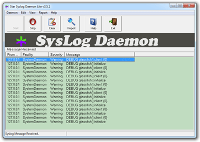

The of the most prominent requirements for application servers derive from the operations space. Taking this into account the next Java EE platform specification will focus entirely on platform as a service (PaaS) and cloud operations. Looking at what we have today still leaves a couple of questions unanswered. The one I get asked for quite a lot is: "How to configure GlassFish to receive notifications/alerts/messages on important log entries?". Seems to be a good topic to blog about.
 
 <b>Application Logging vs. System Logging vs. Monitoring</b>
 
 You basically have three options here. Either you choose to integrate some notification magic into your application logging or you go with the system logging or you go with the more classy monitoring approach. However the differences should be clear. By default GlassFish does not provide any third-party logging integration. Whatever logging way you go from a framework perspective you will end up logging application specific events. If you are looking for some kind of application server specific notifications you have to take the system logging or the monitoring road.
 
 <b>System Logging</b>
 

 

 The easiest configuration I have ever done. GlassFish supports Unix Syslog. By checking the "Write to system log" box in the "Logger Settings" at your desired configuration you enable this feature. In fact this works like a charm but has a couple of drawbacks. Syslog is a protocol that allows a machine to send event notification messages across IP networks to event message collectors - also known as Syslog Servers or Syslog Daemons. It's a connection-less UDP based IP protocol. Some kind of broadcast. If you want to react upon ERRORS or other severity messages you have to use the facilities which come with your syslog server/daemon. This might be a more high sophisticated appliance (STRM, Log Manager) or a piece of software. Most notably the syslog format isn't encrypted in any way so you have to be careful about configuring this. Syslog-ng isn't supported as of latest 3.1.2. And some more hints if you are interested in how this is done. Have a look at com.sun.enterprise.server.logging.Syslog and SyslogHandler. You see that you can only send messages to localhost. No chance to configure that. You have to use syslog forwarding if you want that stuff to end up on another machine. Running on Windows requires to install one of the many open or closed software products. I tested <a href="http://www.thestarsoftware.com/syslogdaemonlite.html" target?__blank_="">http://www.thestarsoftware.com/syslogdaemonlite.html"&gt;Star SysLog Daemon Lite</a> and was quite happy with the results. 
 
 One last note: If you are stumbling over older Google search results refering to something called "GlassFish Performance Advisor" .. that actually no longer exists. Hasn't been ported to 3.x branch. 
 
 <b>Application Logging</b>
 
 In fact, GlassFish doesn't provide a special logging framework integration unlike <a href="http://docs.oracle.com/cd/E24329_01/web.1211/e24428/logging_services.htm#WLLOG116" target="_blank">WebLogic</a>&nbsp;server does. So going this way you will lose the core GlassFish system logs and you can only focus on application specific logging.And that is where the integration actually happens. On an application level.&nbsp;Almost any recent frameworks (Log4J, LogBack) have a couple of providers for you to use out of the box. In terms of notifications email is still the simplest way to go. For that you have to look for the right appender (SMTP). Both LogBack (<a href="http://logback.qos.ch/manual/appenders.html#SMTPAppender" style="background-color: white;" target="_blank">SMTPAppender</a>) and Log4j (<a href="http://logging.apache.org/log4j/1.2/apidocs/org/apache/log4j/net/SMTPAppender.html" style="background-color: white;" target="_blank">SMTPAppender</a>) offer something here. Configuration is straight forward and only requires you to input some stuff about your SMTP infrastructure. Don't forget to set the right level of logging here. You are&nbsp;definitely&nbsp;not willing to have all DEBUG level messages send to your inbox.
 
 Still thinking about the syslog thing? Both Log4j and LogBack can produce syslog messages with their SyslogAppenders (<a href="http://logging.apache.org/log4j/1.2/apidocs/org/apache/log4j/net/SyslogAppender.html" target="_blank">log4j</a>, <a href="http://logback.qos.ch/manual/appenders.html#SyslogAppender" target="_blank">logback</a>). But all the above mentioned drawbacks also apply here. On top of that you will not be able to receive the GlassFish core log messsages with your syslog server. There might be very rare and special situations where this would be of any help.
 
 <b>Monitoring</b>
 
 One last thing to mention is the monitoring approach. A couple of monitoring suites can actually read your logfiles (keyword: logfile adapters) and you can configure your logging solution to react to certain pattern. While I don't consider that elegant it might be a stable solution to work with and I have seen this a lot in the wild. Another approach could be to use JMX or even the GlassFish admin REST interface to find out about the relevant metrics. But both don't provide access to the logging subsystem.
 