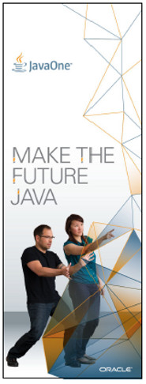
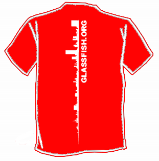

Flights are booked and everything else is arranged. I am truly looking forward to the no one Java event in one of my favorite cities in the states. Moving this from a placeholder to the final state took some time this year. The schedule still isn't finished and all the last minute changes are dropping in. If you are looking for me try to find me at one of the mentioned places and sessions. Beside this I will most likely run around "The Zone" or attend some of the great sessions.
 

 

 <b>My Own Sessions</b>
 
 Three type of sessions for me this year. I will be moderating the Web-Framework Smackdown this year. This year's panelists are:
 
 - Ed Burns: JSF
 
 - James Ward: Play
 
 - Graeme Rocher: Grails
 
 - Santiago Pericas-Geersten: Avatar (Oracle's new proprietary framework)
 
 So, if you are interested in joining us; Happy to welcome you! And bring good questions!
 
 
 Session ID: <b><a href="https://oracleus.activeevents.com/connect/sessionDetail.ww?SESSION_ID=4149" target="_blank">BOF4149 </a></b>
 
 Session Title: <b>Web Framework Smackdown 2012</b>
 
 Venue / Room: <b>Parc 55 - Cyril Magnin II/III</b>
 
 Date and Time: <b>Monday, Oct 1, 20:30 - 21:15</b>
 
 
 Late news! The combined session with Masoud Kalali was accepted also! After I did this on my own at JavaZone before, we will finally give a combined session about Java EE security with GlassFish. I am really looking forward to it!
 
 
 Session ID: <b><a href="https://oracleus.activeevents.com/connect/sessionDetail.ww?SESSION_ID=11881" target="_blank">CON11881</a></b>
 
 Session Title: <b>Java EE Security in Practice with Java EE 6 and GlassFish</b>
 
 Venue / Room: <b>Parc 55 - Powell I/II</b>
 
 Date and Time: <b>Monday, Oct 1, 10:00 AM - 11:00 AM</b>
 
 
 Last but not least I am going to take roughly 8 minutes of Sandeep's breakout session and talk about my experiences with the Oracle Cloud Java Service:
 
 
 Session ID:&nbsp;<b><a href="https://oracleus.activeevents.com/connect/sessionDetail.ww?SESSION_ID=8633" target="_blank">CON8633</a></b>
 
 Session Title:&nbsp;<b>Oracle Cloud: Success Stories</b>
 
 Venue / Room:&nbsp;<b>Moscone South - 307</b>
 
 Date and Time:&nbsp;<b>Monday, Oct 1, 1:45 PM - 2:45 PM</b>
 
 <b>JCP annual gathering and JCP Awards</b>
 
 You might have read, that <a href="http://blog.eisele.net/2012/08/i-am-nominated-for-10th-jcp-annual.html">I was nominated</a> for the JCP Member of the Year. The awards will be presented at the JCP annual gathering at the Infusion Lounge on Tuesday, 2 October at 6:30 pm.
 
 <b>NetBeans Community Day at JavaOne 2012 Conference</b>
 

 

 Join us for a full day dedicated to all things NetBeans. Find out what's new in the IDE and Platform, and how a wide range of companies are using NetBeans technology to deliver innovative applications. 
 <a href="http://netbeans.org/community/articles/javaone/2012/netbeans-day-2012.html" target="_blank">More information!</a>
 
 
 Date: <b>Sunday, September 30</b>
 
 Location: <b>Moscone West, Level 2</b>
 
 Room: <b>MW-L2-2004</b>
 
 Time: <b>9am - 3pm </b>
 
 <b>GlassFish Community Event and Party</b>
 

 

 Join the GlassFish Community for their annual <a href="http://glassfish-event12.eventbrite.com/event" target="_blank">GlassFish Community Event</a> at JavaOne 2012. It's fun and free! (But you need a OOW/JavaOne pass to enter the Moscone Center)
 
 
 Date:&nbsp;<b>Sunday, September 30</b>
 
 Location:&nbsp;<b>Moscone West, Room 2005</b>
 
 Room:&nbsp;<b>MW-L2-2004</b>
 
 Time:&nbsp;<b>11am - 1pm</b>
 
 
 The <a href="" target="_blank">GlassFish and Friends Party</a> takes place at "The Thirsty Bear" (661 Howard Street San Francisco, CA 94105), Sunday, September 30, 2012 from 8:00 PM to 10:00 PM (PDT) 
 
 <b>JavaOne San Francisco Geek Bike Ride</b>
 
 If it happens, that you are a bike fan and would love to bike the bridge you can think about joining this years JavaOne San Francisco Geek Bike Ride.
 
 All you have to do is to register (for free) with&nbsp;<a href="">http://sfgeekbikeride.eventbrite.com/</a>&nbsp;and enjoy the best the Bay Area has to offer by riding a bicycle across the Golden Gate Bridge.
 
 We will meet at <a href="http://www.blazingsaddles.com/san-francisco.aspx">Blazing Saddles</a>&nbsp;at Fisherman's Wharf and ride across the bridge and down into Sausalito, and then take a ferry back to the city.
 
 This is a beginner/intermediate ride, roughly 8 miles and takes 1.5 hours to ride. I expect we'll have several photograph stops, and we'll stop for a treat in Sausalito. There are three big hills (two steep ones going up Fort Mason and the approach to the bridge, and one fun downhill into Sausalito), but (obviously) the bridge is flat and easy. The hardest part may be dodging pedestrians on the bridge!
 
 All geeks and their friends are invited.
 
 
 Meet at Blazing Saddles bikes at 2715 Hyde St. If you want to reserve a particular bike, you can reserve it in advance online. Bike rental is $30-$40 USD, there's a 10% discount if you reserve online. The ferry is $10.50 USD. Follow <a href="https://twitter.com/#!/search/?q=%23geekbikeride" target="_blank">#geekbikeride</a> for updates.