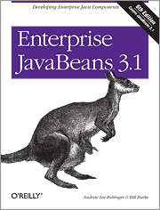

Another O'Reilly book on my review list. This has been sitting there for some time but the <a href="http://oreilly.com/bloggers" target="_blank">blogger review program</a> finally made it happen. This is one of the few books accompanying me since years. I don't know with which one I started but I believe it was the <a href="http://shop.oreilly.com/product/9780596002268.do" target="_blank">3rd</a> or even 2nd edition written by&nbsp;Richard Monson-Haefel himself. That was back in 2001 or&nbsp;earlier. Back than EJB was a nice concept but worth nearly nothing without a container. So I found it hard to follow all those examples enriched with all the fancy CORBA and remoting stuff. Even if it was the one being closest to the specification and as vendor&nbsp;independent&nbsp;as possible a WebLogic specific book caught me more. What a surprise, right? Knowing Andrew since some time now I was curious to see what Bill Burke and he did to the book and how I see things today. More than 10 years later.
 
 

 

 Abstract:&nbsp;Learn how to code, package, deploy, and test functional Enterprise JavaBeans with the latest edition of bestselling guide. Written by the developers of the JBoss EJB 3.1 implementation, this book brings you up to speed on each of the component types and container services in this technology, while the workbook in the second section provides several hands-on examples for putting the concepts into practice. Enterprise JavaBeans 3.1 is the most complete reference you'll find on this specification.
 
 
 Book: <a href="http://shop.oreilly.com/product/9780596158033.do">"Enterprise JavaBeans 3.1"</a>
 
 Language : English
 
 Paperback: 766 pages 
 
 Release Date : September 24, 2010
 
 ISBN-10: 0596158025 
 
 ISBN-13: 978-0596158026
 
 <b>The Author</b>
 
 Andrew Lee Rubinger (<a href="https://twitter.com/ALRubinger">@ALRubinger</a>) is an advocate for and speaker on testable enterprise Java development and a member of the JBoss Application Server development team. Beside that he is the technical lead of the ShrinkWrap project. Working for JBoss / Red Hat. He is running his blog at <a href="">exitcondition.alrubinger.com</a>
 
 The technical manuscript was adapted from Bill Burke and Richard Monson-Haefel’s fifth edition of this book.
 
 <b>The Content</b>
 
 Some statistics front-up. With 766 pages this clearly is a visible book in your book-shelf. If you would remove the preface, index and the code examples you end up with 408 pages of content and 318 pages of examples . This is obviously wrong. Due to many reasons (Environment, cost of the book, my back ...).
 
 But let's start with the overview:&nbsp;The book is organized in five parts. Parts 1 through 4 make up the so-called technical manuscript. Part 5 contains the examples and a detailed guide on installing, configuring and running the examples. Nobody is wondering about the fact that this is done using Arquillian and ShrinkWrap :) All examples run on OpenEJB.
 
 
 Part 1&nbsp;starts with a bird’s-eye view of the&nbsp;technology introducing your to component types and container services and leads you to write your first ever EJB.
 
 Part 2 draws you deeper into the different component models (stateless-, statefull-, singleton- and message driven beans.
 
 Part 3 is all about persistence with JPA. What that is, how to configure and package and simply how to use it.
 
 Part 4 examines the different container services like Security, Injection, Transaction, Interceptors, Timer Services and Web Services.
 
 <b>Writing and Style</b>
 
 Entertaining. That is the right word. If you are used to technical documentation you shouldn't struggle with this book. For a non native speaker it reads very easy and I didn't find very many complex sentences which stopped my reading. For native speaker it might be more likely to identify the different writing styles in it. The extensive examples doesn't make any sense to me. It feels like ages ago when I was used to typewriting stuff from books. 
 
 <b>Conclusion and recommendation</b>
 
 Hard to judge on this one. Beside the fact that I have a personal history with this book, I still believe that is helpful to people which want to get a good and basic introduction to the EJB programming model. The clear separation from any appserver makes this only half as valuable than it could be. And this is the surprising bottom line. I still would prefer any vendor specific book over a plain technology focused one. Anyway, congratulations to Andrew for doing a good job in taking over such a piece of history and making it up to date. And thanks to O'Reilly for keeping traditions alive.