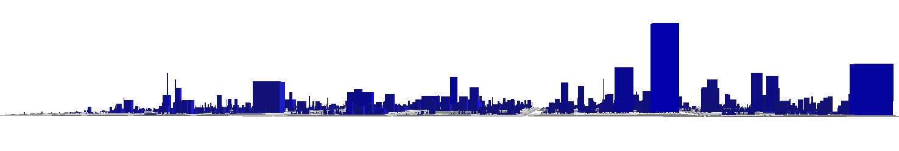
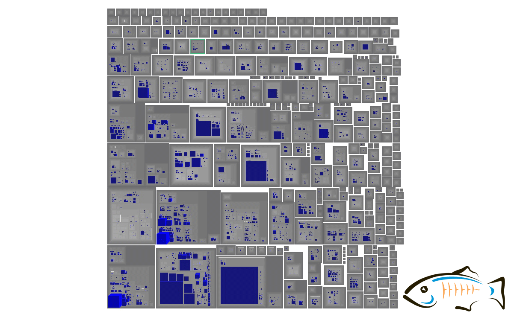
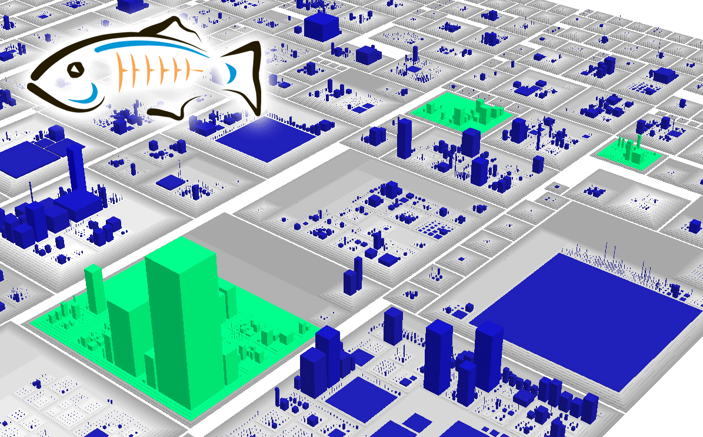
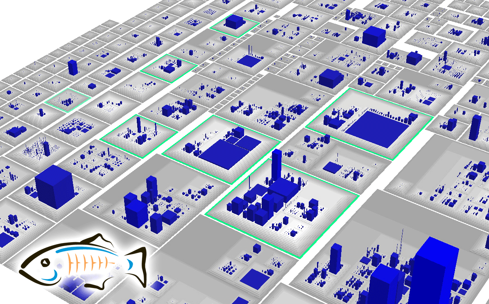
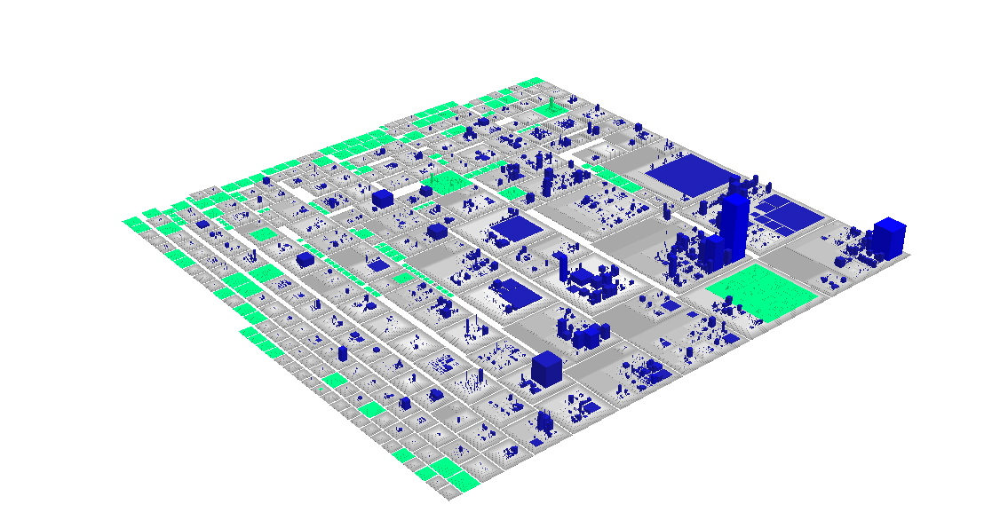

More than a year ago I looked at <a href="http://blog.eisele.net/2011/02/glassfish-city-another-view-onto-your.html">GlassFish from a very high level</a> point of view and did a 3D analysis of the source code. Today I feel like updating the model and re-running the analysis. 
 
 <b>The way we are looking at Code</b>
 
 On a day to day basis we are looking at source code. Classess, Packages, Deployment Units. And for what you usually do, this is far than enough. But there are rare cases where you have to get hand on very big code-bases. Need to navigate stuff or find a way to identify problems very quickly. In these cases alternate views onto your problem might help. CodeCity is one of those tools. Developed back in 2009 you can still use it if you are able to generate a FAMIX 2.1 format which is the input for CodeCity. CodeCity is an integrated environment for software analysis, in which software systems are visualized as interactive, navigable 3D cities. The classes are represented as buildings in the city, while the packages are depicted as the districts in which the buildings reside. But let's start with some basics.
 
 
 My first post about this kind of visualization featured a tool called <a href="http://www.intooitus.com/products/infusion" target="_blank">inFusion</a>. This was available for free or at least as a trial to generate the needed models for CodeCity. As of today it is only available as a demo version and a licensed versions. The first one isn't able to export the mse models. Thanks to the team at intooitus I was granted a license to be able to bring you the GlassFish city update. But please don't think that inFusion is only good for that. It's an eclipse based tool which provides intuitive insights, semantics-rich interpretations and matching refactoring recommendations, which identify and address inadequate underlying design decisions. So I will feature some more details about it later on this blog.
 
 <b>GlassFish</b>
 
 For now lets get back to the post. May I introduce GlassFish. More&nbsp;precisely&nbsp;the com.sun.*, org.glassfish.* and javax.* classes and packages that are contained in GlassFish 3.1.2-b15 which was shipped a few months back. On a&nbsp;high level&nbsp;overview (subsystems) this looks like this (thanks to <a href="http://www.headwaysoftware.com/products/index.php#/define" target="_blank">Headwaysoftware for Structure101</a>) :
 

 

 The complete GlassFish is bigger and also contains work by apache, netbeans and others. Roughly 930K Lines of Code (No comment, no blank lines) and 10.824 Classes overall in 845 packages. The biggest classes are:
 
 com.sun.ejb.containers.BaseContainer
 
 org.apache.catalina.core.StandardContext
 
 com.sun.jdo.spi.persistence.support.sqlstore.SQLStateManager
 
 org.apache.catalina.connector.Request
 
 com.sun.enterprise.deployment.EjbDescriptor
 
 <b>GlassFish Skyline</b>
 
 The skyline view is the most impressive one to me. I didn't publish it one year back but without any intention.
 

 

 The biggest buildings represent the biggest classes from above. Starting right to left. To give you an impression, the StandardContext has 6341 lines of code (which is represented by it's dark blue color), it has a "height" of 390 methods and length and width are calculated based on the 114 attributes. The base container has a "height" of 198 methods but it's width and length are bigger based on 134 methods.
 
 <b>Overview Pictures</b>
 
 Now you know the basics about "city building". Time to look at the overview.&nbsp;The complete city from the front looks like this:
 

 

 From the back:
 

 

 And a view from the top which is probably the most commonly known one because many tools tend to use this kind of perspective:
 

 

 <b>Special Areas</b>
 
 Back in the days I started to look into some special areas. One was the Apache district. The Apache towers are more or less the same. You have some additional areas where you find Apache code. Those are highlighted in green and represent any&nbsp;occurrence&nbsp;of org::apache packages in the sources.
 
 

 

 
 Another interesting area (at least to me) is the weld integration glue code (again, the little green in there).&nbsp;Remarkably less compared with the impact CDI has on the platform.&nbsp;I agree, that this simply is the "glue" and not the complete CDI implementation.
 

 

 
 One last area of interest. The complete CMP container spreads over different packages. This is functionality which is going to be pruned with Java EE 7. Your last chance to take a look at it is here:
 

 

 
 UPDATE 20.08.
 
 Peter asked for tests! Here we go. Highlighted is everything that contains the word "tests". Have fun!
 

 

 